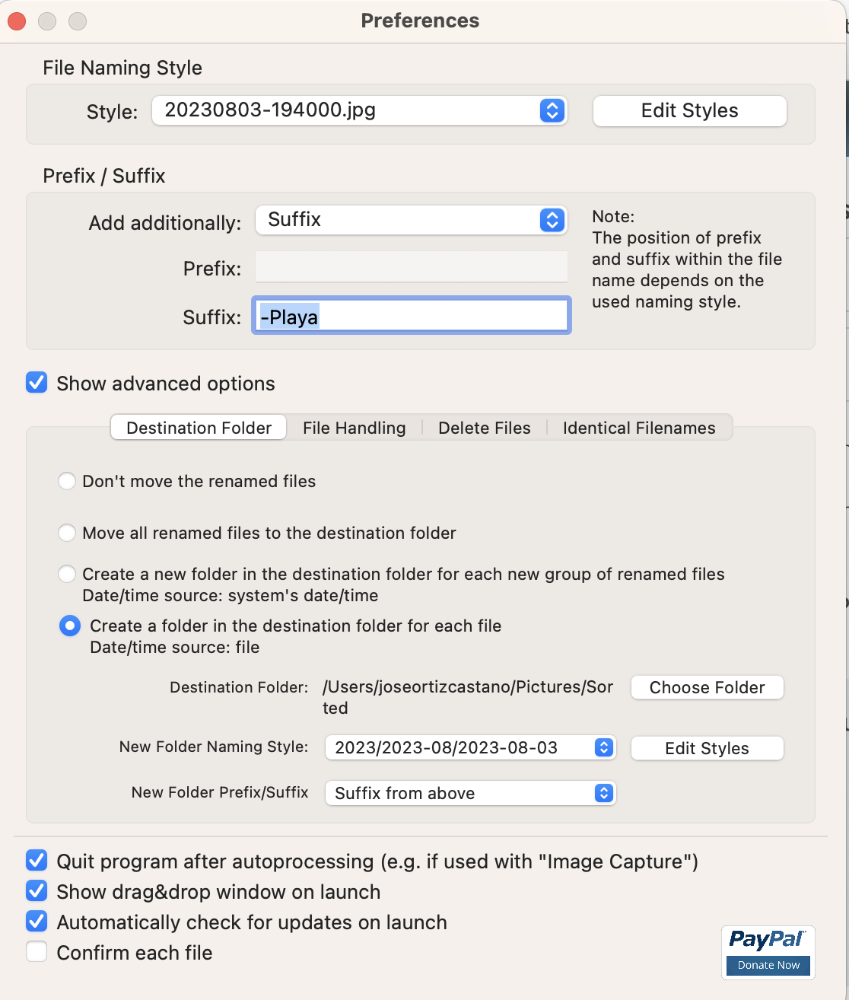
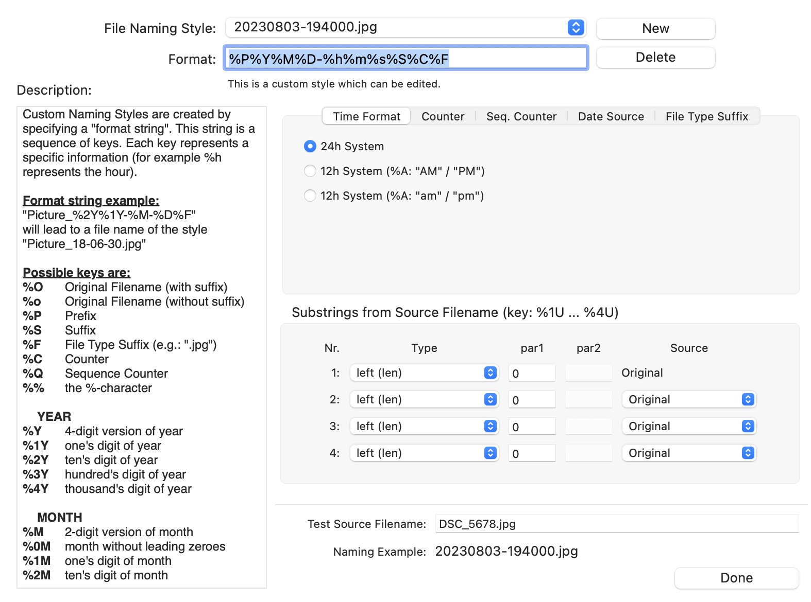
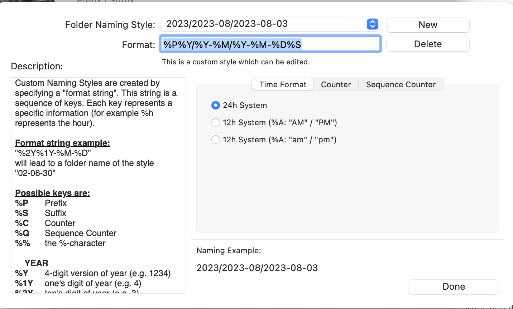

We all have that tiny software utility that has been with us for years. In my case, to organize my personal photos, I used a classic macOS application called **ExifRenamer** (you can check it out on [its official website](https://www.qdev.de/?location=mac%2Fexifrenamer)).

It's an excellent tool that does exactly what it's supposed to: it reads the EXIF metadata of images and renames them in a structured way based on the date and time they were taken. However, it has two major drawbacks: it is proprietary/closed-source, and its design has remained frozen in the macOS Aqua era, which made it impossible to modify or adapt to my terminal workflows.

## The Motivation: Full Control and the Terminal

Beyond having an aesthetic that clashes with modern operating systems, the main issue with relying on a proprietary third-party app is the lack of flexibility. If I wanted to add a specific renaming rule, perform advanced file filtering, or integrate the process into my automation scripts, my hands were completely tied.

I wanted a tool that was:
1. **Open source**, so I could maintain it myself over time.
2. **Extensible**, allowing me to modify it and add features whenever I wanted.
3. **Terminal-native (CLI)**, easy to integrate and blazing fast.

## The Process: Vibe Coding with Antigravity

Instead of sitting down to write all the EXIF metadata parsing logic from scratch, I decided to run a **vibe coding** experiment using **Antigravity**.

I showed the AI assistant how I used the original tool, shared screenshots of the interface and its configuration so it would understand the settings I considered essential (such as date formats, prefixes, suffixes, and name collision handling), and gave it clear instructions to generate a command-line alternative.

Here you can see part of the original configuration we had to replicate:

Using this visual context, my explanations of the behavior, and the technical stack I wanted to use, Antigravity took care of structuring and writing all the code for the new CLI.

## The Result: exifRenamer CLI

The result of this development session is a modern terminal utility written in Go that replicates the features I valued most from the classic app, but with the power and flexibility of the command line.

You can find the full source code on the GitHub repository:
👉 **[jose-oc/exifRenamer](https://github.com/jose-oc/exifRenamer)**

### Key Features:
* **Native EXIF parsing**: Extracts the exact capture date and time from images.
* **Highly customizable format**: Allows you to structure filenames using any time pattern (e.g., `YYYY-MM-DD_HH-MM-SS`).
* **Prefix and suffix support**: Easily add context to your batches of photos.
* **No heavy dependencies**: Compiles into a single, fast, cross-platform binary.

And best of all: being open source, I now have complete control to modify it, add new metadata formats, or adapt it to any other type of media file in the future. AI-assisted development allows us to turn frustration with obsolete software into a custom solution in a matter of minutes.

## Vibe Coding

I've been using generative AI for a while to help me both in my daily job and with my side projects. However, until now, I always controlled exactly what the LLM should generate, providing detailed specifications, and reviewing and modifying the code it wrote for me.

This time, I decided to try pure vibe coding. Since it was a small utility, it felt like the perfect project for this experiment.

I didn't look at the code at all during the process. When the code was generated, I tested it as an end-user to check if the result matched what I wanted, and I gave instructions to modify it according to what I wanted to have in the end.

The result: I had a lot of fun, and I have an application that does exactly what I want.

To build these kinds of applications, you only need to be clear about what you want to achieve, have enough knowledge to guide the AI with good prompts, and enjoy the ride!
