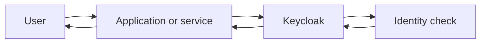
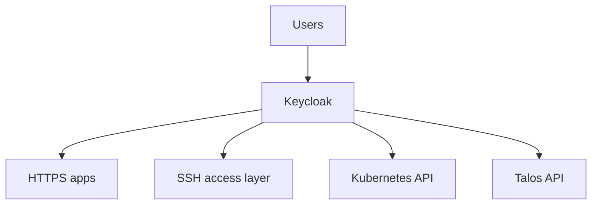
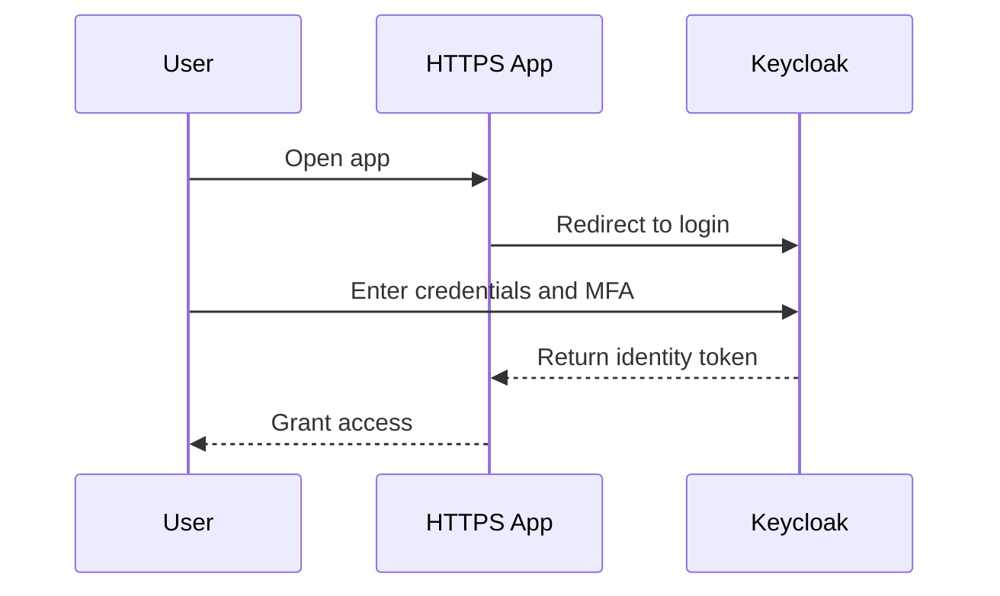
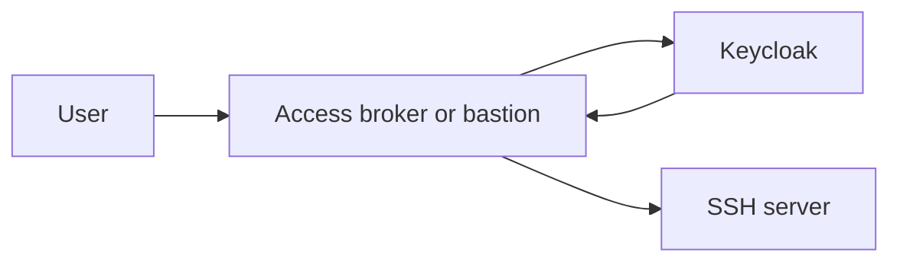
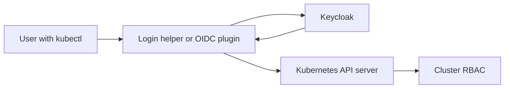
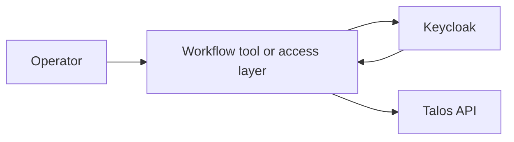

Keycloak is an identity and access management platform. In plain terms, it is a system that helps you avoid creating a separate username, password, and login flow for every tool.

Instead of each application handling authentication on its own, applications can trust Keycloak to answer a few important questions:

- who is this user?
- did they log in successfully?
- should they be allowed to access this system?

That makes life easier for both users and operators. Users get one place to sign in. Operators get one place to manage accounts, groups, policies, and stronger security controls such as MFA.

## Why people use Keycloak

Without centralized authentication, teams often end up with:

- separate local accounts in every application
- inconsistent password policies
- access that is hard to revoke cleanly
- no single place to enforce MFA
- poor visibility into who logged in where

Keycloak solves that by becoming the shared authentication layer.

## The core idea

Here is the basic web login flow:

The application does not need to store the user password itself. It delegates the login process to Keycloak and receives trusted identity information back.

## Glossary: the terms that matter

These words appear often when people talk about Keycloak.

### IdP

`IdP` means **Identity Provider**.

It is the system that confirms who a user is. Keycloak can act as the IdP for your applications.

### SSO

`SSO` means **Single Sign-On**.

It means a user signs in once and can then access multiple connected applications without logging in again every time.

### MFA

`MFA` means **Multi-Factor Authentication**.

It requires more than one proof of identity, for example:

- password plus a TOTP code
- password plus a hardware security key

MFA makes stolen passwords less useful to an attacker.

### Realm

A realm is a top-level Keycloak space for identities, clients, groups, and policies.

You can think of it as a security boundary or a tenant. One company might have one realm. A service provider might have many.

### Client

A client is an application or service that trusts Keycloak.

Examples:

- a web dashboard
- Grafana
- Argo CD
- a Kubernetes API integration

### Token

A token is a signed piece of identity information issued after successful login.

Applications use tokens to verify that the user authenticated and to inspect claims such as username, email, group membership, or role.

### Claims

Claims are facts inside a token.

Examples:

- username
- email
- groups
- roles

### RBAC

`RBAC` means **Role-Based Access Control**.

It means permissions are assigned through roles rather than by configuring every user individually.

### LDAP or Active Directory

These are directory systems used to store users and groups.

Keycloak can often connect to them so you do not have to recreate every account manually.

## Where Keycloak fits

A simple mental model looks like this:

Keycloak is not the application itself. It is the shared login and identity layer that other systems trust.

## Example 1: centralized auth for HTTPS applications

This is the most common Keycloak use case.

Imagine you have:

- Grafana
- Argo CD
- an internal wiki
- a custom admin portal

Without Keycloak, each tool may have its own login page and user database.

With Keycloak, each tool redirects the user to Keycloak for login.

### Why this is useful

- one login experience across many tools
- one place to enforce MFA
- easier account disablement when someone leaves
- easier group-based access control

### Practical note

This usually uses standards such as:

- OpenID Connect (OIDC)
- OAuth 2.0
- sometimes SAML

You do not need to understand every detail on day one. The important point is that the application trusts Keycloak instead of asking for a local password.

## Example 2: centralized auth for SSH

SSH does not normally redirect you to a browser login page by itself, so this setup usually needs an extra integration layer.

Common patterns include:

- using short-lived SSH certificates
- using a bastion or access proxy
- integrating with a platform such as Teleport or another broker that trusts Keycloak

The flow looks more like this:

### What changes here

Keycloak is still the source of identity, but another component translates that identity into something SSH understands.

That might be:

- an SSH certificate
- a temporary key
- a policy decision on a jump host

### Why this is useful

- no long-lived shared SSH accounts
- easier offboarding
- centralized MFA before shell access
- clearer audit trail of who accessed what

> [!NOTE]
> Keycloak usually does not replace `sshd` by itself. It normally works with another tool that bridges browser-based identity and SSH.

## Example 3: centralized auth for the Kubernetes API

Kubernetes supports external identity providers, which makes it a strong fit for Keycloak.

A common pattern is:

- the user authenticates against Keycloak
- Kubernetes trusts the issued token
- RBAC maps groups or roles from the token to cluster permissions

### Why this is useful

- cluster access can follow central identity rules
- groups from Keycloak can map to Kubernetes roles
- removing a user from the identity system can remove practical access quickly

### What to understand first

There are two separate steps:

1. authentication: Keycloak proves who the user is
2. authorization: Kubernetes RBAC decides what that user can do

Those steps are related, but they are not the same thing.

## Example 4: centralized auth for the Talos API

Talos is an API-driven operating system for Kubernetes nodes. Like SSH, it does not directly behave like a normal web application, so centralized auth usually depends on how the environment is integrated.

In practice, teams often use one of these patterns:

- an identity-aware access layer in front of operational workflows
- short-lived credentials issued after authenticating with Keycloak
- a platform that connects Keycloak identity to Talos management actions

### The important idea

The goal is not “Talos magically speaks Keycloak everywhere.”

The real goal is:

- identity starts in one trusted place
- access is short-lived and auditable
- operators use fewer static credentials

That matters a lot for sensitive infrastructure APIs.

## What Keycloak improves operationally

Even if the integration details differ by protocol, the benefits are usually the same:

- one identity source instead of many local user stores
- central MFA policy
- easier onboarding and offboarding
- group-based access
- less password sprawl
- better auditability

## Common misunderstandings

### “Keycloak is only for websites”

No. Web apps are the easiest example, but the same identity model can support infrastructure access when paired with the right integration.

### “Authentication and authorization are the same”

No.

- authentication answers: who are you?
- authorization answers: what are you allowed to do?

Keycloak is often strongest on the first question, while the target system still enforces the second.

### “If I install Keycloak, every protocol will work the same way”

No. HTTPS apps, SSH, Kubernetes, and Talos do not all consume identity in the same way. Some need a proxy, plugin, broker, or certificate workflow in between.

## When Keycloak is a good fit

Keycloak is a strong fit when you want:

- self-hosted identity management
- SSO across many internal tools
- MFA enforcement
- integration with existing directories
- group and role based access patterns

It may be more than you need if you only have one small internal application and no broader identity problem to solve.

## Final takeaway

Keycloak is best understood as a central identity hub.

It helps different systems trust the same user identity, even if the exact integration differs between:

- web applications
- SSH access
- Kubernetes
- Talos

If you remember one thing, remember this:

Keycloak does not replace every target system. It gives them a shared and more manageable way to know who the user is.
