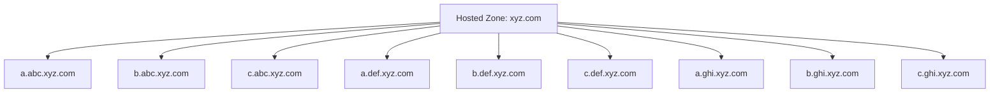
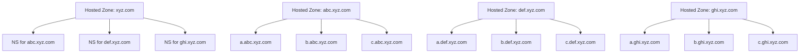
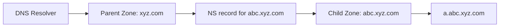
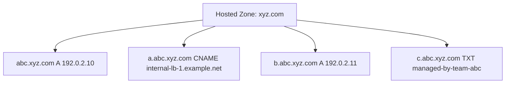
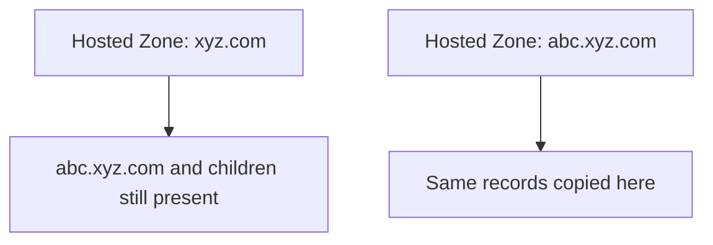
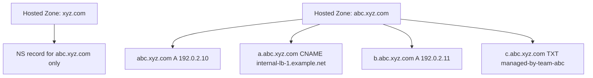

# Splitting One Route 53 Hosted Zone into Delegated Subdomains

If you already manage `xyz.com` in Amazon Route 53 and your records are starting to look like this:

- `a.abc.xyz.com`
- `b.abc.xyz.com`
- `c.abc.xyz.com`
- `a.def.xyz.com`
- `b.def.xyz.com`
- `c.def.xyz.com`
- `a.ghi.xyz.com`
- `b.ghi.xyz.com`
- `c.ghi.xyz.com`

you may want to break that single large hosted zone into smaller delegated subdomains:

- `abc.xyz.com`
- `def.xyz.com`
- `ghi.xyz.com`

This is a common and technically straightforward DNS pattern. The important part is doing the migration in the right order so DNS answers stay consistent.

This post explains the main DNS terms in simple language, shows the target structure, and gives a practical Route 53 runbook you can follow.

## Terms Used in This Post

Before the runbook, here are the DNS terms in plain language.

### Domain

A domain is a DNS name that people or systems use. In this post, `xyz.com` is the main domain.

Examples:

- `xyz.com`
- `abc.xyz.com`
- `a.abc.xyz.com`

### Subdomain

A subdomain is a name underneath another domain.

Examples:

- `abc.xyz.com` is a subdomain of `xyz.com`
- `a.abc.xyz.com` is a subdomain of `abc.xyz.com`

### Hosted Zone

A hosted zone in Route 53 is the container that holds DNS records for a domain or subdomain.

Examples:

- one hosted zone for `xyz.com`
- another hosted zone for `abc.xyz.com`

Think of a hosted zone as the place where Route 53 stores the DNS rules for that name.

### DNS Record

A DNS record is a single entry inside a hosted zone.

Examples:

- an `A` record mapping a name to an IPv4 address
- a `CNAME` record pointing one name to another
- an `MX` record for mail
- an `NS` record telling the world which name servers are authoritative

### Name Server

A name server is a DNS server that answers questions about a domain or subdomain.

When you create a public hosted zone in Route 53, AWS gives that zone four authoritative name servers.

### NS Record

An `NS` record is a DNS record that says, "for this domain or subdomain, ask these name servers."

This is the key to delegation.

Example:

If `xyz.com` contains an `NS` record for `abc.xyz.com`, resolvers learn that `abc.xyz.com` is managed somewhere else, using the name servers listed in that record.

### Delegation

Delegation is the act of handing responsibility for a subdomain from the parent zone to a child zone.

Example:

- parent zone: `xyz.com`
- child zone: `abc.xyz.com`

After delegation, records such as `a.abc.xyz.com` should be managed in the `abc.xyz.com` hosted zone, not in the `xyz.com` hosted zone.

### Parent Zone and Child Zone

The parent zone is the higher-level zone that delegates authority.
The child zone is the lower-level zone that receives authority.

Examples:

- parent: `xyz.com`
- child: `abc.xyz.com`

### TTL

TTL means "time to live." It tells DNS resolvers how long they may cache an answer before asking again.

Lower TTL values usually make changes visible sooner, but they also increase query traffic.

### Apex

The apex is the root name of a hosted zone itself.

Examples:

- the apex of the `xyz.com` zone is `xyz.com`
- the apex of the `abc.xyz.com` zone is `abc.xyz.com`

If you create a child zone for `abc.xyz.com`, records at `abc.xyz.com` itself must also move there.

## What We Are Trying to Achieve

We start with a single parent hosted zone:



We want to end up with this:



The parent zone keeps control of `xyz.com`, but it delegates each subdomain to its own hosted zone.

## The One Rule That Matters Most

The safe migration order is:

1. Copy the records into the child hosted zone.
2. Add the delegation `NS` record in the parent zone.
3. Remove the old records from the parent zone.

Do not delete the old records first.

That would create a gap where the child zone is not yet authoritative and clients may get failures.

Also, do not leave duplicate records in both places for longer than necessary after delegation. Once the subdomain is delegated, Route 53 expects that subtree to be served by the child zone.

## Example Scenario

Assume the parent zone `xyz.com` currently contains:

- `abc.xyz.com A 192.0.2.10`
- `a.abc.xyz.com CNAME internal-lb-1.example.net`
- `b.abc.xyz.com A 192.0.2.11`
- `c.abc.xyz.com TXT "managed-by-team-abc"`

The goal is to create a dedicated hosted zone `abc.xyz.com` and move those records there.

## Runbook: Migrate `abc.xyz.com` into Its Own Hosted Zone

This runbook describes one subdomain migration. Repeat the same pattern for `def.xyz.com`, `ghi.xyz.com`, and any others.

### Step 1: Inventory the Records That Belong to the Child Zone

List every record that belongs under `abc.xyz.com`.

That means:

- records at the apex `abc.xyz.com`
- records below it, like `a.abc.xyz.com`, `b.abc.xyz.com`, and `c.abc.xyz.com`

Create a temporary checklist like this:

| Name | Type | Value |
| --- | --- | --- |
| `abc.xyz.com` | `A` | `192.0.2.10` |
| `a.abc.xyz.com` | `CNAME` | `internal-lb-1.example.net` |
| `b.abc.xyz.com` | `A` | `192.0.2.11` |
| `c.abc.xyz.com` | `TXT` | `"managed-by-team-abc"` |

Be careful not to miss the apex record at `abc.xyz.com` itself.

Example AWS CLI command:

```bash
aws route53 list-resource-record-sets \
  --hosted-zone-id ZPARENT123456 \
  --profile myprofile \
  --output json |
jq -r '
  .ResourceRecordSets[]
  | select(.Name == "abc.xyz.com." or (.Name | endswith(".abc.xyz.com.")))
'
```

If you want a more zone-file-like review format for standard records, you can use the output with the `import zone file` button in the AWS web console in the child zone details:

```bash
aws route53 list-resource-record-sets \
  --hosted-zone-id ZPARENT123456 \
  --profile myprofile \
  --output json |
jq -r '
  .ResourceRecordSets[]
  | select(.Name == "abc.xyz.com." or (.Name | endswith(".abc.xyz.com.")))
  | select(has("ResourceRecords"))
  | select(.Type != "SOA")
  | . as $r
  | $r.ResourceRecords[]
  | "\($r.Name) \($r.TTL // 300) IN \($r.Type) \(.Value)"
'
```

What to look for:

- all records at `abc.xyz.com.` itself
- all child records under `.abc.xyz.com.`
- no unrelated siblings such as `abc2.xyz.com.`
- any `NS`, `SOA`, alias, weighted, or health-check-linked records that may need extra care

### Step 2: Lower TTLs Before the Migration Window

If the records currently have high TTLs, consider lowering them ahead of time.

Example:

- old TTL: `3600`
- temporary migration TTL: `300`

Do this early enough that caches have time to expire before the cutover window.

This step is optional, but it makes migrations easier to observe and easier to roll back.

Example change batch to reduce TTL on selected records:

```json
{
  "Changes": [
    {
      "Action": "UPSERT",
      "ResourceRecordSet": {
        "Name": "abc.xyz.com.",
        "Type": "A",
        "TTL": 300,
        "ResourceRecords": [
          { "Value": "192.0.2.10" }
        ]
      }
    },
    {
      "Action": "UPSERT",
      "ResourceRecordSet": {
        "Name": "a.abc.xyz.com.",
        "Type": "CNAME",
        "TTL": 300,
        "ResourceRecords": [
          { "Value": "internal-lb-1.example.net." }
        ]
      }
    }
  ]
}
```

Apply it with:

```bash
aws route53 change-resource-record-sets \
  --hosted-zone-id ZPARENT123456 \
  --change-batch file://reduce-ttl-abc.json \
  --profile myprofile
```

What to look for:

- the records are unchanged except for `TTL`
- you only include records you really want to lower
- you preserve the full original record shape when doing the `UPSERT`

### Step 3: Create the Child Hosted Zone

Create a new public hosted zone in Route 53 for:

- `abc.xyz.com`

Route 53 will automatically assign four authoritative name servers to this new hosted zone.

At this stage, the zone exists, but it is not yet delegated from the parent zone.

Create it with:

```bash
aws route53 create-hosted-zone \
  --name abc.xyz.com \
  --caller-reference abc-xyz-com-20260504T120000Z \
  --hosted-zone-config Comment="Child zone for abc.xyz.com",PrivateZone=false \
  --profile myprofile
```

What to look for in the output:

- `HostedZone.Id`: the new child hosted zone ID
- `DelegationSet.NameServers`: the four authoritative Route 53 name servers
- `Config.PrivateZone`: it must be `false` for a public delegation

### Step 4: Recreate the Child Records in the New Hosted Zone

Add all `abc.xyz.com` records to the new `abc.xyz.com` hosted zone.

For our example, the child zone should contain:

- `abc.xyz.com A 192.0.2.10`
- `a.abc.xyz.com CNAME internal-lb-1.example.net`
- `b.abc.xyz.com A 192.0.2.11`
- `c.abc.xyz.com TXT "managed-by-team-abc"`

At the end of this step, the same functional records exist in both places:

- still present in the parent zone
- now also present in the child zone

That temporary duplication is expected before delegation.

Example change batch for the child zone:

```json
{
  "Changes": [
    {
      "Action": "UPSERT",
      "ResourceRecordSet": {
        "Name": "abc.xyz.com.",
        "Type": "A",
        "TTL": 300,
        "ResourceRecords": [
          { "Value": "192.0.2.10" }
        ]
      }
    },
    {
      "Action": "UPSERT",
      "ResourceRecordSet": {
        "Name": "a.abc.xyz.com.",
        "Type": "CNAME",
        "TTL": 300,
        "ResourceRecords": [
          { "Value": "internal-lb-1.example.net." }
        ]
      }
    },
    {
      "Action": "UPSERT",
      "ResourceRecordSet": {
        "Name": "b.abc.xyz.com.",
        "Type": "A",
        "TTL": 300,
        "ResourceRecords": [
          { "Value": "192.0.2.11" }
        ]
      }
    },
    {
      "Action": "UPSERT",
      "ResourceRecordSet": {
        "Name": "c.abc.xyz.com.",
        "Type": "TXT",
        "TTL": 300,
        "ResourceRecords": [
          { "Value": "\"managed-by-team-abc\"" }
        ]
      }
    }
  ]
}
```

Apply it with:

```bash
aws route53 change-resource-record-sets \
  --hosted-zone-id ZCHILD123456 \
  --change-batch file://child-zone-records-abc.json \
  --profile myprofile
```

What to look for:

- every intended record is present in the child zone
- apex records at `abc.xyz.com.` are included
- record values match the parent zone exactly before delegation

### Step 5: Capture the Child Zone Name Servers

In the new `abc.xyz.com` hosted zone, find the `NS` record that Route 53 created automatically.

It will contain four name servers, something like:

- `ns-123.awsdns-45.com`
- `ns-678.awsdns-90.net`
- `ns-234.awsdns-56.org`
- `ns-789.awsdns-12.co.uk`

These are the authoritative name servers for the child hosted zone.

Retrieve them with:

```bash
aws route53 get-hosted-zone \
  --id ZCHILD123456 \
  --profile myprofile
```

What to look for in the output:

- `DelegationSet.NameServers`
- the four Route 53 names you will copy into the parent `NS` record
- the hosted zone name is exactly `abc.xyz.com.`

### Step 6: Delegate the Child Zone from the Parent Zone

In the parent hosted zone `xyz.com`, create an `NS` record for:

- name: `abc.xyz.com`

Its values must be the four Route 53 name servers assigned to the child hosted zone.

Conceptually, this says:

"For anything under `abc.xyz.com`, stop asking the `xyz.com` zone and start asking these child-zone name servers."

The delegation looks like this:



Example change batch for the parent zone:

```json
{
  "Changes": [
    {
      "Action": "UPSERT",
      "ResourceRecordSet": {
        "Name": "abc.xyz.com.",
        "Type": "NS",
        "TTL": 300,
        "ResourceRecords": [
          { "Value": "ns-123.awsdns-45.com." },
          { "Value": "ns-678.awsdns-90.net." },
          { "Value": "ns-234.awsdns-56.org." },
          { "Value": "ns-789.awsdns-12.co.uk." }
        ]
      }
    }
  ]
}
```

Apply it with:

```bash
aws route53 change-resource-record-sets \
  --hosted-zone-id ZPARENT123456 \
  --change-batch file://delegate-abc-ns.json \
  --profile myprofile
```

What to look for:

- the `Name` is exactly `abc.xyz.com.`
- all four child-zone name servers are present
- you are changing the parent zone, not the child zone

### Step 7: Remove the Old Child Records from the Parent Zone

After the `NS` delegation record exists in `xyz.com`, delete the records that belong to the delegated child namespace from the parent zone.

Delete records such as:

- `abc.xyz.com A 192.0.2.10`
- `a.abc.xyz.com CNAME internal-lb-1.example.net`
- `b.abc.xyz.com A 192.0.2.11`
- `c.abc.xyz.com TXT "managed-by-team-abc"`

Do not delete the delegation `NS` record you just added.

After cleanup, the parent zone should keep only:

- its own `xyz.com` records
- the `NS` delegation for `abc.xyz.com`

And the child zone should now be the only place that contains records for the `abc.xyz.com` subtree.

Example change batch to delete the moved records from the parent zone:

```json
{
  "Changes": [
    {
      "Action": "DELETE",
      "ResourceRecordSet": {
        "Name": "abc.xyz.com.",
        "Type": "A",
        "TTL": 300,
        "ResourceRecords": [
          { "Value": "192.0.2.10" }
        ]
      }
    },
    {
      "Action": "DELETE",
      "ResourceRecordSet": {
        "Name": "a.abc.xyz.com.",
        "Type": "CNAME",
        "TTL": 300,
        "ResourceRecords": [
          { "Value": "internal-lb-1.example.net." }
        ]
      }
    },
    {
      "Action": "DELETE",
      "ResourceRecordSet": {
        "Name": "b.abc.xyz.com.",
        "Type": "A",
        "TTL": 300,
        "ResourceRecords": [
          { "Value": "192.0.2.11" }
        ]
      }
    },
    {
      "Action": "DELETE",
      "ResourceRecordSet": {
        "Name": "c.abc.xyz.com.",
        "Type": "TXT",
        "TTL": 300,
        "ResourceRecords": [
          { "Value": "\"managed-by-team-abc\"" }
        ]
      }
    }
  ]
}
```

Apply it with:

```bash
aws route53 change-resource-record-sets \
  --hosted-zone-id ZPARENT123456 \
  --change-batch file://delete-parent-abc-records.json \
  --profile myprofile
```

What to look for:

- you do not delete the new `NS` delegation record
- the deleted record definitions exactly match the current parent-zone records
- after deletion, only the delegation remains in the parent for `abc.xyz.com.`

### Step 8: Validate Resolution

Check that DNS now resolves through the child hosted zone.

Validation goals:

- `abc.xyz.com` resolves correctly
- `a.abc.xyz.com` resolves correctly
- `b.abc.xyz.com` resolves correctly
- `c.abc.xyz.com` resolves correctly

You can verify both:

- functional answers, such as correct `A`, `CNAME`, or `TXT` responses
- delegation, by confirming that `abc.xyz.com` returns the expected `NS` answers

Use these commands.

Check the delegated name servers published by normal recursive resolution:

```bash
dig NS abc.xyz.com
```

Example output:

```text
; <<>> DiG 9.10.6 <<>> NS abc.xyz.com
;; QUESTION SECTION:
;abc.xyz.com.                 IN      NS

;; ANSWER SECTION:
abc.xyz.com.          300     IN      NS      ns-123.awsdns-45.com.
abc.xyz.com.          300     IN      NS      ns-678.awsdns-90.net.
abc.xyz.com.          300     IN      NS      ns-234.awsdns-56.org.
abc.xyz.com.          300     IN      NS      ns-789.awsdns-12.co.uk.
```

What to look for:

- the `ANSWER SECTION` contains the four new child-zone Route 53 name servers
- the name is exactly `abc.xyz.com.`
- the TTL is in the expected range for your delegation record

Query one of those authoritative child-zone name servers directly for the apex record:

```bash
dig @ns-123.awsdns-45.com abc.xyz.com
```

Example output:

```text
; <<>> DiG 9.10.6 <<>> @ns-123.awsdns-45.com abc.xyz.com
;; flags: qr aa rd; QUERY: 1, ANSWER: 1

;; ANSWER SECTION:
abc.xyz.com.          300     IN      A       192.0.2.10
```

What to look for:

- the `aa` flag means the responding server is authoritative
- the `ANSWER SECTION` contains the expected apex record from the child zone
- the TTL matches what you configured in the child hosted zone

Query one of those authoritative child-zone name servers directly for a child record:

```bash
dig @ns-123.awsdns-45.com a.abc.xyz.com
```

Example output:

```text
; <<>> DiG 9.10.6 <<>> @ns-123.awsdns-45.com a.abc.xyz.com
;; flags: qr aa rd; QUERY: 1, ANSWER: 1

;; ANSWER SECTION:
a.abc.xyz.com.        300     IN      CNAME   internal-lb-1.example.net.
```

What to look for:

- again, the `aa` flag shows an authoritative answer
- the record value is the one you copied into the child zone
- this proves the child hosted zone itself is correct, regardless of resolver cache

Trace the full delegation path:

```bash
dig +trace a.abc.xyz.com
```

Example output:

```text
com.                   172800  IN      NS      a.gtld-servers.net.
xyz.com.               172800  IN      NS      ns-111.awsdns-11.org.
abc.xyz.com.           300     IN      NS      ns-123.awsdns-45.com.
abc.xyz.com.           300     IN      NS      ns-678.awsdns-90.net.
a.abc.xyz.com.         300     IN      CNAME   internal-lb-1.example.net.
```

What to look for:

- the trace reaches the parent `xyz.com` zone
- the parent refers the resolver to the new `abc.xyz.com` child-zone name servers
- the final answer comes after that referral, not from the old parent-zone records

If you want to check all four Route 53 child-zone name servers directly:

```bash
for ns in \
  ns-123.awsdns-45.com \
  ns-678.awsdns-90.net \
  ns-234.awsdns-56.org \
  ns-789.awsdns-12.co.uk
do
  dig @"$ns" a.abc.xyz.com +short
done
```

What to look for:

- all four authoritative servers return the expected answer
- there is no `SERVFAIL` or empty response from one server while others succeed

Important note:

- direct `dig @<child-ns>` tests tell you whether the new hosted zone is correct
- normal recursive queries may still show older cached answers until TTL expires

### Step 9: Observe for a Short Period

Watch the migrated names during the first cache window after cutover.

Look for:

- unexpected `NXDOMAIN`
- answers coming from stale caches
- missing records that were not copied into the child zone

If you lowered TTLs before migration, this observation window is shorter and easier to reason about.

Helpful observation commands:

```bash
dig abc.xyz.com
dig a.abc.xyz.com
dig NS abc.xyz.com
dig +trace a.abc.xyz.com
```

What to look for:

- answers gradually converge to the new child-zone data
- no intermittent `NXDOMAIN`
- no mismatch between direct authoritative answers and recursive answers after cache expiry

## Visualizing the Cutover

### Before Migration



### During Migration, Before Delegation



### After Delegation and Cleanup



## Why the Order Matters

The order is important because DNS authority changes in stages.

If you delete the records from the parent zone before creating the child zone and its delegation:

- clients may get missing answers
- resolvers may cache failures

If you delegate the child zone before copying the records into it:

- the child zone becomes authoritative
- but the records may not exist there yet
- clients may get incomplete answers or `NXDOMAIN`

If you leave the same records in both parent and child zones after delegation:

- behavior can become inconsistent
- different resolvers may follow different cached paths

So the safe sequence is always:

1. prepare the child zone
2. delegate the child zone
3. clean up the parent zone

## Rollback Plan

If something goes wrong immediately after delegation, the rollback path is usually simple.

### Fast Rollback

1. Restore the moved records in the parent `xyz.com` hosted zone if they were deleted.
2. Remove the delegation `NS` record for `abc.xyz.com` from the parent zone.

This returns authority for `abc.xyz.com` to the parent zone.

### Important Rollback Note

Rollback is affected by TTL and DNS caches.

Even after you restore the old setup, some resolvers may continue using cached delegation or cached answers until their TTL expires.

That is another reason to lower TTLs ahead of the migration when possible.

## Repeating the Pattern for Other Subdomains

Once `abc.xyz.com` is complete, repeat the same process for:

- `def.xyz.com`
- `ghi.xyz.com`

Each one gets:

- its own hosted zone
- its own Route 53 name servers
- its own delegation `NS` record in the parent zone

## A Common Future Design Detail

If one day you also want to split `jkl.abc.xyz.com` into its own hosted zone, the parent for that delegation is no longer `xyz.com`.

Instead:

- parent zone: `abc.xyz.com`
- child zone: `jkl.abc.xyz.com`

That is because delegation always happens from the nearest authoritative parent.

## Final Checklist

Use this checklist for each subdomain migration:

1. Inventory all records for the child namespace.
2. Lower TTLs if needed.
3. Create the child hosted zone.
4. Copy all relevant records into the child hosted zone.
5. Capture the child zone name servers.
6. Add the child `NS` delegation record in the parent zone.
7. Delete the moved records from the parent zone.
8. Validate answers and delegation.
9. Observe until caches settle.

## Closing Thought

Splitting a large Route 53 hosted zone into delegated subdomains is a well-supported DNS design and a sensible way to separate ownership, reduce clutter, and isolate changes.

The migration is not difficult, but the sequence matters:

copy first, delegate second, clean up third.
