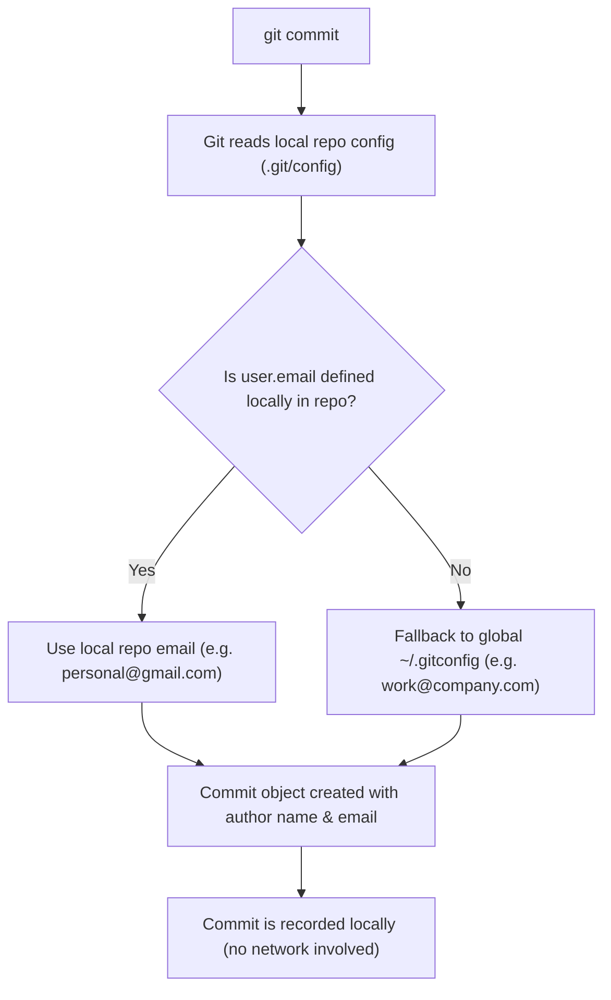
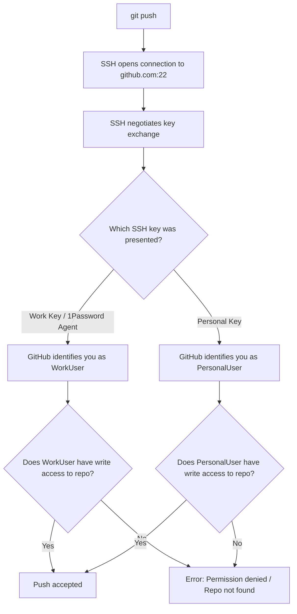

# Using Multiple GitHub Accounts on the Same Machine

If you use your primary development laptop for both your company job and personal projects or open source contributions, you quickly run into a classic problem:

1. **Permission Denied**: You try to push to your personal repository, and GitHub rejects you with `Permission to user/repo denied to work-user` or `Repository not found`.
2. **Identity Leak**: You successfully push a commit to your personal repo, but the commit shows up on GitHub with your corporate avatar and company email address.

Both issues happen because Git and SSH treat **network authentication** and **commit authorship** as two completely separate things.

This guide explains why this happens, how to configure your system for both accounts, and the two main approaches to manage them cleanly.

---

## Why This Happens: Authentication vs. Authorship

To master multiple accounts, you must understand what happens during `git commit` (authorship) versus `git push` (authentication).

### 1. The Git Layer: Authorship (`git commit`)

When you run `git commit`, Git does not connect to the network or consult SSH keys. It creates a local commit containing whatever author values are defined in your configuration:



If you configure your work email globally (`git config --global user.email "work@company.com"`), **any repository where you haven't explicitly set a local email will silently use your work email**.

> [!IMPORTANT]
> GitHub uses the email inside the commit object to attribute commits to profiles and display user avatars in PRs. That is why you can push successfully with your personal SSH key, but still see your work avatar on the commit if `user.email` was not changed locally!

### 2. The SSH Layer: Authentication (`git push`)

When you run `git push` or `git fetch`, Git does not tell GitHub your email. Git hands off network communication to **SSH**.



SSH sends a cryptographic signature using your SSH private key. GitHub looks up that public key in its database to see which account owns it:
- If GitHub sees your work SSH key, it assumes you are your work user.
- If your work user does not have write permissions to your personal repository `jose-oc/my-project`, GitHub rejects the connection immediately.

---

## Method 1: SSH Host Aliases (Recommended)

This is the standard, most reliable approach. You define custom "Host" aliases in `~/.ssh/config` so SSH knows which key to use depending on the hostname.

### Step 1: Configure `~/.ssh/config`

Edit or create `~/.ssh/config`:

```text
# Default: Work GitHub Account (uses 1Password SSH Agent or work key)
Host github.com
  HostName github.com
  User git
  IdentityAgent "~/Library/Group Containers/2BUA8C4S2C.com.1password/t/agent.sock"
  IdentityFile ~/.ssh/id_ed25519_work.pub
  IdentitiesOnly yes

# Personal GitHub Account
Host github-jose
  HostName github.com
  User git
  IdentityFile ~/.ssh/id_ed25519_personal
  IdentitiesOnly yes
```

> [!WARNING]
> Always include `IdentitiesOnly yes`. Without it, SSH may offer all keys loaded in your SSH agent or default identity files first. If the server sees your work key first and matches it, GitHub will reject the personal repository operation before SSH ever tries your personal key.

### Step 2: Use the Host Alias in Personal Repositories

When cloning a personal repository, replace `github.com` with your alias `github-jose`:

```bash
git clone git@github-jose:jose-oc/my-personal-project.git
```

If you already cloned the repository with the default `github.com` URL, update the remote URL:

```bash
git remote set-url origin git@github-jose:jose-oc/my-personal-project.git
```

### Step 3: Set Your Local Author Email

Inside the personal repository directory, configure your personal identity:

```bash
git config user.name "Jose"
git config user.email "jose@mail.com"
```

> [!TIP]
> Notice there is no `--global` flag here. This writes the settings directly to `.git/config` inside that specific repository, overriding your global work email.

---

## Method 2: Per-Repository `core.sshCommand`

If you prefer to keep standard Git remote URLs (`git@github.com:owner/repo.git`) without modifying `~/.ssh/config` aliases, Git allows you to specify a custom SSH command per repository.

### Step 1: Configure the Repository

Inside your personal repository, run:

```bash
git config core.sshCommand 'ssh -i ~/.ssh/id_ed25519_personal -o IdentitiesOnly=yes'
git config user.email "jose@mail.com"
```

### How It Works

- `core.sshCommand` tells Git: *"Whenever you run network commands (push, pull, fetch) for this specific repo, run `ssh` with this exact private key and ignore all other agent identities."*
- `user.email` ensures all commits authored in this repo use your personal email.

### Comparing Both Methods

| Feature | Method 1: SSH Host Alias (`~/.ssh/config`) | Method 2: `core.sshCommand` |
| :--- | :--- | :--- |
| **Remote URL** | Modified (`git@github-jose:...`) | Standard (`git@github.com:...`) |
| **SSH Config File** | Requires entries in `~/.ssh/config` | Works without touching `~/.ssh/config` |
| **1Password / Agent Integration** | Native and flexible per host | Configured in command string |
| **Cloning Experience** | Clone directly with `git clone git@github-jose:...` | Clone first, then set local config |

---

## Bonus: Automate with `includeIf` (Never Forget Your Email)

The biggest headache with both methods is remembering to run `git config user.email` every time you clone a new personal repository.

Git provides a built-in solution: conditional includes based on directory paths.

### 1. Organize Your Repositories by Folder

Keep your projects in separate root folders:

```text
~/code/
├── work/
│   ├── api-backend/
│   └── frontend-dashboard/
└── personal/
    ├── blog/
    └── open-source-tool/
```

### 2. Configure `~/.gitconfig`

In your global `~/.gitconfig`, set your work identity as default, and include a personal config for anything inside `~/code/personal/`:

```ini
[user]
    name = Jose
    email = jose.work@company.com

# Automatically load personal settings for all repos in ~/code/personal/
[includeIf "gitdir:~/code/personal/"]
    path = ~/.gitconfig-personal
```

### 3. Create `~/.gitconfig-personal`

Create `~/.gitconfig-personal`:

```ini
[user]
    name = Jose
    email = jose@mail.com

[core]
    sshCommand = ssh -i ~/.ssh/id_ed25519_personal -o IdentitiesOnly=yes
```

Now, every repository inside `~/code/personal/` will automatically use your personal email and personal SSH key without running any manual setup commands.

---

## Verification & Troubleshooting

### 1. Test Your SSH Connection
Verify that GitHub recognizes your keys correctly:

```bash
# Test default (Work) account:
ssh -T git@github.com
# Output: Hi work-user! You've successfully authenticated...

# Test personal alias:
ssh -T git@github-jose
# Output: Hi jose-oc! You've successfully authenticated...
```

If it fails or authenticates as the wrong user, run `ssh -vT git@github-jose` to inspect the offered keys.

### 2. Verify Which Email Git is Using
Inside any repository, check the effective email and where it comes from:

```bash
git config --show-origin user.email
```

Output example:
```text
file:.git/config    jose@mail.com
```

### 3. How to Fix Commits Made with the Wrong Email

If you made unpushed commits with your work email in a personal repo:

1. Update your local email:
   ```bash
   git config user.email "jose@mail.com"
   ```

2. Amend the last commit with the new author info:
   ```bash
   git commit --amend --reset-author --no-edit
   ```

3. If you have several commits, run an interactive rebase (`git rebase -i HEAD~N`) and re-commit them with `--reset-author`.

---

## Quick Reference Summary

To use your personal GitHub account in a repository on a work machine:

```bash
# 1. Update remote URL to use your SSH Host alias
git remote set-url origin git@github-jose:OWNER/REPO.git

# 2. Set your personal commit email
git config user.email "jose@mail.com"
```

Or using the one-liner command override:

```bash
git config core.sshCommand 'ssh -i ~/.ssh/id_ed25519_personal -o IdentitiesOnly=yes'; \
git config user.email "jose@mail.com"
```
