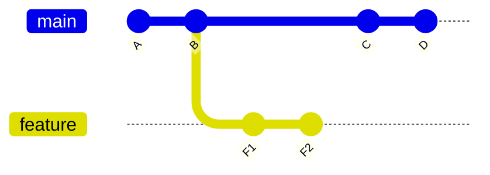
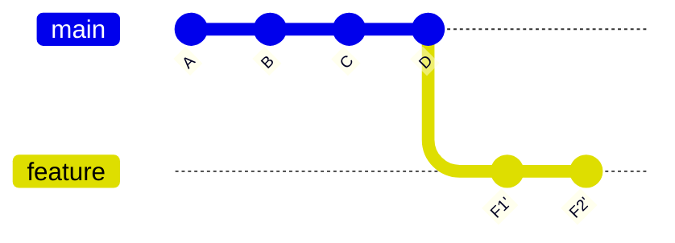
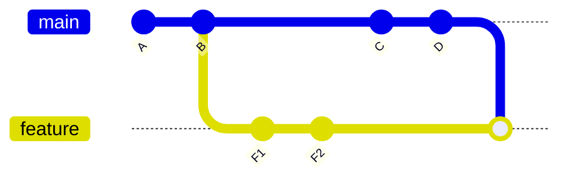
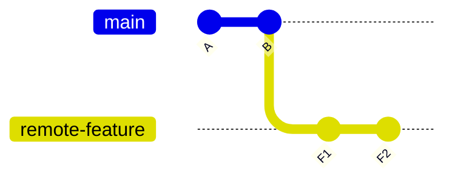
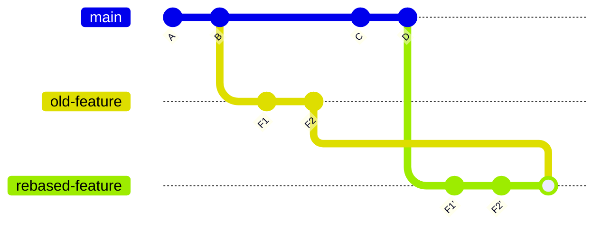

# Git Rebase Without Fear

This guide is for people who use Git every day for `commit` and `push`, but feel lost when someone says:

- "rebase your branch"
- "you rewrote history"
- "use `--force-with-lease`"
- "don’t merge after rebasing"

If that sounds familiar, this is for you.


## The Short Version

`git rebase` takes your branch's commits and replays them on top of another branch, usually `main`.

That means:

- your code changes stay
- your commit IDs change
- Git history becomes linear and easier to review

The most important consequence is this:

After a rebase, your branch is no longer the same branch history that exists on GitHub.

So if the branch already exists on GitHub, you usually must push it with:

```bash
git push --force-with-lease
```

> [!IMPORTANT]
> Not plain `git push`.

## What Rebase Means

Imagine this history:



`feature` started from `B`.

Later, `main` moved forward to `C` and `D`.

Now your branch is based on old history. A rebase says:

"Take `F1` and `F2`, and replay them as if they had been created on top of `D`."

After rebasing:



Notice the apostrophes.

`F1'` and `F2'` are not the original commits. They are new commits with the same intent, but new IDs.

That is why rebasing is called "rewriting history".

## Why Teams Ask For Rebase

Rebasing is often used to:

- keep a PR clean
- avoid extra merge commits
- make the diff easier to review
- place feature commits on top of the latest `main`

For a reviewer, this:



is often noisier than this:


## The Safe Way To Rebase Your Branch

If your goal is "update my branch with the latest `main` and keep the PR clean", this is the usual flow:

```bash
git fetch origin
git checkout <your-branch>
git rebase origin/main
git push --force-with-lease
```


### What each command does

`git fetch origin`

- downloads the latest branch information from GitHub
- does not change your files

`git checkout <your-branch>`

- moves you to your feature branch

`git rebase origin/main`

- replays your branch commits on top of the latest `main`

`git push --force-with-lease`

- updates the remote branch with your new rewritten history
- safely refuses if someone else updated the branch unexpectedly

## Why `--force-with-lease` Matters

After a rebase, GitHub still has the old version of your branch.

Your local branch now points to new commit IDs.

Plain `git push` usually fails because Git sees this as "history went backwards".

`--force-with-lease` tells Git:

"Yes, I know the branch history changed. Replace the remote branch, but only if nobody else changed it behind my back."

That is much safer than `--force`.

## What You Should Not Do

This is the part that prevents messy PRs.

### 1. Do not rebase and then forget to force-push

Bad flow:

```bash
git fetch origin
git checkout my-feature
git rebase origin/main
```

Then later:

```bash
git pull
```

or:

```bash
git merge origin/my-feature
```

This is where things often go wrong.

Why? Because:

- your local branch now has rewritten commits
- the remote branch still has the old commits
- Git may try to combine both histories instead of replacing one with the other

That can produce a branch that contains:

- old feature commits
- new rebased feature commits
- a merge commit tying them together

Result: a noisy PR with duplicated history.

### 2. Do not merge the old remote branch back into your rebased branch

This is the classic mistake behind "Why does my PR show tons of weird commits?"

Before rebase:


After rebase, locally:


But GitHub still has the old branch:



If you now merge the remote branch into your rebased branch, you get both histories:



That is the mess.

### 3. Do not use rebase casually on shared branches unless you know who else is using them

Rebase changes commit IDs.

If two people are both working on the same branch, rebasing can confuse the other person's local history.

If the branch is shared:

- tell people before rebasing
- coordinate the force-push
- or create a fresh branch instead

## What To Do If Rebase Shows Conflicts

If Git stops during rebase, it means two changes touched the same area.

Typical flow:

```bash
git fetch origin
git checkout my-feature
git rebase origin/main
```

Then Git pauses.

At that point:

1. Fix the files Git mentions.
2. Mark them resolved:

```bash
git add <file>
```

3. Continue:

```bash
git rebase --continue
```

If you panic and want to cancel:

```bash
git rebase --abort
```

That puts you back where you started before the rebase.

## A Good Mental Model

Think of rebase as:

"Take my work, keep the content, rebuild the path."

Think of merge as:

"Join two paths together."

That is why rebasing and then merging the old path back in is usually the wrong combination.

## A Simple Rule To Remember

If you rebased a branch that already exists on GitHub:

1. rebase
2. test if needed
3. push with `--force-with-lease`
4. do not merge the old remote branch back into it

## Practical Example

Clean flow:

```bash
git fetch origin
git checkout feature/improvement-a
git rebase origin/main
git push --force-with-lease
```

Messy flow:

```bash
git fetch origin
git checkout feature/improvement-a
git rebase origin/main
git pull
```

or:

```bash
git fetch origin
git checkout feature/improvement-a
git rebase origin/main
git merge origin/feature/improvement-a
```

The second pattern is how people accidentally end up with duplicated branch history in a PR.

## When To Prefer A New Branch Instead

Sometimes the history is already too tangled.

In that case, the cleanest fix is:

1. create a new branch from current `main`
2. cherry-pick or re-apply the real feature commits
3. push that new branch
4. open a new PR

This is often less risky than trying to rescue a badly tangled branch in place.

## Final Advice

If you are not fully confident, use this checklist:

- `git fetch origin`
- make sure you are on your feature branch
- run `git rebase origin/main`
- if conflicts happen, resolve them carefully
- when done, push with `git push --force-with-lease`
- do not merge the remote branch back into your rebased branch

That one habit prevents a lot of painful PR cleanup.

## Quick Reference

The safest everyday rebase flow:

```bash
git fetch origin
git checkout <your-branch>
git rebase origin/main
git push --force-with-lease
```

The one-line lesson:

**A rebase changes commit IDs, so the remote branch must usually be updated with `--force-with-lease`, not merged back into your local rebased branch.**

If you want a shorter reference, see the [Git Rebase Cheat Sheet](/docs/git/rebase-cheat-sheet).
