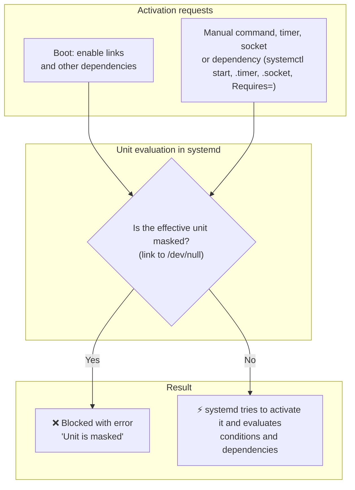

When managing background services on Ubuntu and Debian-based systems, administrators frequently need to prevent certain services from running. Whether you are tuning a lean cloud image, stopping Ubuntu's automated background updates from locking the APT database during CI/CD runs, or resolving daemon port conflicts, managing the service lifecycle is essential.

However, standard systemd commands like `systemctl stop` and `systemctl disable` do not guarantee that a service will stay down.

To stop systemd from starting a unit—whether triggered by timers, sockets, dependencies, or accidental manual commands—you can **mask** it. An effective mask blocks activation through systemd for as long as it stays in place.

Here is a practical guide explaining how systemd masking works, how it compares to `stop` and `disable`, and how to use it safely with real-world examples.

---

## The Three Levels of Service Control: Stop vs. Disable vs. Mask

System administrators often confuse what `stop`, `disable`, and `mask` actually accomplish:



> [!NOTE]
> `enable` is not a gate for every start: a manual `systemctl start` does not need the unit to be enabled, and being enabled does not guarantee the process ends up starting successfully. `enable` only adds links that generate activation requests at boot.

### 1. `systemctl stop` (Runtime Only)
* **What it does**: Halts the running process immediately.
* **What it does not do**: It does not change any configuration on disk.
* **Why it starts again**: After a `stop`, the service can start again if another service, timer, socket, or administrator triggers it. On reboot it only comes back if something activates it at boot (for example an `enable` link or a dependency), but there is no guarantee it will not.

```bash
sudo systemctl stop apt-daily.service
```

### 2. `systemctl disable` (Enable Link Removal)
* **What it does**: Removes the unit's enable links (such as `/etc/systemd/system/multi-user.target.wants/<unit>.service`), so that mechanism no longer activates it at boot. It does not stop the unit or prevent other activations, including during boot (dependencies, timers, sockets).
* **`static` units**: a unit with no `[Install]` section, like `apt-daily.service`, is `static`; it has no enable links to remove, so `disable` does nothing to it. In that case, act on the timer that activates it.
* **What it does not do**: It does not stop a currently running instance, nor does it block on-demand activation.
* **Why it starts again**: An administrator can still run `systemctl start`, or another active service with a `Wants=` or `Requires=` dependency can trigger it, or a companion `.timer` / `.socket` unit can start it.

```bash
sudo systemctl disable apt-daily.timer

# disable does not stop the timer if it is already active.
# To disable and stop it at the same time:
sudo systemctl disable --now apt-daily.timer
```

### 3. `systemctl mask` (Total Block)
* **What it does**: Symlinks the service unit configuration file directly to `/dev/null`.
* **What it achieves**: While the mask is effective, systemd rejects any attempt to start the unit through it—manually, at boot, via timer, or via dependency—with an explicit error. It does not isolate the binary and is not a barrier against an administrator who can change the configuration.
* **How to restore**: The usual way is `systemctl unmask`.

```bash
sudo systemctl mask apt-daily.service
```

> [!NOTE]
> `mask` is especially useful for package units that live in the vendor directory. If you created the unit yourself in `/etc/systemd/system` or `/run/systemd/system`, `mask` can fail because the file already exists (`already exists`). Inspect where the unit comes from and keep its definition before deciding how to handle it; do not delete a local unit blindly.

---

## Comparison Summary

| Feature / Behavior | `systemctl stop` | `systemctl disable` | `systemctl mask` |
| :--- | :---: | :---: | :---: |
| **Terminates running process?** | ✅ Yes | ❌ No (requires manual stop) | ❌ No (requires manual stop) |
| **Removes boot enable links?** | ❌ No | ✅ Yes (if the unit has `[Install]`) | ⚠️ No, but it blocks activation |
| **Prevents manual `systemctl start`?** | ❌ No | ❌ No | ✅ Yes (fails with error) |
| **Prevents timer or socket activation?** | ❌ No | ❌ No | ✅ Yes |
| **Prevents dependency triggering (`Requires=`)?** | ❌ No | ❌ No | ✅ Yes |
| **Survives package updates?** | N/A | ⚠️ Sometimes overwritten | ✅ Yes |

> [!NOTE]
> `systemctl mask` and `systemctl disable` only modify how systemd loads the unit configuration. To immediately terminate a running service while masking it, combine the command with `--now`:
> ```bash
> sudo systemctl mask --now <service-name>
> ```

---

## How Masking Works Under the Hood

Systemd determines which configuration file to load by searching directories in a specific order of precedence:

As a simplification for common package-installed units:

1. `/etc/systemd/system/` (Local system administrator configuration — higher priority)
2. `/run/systemd/system/` (Runtime / ephemeral units generated during current boot)
3. `/lib/systemd/system/` or `/usr/lib/systemd/system/` (Default package vendor units — lower priority)

The full load path includes other locations, for example transient units and `generator.early`. The manual also lists `system.control` directories above `/etc/systemd/system`.

When you execute `sudo systemctl mask apt-daily.service`, systemd creates a symbolic link:

```bash
/etc/systemd/system/apt-daily.service -> /dev/null
```

*Illustrative output; format and details may vary with the systemd version and the unit state.*

```text
$ ls -l /etc/systemd/system/apt-daily.service
lrwxrwxrwx 1 root root 9 Oct  1 12:00 /etc/systemd/system/apt-daily.service -> /dev/null
```

Because `/etc/systemd/system/` overrides `/lib/systemd/system/`, systemd reads the `/dev/null` link instead of the real unit file provided by the package maintainer. As a result, systemd considers the unit invalid and refuses start requests for as long as that link remains the effective definition.

### What Masking Does NOT Do

Masking operates strictly within the systemd process manager. Keep in mind:
* **It does not uninstall the package**: Binaries in `/usr/bin/` or configuration files in `/etc/` remain intact.
* **It does not block direct command-line execution**: If you execute a binary directly (for example, running `sudo apt update` or launching a daemon binary manually), it runs normally because it bypasses systemd.

---

## Practical Examples & Walkthroughs

### Example 1: Silencing Ubuntu Automated APT Background Tasks

Ubuntu servers automatically execute background APT updates and upgrades via two systemd services:
* `apt-daily.service` (downloads package lists and indexes)
* `apt-daily-upgrade.service` (downloads and installs unattended security updates)

These services are triggered by their companion timer units: `apt-daily.timer` and `apt-daily-upgrade.timer`.

In automated environments, CI/CD pipelines, or Ansible provisioning jobs, these background tasks often trigger at unexpected moments, locking `/var/lib/dpkg/lock-frontend` and causing automation scripts to fail.

> [!WARNING]
> Masking these services and timers turns off this automatic update path, **including security updates**. Use it only on disposable CI images or on systems with another explicit patching process, and document when to restore it. Before using `--now`, check that no package installation or configuration is in progress: do not force-interrupt `dpkg`/`apt` to free a lock.

#### A narrower alternative: `Persistent=false`

If the problem is pending runs firing at boot, Canonical documents a less aggressive option: change `Persistent` on the timers instead of blocking the whole mechanism.

```bash
sudo systemctl edit apt-daily.timer
sudo systemctl edit apt-daily-upgrade.timer
```

In each override:

```ini
[Timer]
Persistent=false
```

`Persistent=false` prevents catching up on a run missed while the machine was off and keeps the next scheduled runs. It does not remove every chance of two package processes colliding.

#### Step 1: Stop and Mask Services and Timers

If you still need to silence both the timers and the services:

```bash
# Stop running instances and mask services & timers simultaneously
sudo systemctl mask --now apt-daily.service apt-daily.timer apt-daily-upgrade.service apt-daily-upgrade.timer
```

Systemd will confirm the creation of the symlinks (illustrative output; format may vary with the systemd version):

```text
Created symlink /etc/systemd/system/apt-daily.service → /dev/null.
Created symlink /etc/systemd/system/apt-daily.timer → /dev/null.
Created symlink /etc/systemd/system/apt-daily-upgrade.service → /dev/null.
Created symlink /etc/systemd/system/apt-daily-upgrade.timer → /dev/null.
```

#### Step 2: Verify the Masked State

Check the status of the masked service:

```bash
systemctl status apt-daily.service
```

Illustrative output; format and details may vary with the systemd version and the unit state:
```text
○ apt-daily.service
     Loaded: masked (Reason: Unit apt-daily.service is masked.)
     Active: inactive (dead)
```

#### Step 3: Test What Happens When Starting a Masked Service

If another script or admin tries to start the service:

```bash
sudo systemctl start apt-daily.service
```

Systemd immediately rejects the request:

```text
Failed to start apt-daily.service: Unit apt-daily.service is masked.
```

#### Step 4: Verify Direct Commands Still Function

Masking the systemd service does not impede normal manual operations. Masking these units does not prevent running APT manually:

```bash
sudo apt update
sudo apt upgrade
```

The operation is still subject to locks held by other processes, the state of `dpkg`, and the usual package manager errors. Running the commands separately lets you review the changes before accepting them.

---

### Example 2: Finding All Masked Services on Your System

To view every unit currently masked on your machine:

```bash
systemctl list-unit-files --state=masked,masked-runtime
```

`masked` identifies persistent masks and `masked-runtime` identifies temporary ones (`--runtime`). Filtering on `masked` alone will not show the latter.

Example output (illustrative; format may vary):
```text
UNIT FILE                  STATE  PRESET 
apt-daily-upgrade.service  masked enabled
apt-daily-upgrade.timer    masked enabled
apt-daily.service          masked enabled
apt-daily.timer            masked enabled

4 unit files listed.
```

---

### Example 3: Temporary Masking for Maintenance Windows (`--runtime`)

If you want to prevent a service from starting during a maintenance window or troubleshooting session, but want the block automatically removed on the next system reboot, use the `--runtime` flag:

```bash
sudo systemctl mask --runtime --now nginx.service
```

`--runtime` creates the symlink under `/run/systemd/system/nginx.service -> /dev/null`, and `--now` also stops the service if it is already running (without `--now`, `mask --runtime` does not stop an nginx that is already up). Because `/run` is a temporary in-memory filesystem (`tmpfs`), the mask is discarded upon reboot.

To remove it without rebooting, and start the service only when appropriate:

```bash
sudo systemctl unmask --runtime nginx.service
sudo systemctl start nginx.service
```

> [!NOTE]
> A definition with the same name in `/etc/systemd/system` takes precedence over the mask in `/run/systemd/system`. A reboot removes the runtime mask, but does not by itself guarantee that the service starts: that depends on the remaining configuration.

---

## How to Unmask and Restore a Service

When you are ready to re-enable a masked service, use `systemctl unmask`:

```bash
# 1. Remove the /dev/null mask symlink
sudo systemctl unmask apt-daily.service apt-daily.timer apt-daily-upgrade.service apt-daily-upgrade.timer

# 2. Re-enable the timers or services if you want them active on boot
sudo systemctl enable --now apt-daily.timer apt-daily-upgrade.timer
```

Output of unmask (illustrative; format may vary):
```text
Removed /etc/systemd/system/apt-daily.service.
Removed /etc/systemd/system/apt-daily.timer.
Removed /etc/systemd/system/apt-daily-upgrade.service.
Removed /etc/systemd/system/apt-daily-upgrade.timer.
```

> [!WARNING]
> Unmasking a service only removes the `/dev/null` link; it does not automatically enable or start the unit. Remember to run `systemctl enable` or `systemctl start` afterwards if you need the service active.

---

## Best Practices & Key Takeaways

1. **Always mask companion timers and sockets**: If a service has an accompanying `.timer` (e.g. `apt-daily.timer`) or `.socket` (e.g. `cups.socket`), masking only the `.service` can leave the timer firing in the background and generating log noise. Mask both.
2. **Combine with `--now` for instant shutdown**: By default, `systemctl mask <unit>` only prevents future starts. Use `systemctl mask --now <unit>` to stop the running daemon immediately, after checking that no critical operation is in progress.
3. **Use masking instead of deleting system unit files**: Never delete vendor files in `/lib/systemd/system/`. Package updates will restore them anyway. Masking cleanly overrides them in `/etc/systemd/system/`.
4. **Inspect masked units during troubleshooting**: If a service fails to start with `Unit is masked`, check `systemctl list-unit-files --state=masked,masked-runtime` to verify why the override was put in place.
