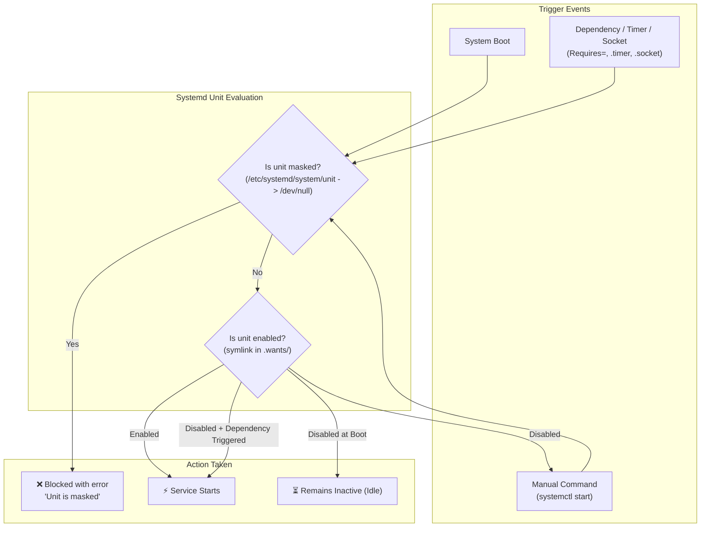

When managing background services on Ubuntu and Debian-based systems, administrators frequently need to prevent certain services from running. Whether you are tuning a lean cloud image, stopping Ubuntu's automated background updates from locking the APT database during CI/CD runs, or resolving daemon port conflicts, managing the service lifecycle is essential.

However, standard systemd commands like `systemctl stop` and `systemctl disable` do not guarantee that a service will stay down.

To make a unit completely impossible to start—even if triggered by timers, sockets, dependencies, or accidental manual commands—you must **mask** the service.

Here is a practical guide explaining how systemd masking works, how it compares to `stop` and `disable`, and how to use it safely with real-world examples.

---

## The Three Levels of Service Control: Stop vs. Disable vs. Mask

System administrators often confuse what `stop`, `disable`, and `mask` actually accomplish:



### 1. `systemctl stop` (Runtime Only)
* **What it does**: Halts the running process immediately.
* **What it does not do**: It does not change any configuration on disk.
* **Why it starts again**: The service will start again on the next reboot, or immediately if another service, timer, socket, or administrator triggers it.

```bash
sudo systemctl stop apt-daily.service
```

### 2. `systemctl disable` (Boot Link Removal)
* **What it does**: Removes the boot target symlink (such as `/etc/systemd/system/multi-user.target.wants/<unit>.service`). The service will no longer start automatically at system startup.
* **What it does not do**: It does not stop a currently running instance, nor does it block on-demand activation.
* **Why it starts again**: An administrator can still run `systemctl start`, or another active service with a `Wants=` or `Requires=` dependency can trigger it, or a companion `.timer` / `.socket` unit can start it.

```bash
sudo systemctl disable apt-daily.service
```

### 3. `systemctl mask` (Total Block)
* **What it does**: Symlinks the service unit configuration file directly to `/dev/null`.
* **What it guarantees**: Systemd treats the unit as non-existent or permanently forbidden. Any attempt to start it—manually, via boot, via timer, or via dependency—fails immediately with an explicit error.
* **How to restore**: The only way to start it again is through `systemctl unmask`.

```bash
sudo systemctl mask apt-daily.service
```

---

## Comparison Summary

| Feature / Behavior | `systemctl stop` | `systemctl disable` | `systemctl mask` |
| :--- | :---: | :---: | :---: |
| **Terminates running process?** | ✅ Yes | ❌ No (requires manual stop) | ❌ No (requires manual stop) |
| **Prevents automatic boot startup?** | ❌ No | ✅ Yes | ✅ Yes |
| **Prevents manual `systemctl start`?** | ❌ No | ❌ No | ✅ Yes (fails with error) |
| **Prevents timer or socket activation?** | ❌ No | ❌ No | ✅ Yes |
| **Prevents dependency triggering (`Requires=`)?** | ❌ No | ❌ No | ✅ Yes |
| **Survives package updates?** | N/A | ⚠️ Sometimes overwritten | ✅ Yes |

> [!NOTE]
> `systemctl mask` and `systemctl disable` only modify how systemd loads the unit configuration. To immediately terminate a running service while masking it, combine the command with `--now`:
> ```bash
> sudo systemctl mask --now <service-name>
> ```

---

## How Masking Works Under the Hood

Systemd determines which configuration file to load by searching directories in a specific order of precedence:

1. `/etc/systemd/system/` (Local system administrator configuration — **highest priority**)
2. `/run/systemd/system/` (Runtime / ephemeral units generated during current boot)
3. `/lib/systemd/system/` or `/usr/lib/systemd/system/` (Default package vendor units — **lowest priority**)

When you execute `sudo systemctl mask apt-daily.service`, systemd creates a symbolic link:

```bash
/etc/systemd/system/apt-daily.service -> /dev/null
```

```text
$ ls -l /etc/systemd/system/apt-daily.service
lrwxrwxrwx 1 root root 9 Oct  1 12:00 /etc/systemd/system/apt-daily.service -> /dev/null
```

Because `/etc/systemd/system/` overrides `/lib/systemd/system/`, systemd reads the `/dev/null` link instead of the real unit file provided by the package maintainer. As a result, systemd considers the unit invalid and refuses any request to start it.

### What Masking Does NOT Do

Masking operates strictly within the systemd process manager. Keep in mind:
* **It does not uninstall the package**: Binaries in `/usr/bin/` or configuration files in `/etc/` remain intact.
* **It does not block direct command-line execution**: If you execute a binary directly (for example, running `sudo apt update` or launching a daemon binary manually), it runs normally because it bypasses systemd.

---

## Practical Examples & Walkthroughs

### Example 1: Silencing Ubuntu Automated APT Background Tasks

Ubuntu servers automatically execute background APT updates and upgrades via two systemd services:
* `apt-daily.service` (downloads package lists and indexes)
* `apt-daily-upgrade.service` (downloads and installs unattended security updates)

These services are triggered by their companion timer units: `apt-daily.timer` and `apt-daily-upgrade.timer`.

In automated environments, CI/CD pipelines, or Ansible provisioning jobs, these background tasks often trigger at unexpected moments, locking `/var/lib/dpkg/lock-frontend` and causing automation scripts to fail.

#### Step 1: Stop and Mask Services and Timers

To permanently silence both the timers and the services:

```bash
# Stop running instances and mask services & timers simultaneously
sudo systemctl mask --now apt-daily.service apt-daily.timer apt-daily-upgrade.service apt-daily-upgrade.timer
```

Systemd will confirm the creation of the symlinks:

```text
Created symlink /etc/systemd/system/apt-daily.service → /dev/null.
Created symlink /etc/systemd/system/apt-daily.timer → /dev/null.
Created symlink /etc/systemd/system/apt-daily-upgrade.service → /dev/null.
Created symlink /etc/systemd/system/apt-daily-upgrade.timer → /dev/null.
```

#### Step 2: Verify the Masked State

Check the status of the masked service:

```bash
systemctl status apt-daily.service
```

Output:
```text
○ apt-daily.service
     Loaded: masked (Reason: Unit apt-daily.service is masked.)
     Active: inactive (dead)
```

#### Step 3: Test What Happens When Starting a Masked Service

If another script or admin tries to start the service:

```bash
sudo systemctl start apt-daily.service
```

Systemd immediately rejects the request:

```text
Failed to start apt-daily.service: Unit apt-daily.service is masked.
```

#### Step 4: Verify Direct Commands Still Function

Masking the systemd service does not impede normal manual operations. You can still manage packages manually whenever you want:

```bash
sudo apt update && sudo apt upgrade -y
```

This runs without any issues because manual execution does not call `apt-daily.service`.

---

### Example 2: Finding All Masked Services on Your System

To view every unit currently masked on your machine:

```bash
systemctl list-unit-files --state=masked
```

Example output:
```text
UNIT FILE                  STATE  PRESET 
apt-daily-upgrade.service  masked enabled
apt-daily-upgrade.timer    masked enabled
apt-daily.service          masked enabled
apt-daily.timer            masked enabled

4 unit files listed.
```

---

### Example 3: Temporary Masking for Maintenance Windows (`--runtime`)

If you want to prevent a service from starting during a maintenance window or troubleshooting session, but want the block automatically removed on the next system reboot, use the `--runtime` flag:

```bash
sudo systemctl mask --runtime nginx.service
```

This creates the symlink under `/run/systemd/system/nginx.service -> /dev/null`. Because `/run` is a temporary in-memory filesystem (`tmpfs`), the mask is discarded upon reboot.

---

## How to Unmask and Restore a Service

When you are ready to re-enable a masked service, use `systemctl unmask`:

```bash
# 1. Remove the /dev/null mask symlink
sudo systemctl unmask apt-daily.service apt-daily.timer apt-daily-upgrade.service apt-daily-upgrade.timer

# 2. Re-enable the timers or services if you want them active on boot
sudo systemctl enable --now apt-daily.timer apt-daily-upgrade.timer
```

Output of unmask:
```text
Removed /etc/systemd/system/apt-daily.service.
Removed /etc/systemd/system/apt-daily.timer.
Removed /etc/systemd/system/apt-daily-upgrade.service.
Removed /etc/systemd/system/apt-daily-upgrade.timer.
```

> [!WARNING]
> Unmasking a service only removes the `/dev/null` link; it does not automatically enable or start the unit. Remember to run `systemctl enable` or `systemctl start` afterwards if you need the service active.

---

## Best Practices & Key Takeaways

1. **Always mask companion timers and sockets**: If a service has an accompanying `.timer` (e.g. `apt-daily.timer`) or `.socket` (e.g. `cups.socket`), masking only the `.service` can leave the timer firing in the background and generating log noise. Mask both.
2. **Combine with `--now` for instant shutdown**: By default, `systemctl mask <unit>` only prevents future starts. Use `systemctl mask --now <unit>` to stop the running daemon immediately.
3. **Use masking instead of deleting system unit files**: Never delete vendor files in `/lib/systemd/system/`. Package updates will restore them anyway. Masking cleanly overrides them in `/etc/systemd/system/`.
4. **Inspect masked units during troubleshooting**: If a service fails to start with `Unit is masked`, check `systemctl list-unit-files --state=masked` to verify why the override was put in place.
