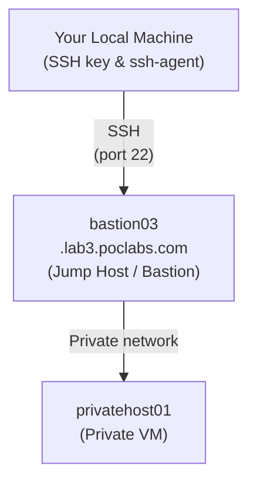
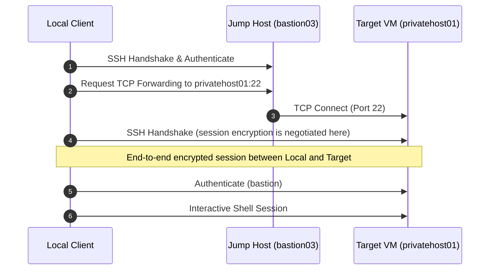

When managing cloud infrastructure or on-premise environments, some virtual machines cannot be reached directly over SSH from your workstation, for example because they sit in a private subnet or behind firewall rules. A jump host that you can reach can act as the entry point. To manage these private virtual machines, administrators often route connections through a **jump host** (also known as a **bastion host**).

An SSH jump host allows you to access private internal machines securely without copying your private SSH keys to intermediary servers or relying on passwords.

---

## Example Scenario

In this guide, we use the following realistic environment:

- **Jump host (Public/Bastion)**: `bastion03.lab3.poclabs.com`
- **Target VM (Internal/Private)**: `privatehost01`
- **Target user**: `bastion`
- **Local SSH key**: `~/.ssh/id_ed25519`

### Network Layout



> [!NOTE]
> The fact that `bastion03.lab3.poclabs.com` has a public DNS record does not mean that `privatehost01` needs a public IP address. DNS simply resolves a hostname to an IP address. The jump host resolves and reaches `privatehost01` directly across its internal, private network interface.

There are two primary methods for reaching target VMs through a jump host: **ProxyJump (`-J`)**, the recommended default, and **Agent Forwarding (`-A`)**, for specific cases.

## Prerequisites

Neither method sets up the network or authorizes keys for you. Before you start you need:

- An SSH server on the bastion and on the target VM.
- Access from your workstation to the bastion.
- The bastion must resolve `privatehost01` and reach its SSH port.
- Your public key authorized for the accounts you will use, **on both servers**.
- The bastion must allow TCP forwarding to the target: check `AllowTcpForwarding`, `PermitOpen`, and any restrictions in `authorized_keys`. Routes and firewalls must allow it too.

> [!WARNING]
> Before accepting a new host key, compare its fingerprint with a trusted source from the administrator. Check the bastion and the target VM separately. Do not disable host key checking just to make it work.

---

## Method 1: ProxyJump (`-J`) — The Modern, Recommended Standard

`ProxyJump` (introduced natively in OpenSSH 7.3) uses the jump host strictly as a network proxy. Your local OpenSSH client establishes an end-to-end encrypted connection directly to the target VM through an encrypted tunnel over the jump host.

### How It Works

```bash
ssh -J bastion@bastion03.lab3.poclabs.com bastion@privatehost01
```

This single command automatically performs the following:

1. Connects and authenticates to `bastion03.lab3.poclabs.com`.
2. Instructs the jump host to open a TCP forwarding channel (`ssh -W`) to `privatehost01:22`.
3. Negotiates end-to-end SSH encryption and authenticates directly to `privatehost01` as `bastion` from your local machine.



### Advantages

- **Single command execution**: Connects straight to the target VM in one step.
- **End-to-end encryption**: The jump host only sees encrypted traffic packets; it cannot inspect your session content.
- **No remote agent socket needed**: ProxyJump does not require Agent Forwarding and does not enable it by itself, so no `$SSH_AUTH_SOCK` is created on the jump host unless some other part of your configuration enables `ForwardAgent`. Keep `ForwardAgent no` if you do not need an agent in a remote session.
- **Tool compatibility**: Works seamlessly with `scp`, `rsync`, `sftp`, and VS Code Remote SSH.

### Important Detail: Target Username

If you do not specify a user in the command, SSH uses the matching `User` directive from your `~/.ssh/config`; if there is none, it uses your local username. You can write `user@host` or set it in `~/.ssh/config`.

```bash
# No User in your config: uses your local username (e.g., 'jose'), which probably does not exist on the VM
ssh -J bastion@bastion03.lab3.poclabs.com privatehost01
```

In standalone commands, state both the jump host user and the target user explicitly:

```bash
# Correct: explicit user on both hops
ssh -J bastion@bastion03.lab3.poclabs.com bastion@privatehost01
```


---

## Recommended Configuration (`~/.ssh/config`)

To streamline your workflow and avoid typing jump host parameters every time, declare the target VM in `~/.ssh/config`:

```ssh-config
# Target private VM
Host privatehost01
  HostName privatehost01
  User bastion
  ProxyJump bastion03.lab3.poclabs.com
  IdentityFile ~/.ssh/id_ed25519
  IdentitiesOnly yes
  ForwardAgent no

# Optional: configure the jump host defaults
Host bastion03.lab3.poclabs.com
  User bastion
  IdentityFile ~/.ssh/id_ed25519
  IdentitiesOnly yes
  ForwardAgent no
```

With this configuration in place, you can connect directly with:

```bash
ssh privatehost01
```

All other standard utilities will automatically honor this tunnel:

```bash
# Copy a file to the private VM
scp ./backup.tar.gz privatehost01:/tmp/

# Sync files with rsync
rsync -avz ./src/ privatehost01:/opt/app/
```

> [!NOTE]
> If you have broader blocks that enable `ForwardAgent` (for example `Host *`), remove or narrow them. In `~/.ssh/config` the first value obtained for an option usually wins, so adding a block at the end does not guarantee it overrides an earlier one.

---

## Method 2: SSH Agent Forwarding (`-A`)

Agent forwarding makes your local SSH authentication agent (`ssh-agent`) available inside your interactive jump-host session.

### How It Works

1. You establish an SSH session with the jump host while forwarding your local agent socket.
2. From the jump-host shell, you initiate a secondary SSH connection to the private VM.
3. When the target VM challenges the jump host for authentication, the jump host proxies the cryptographic challenge back to your local `ssh-agent`.
4. Your local agent signs the challenge and returns the signature. **Your private key never leaves your local workstation.**

```bash
# Step 1: Connect to the jump host with agent forwarding
ssh -A bastion@bastion03.lab3.poclabs.com

# Step 2: From the jump host, connect to the private target VM
ssh bastion@privatehost01
```

### Client Configuration (`~/.ssh/config`)

Instead of specifying flags manually, configure agent forwarding in `~/.ssh/config`:

```ssh-config
# Only for the trusted bastion, not the whole domain
Host bastion03.lab3.poclabs.com
  User bastion
  IdentityFile ~/.ssh/id_ed25519
  ForwardAgent yes
```

### Loading Your Key into the Local Agent

Before connecting, ensure your SSH key is loaded into your local agent. The key must exist and its public key must be authorized on the relevant servers. If your desktop session already provides an agent, you do not need to start a new one:

```bash
# Check the fingerprints of the loaded keys (-L shows the public keys)
ssh-add -l

# If no agent is available, on a Linux shell:
eval "$(ssh-agent -s)"

# Add your key if it is not listed
ssh-add ~/.ssh/id_ed25519
```

Once logged into the jump host, you can verify that the forwarded agent is accessible:

```bash
ssh-add -L
```

### Advantages

- **Interactive flexibility**: Ideal when you need to log into the jump host and run commands or scripts directly from its shell.
- **Multi-target access**: Simplifies hopping between multiple internal servers from a single open jump-host terminal.

### Security Risks & Caveats

> [!WARNING]
> Agent forwarding creates an authentication socket on the remote jump host (accessible via the `$SSH_AUTH_SOCK` environment variable). While remote users or administrators **cannot extract your private key**, anyone with root privileges (or access to your user account) on a compromised jump host could send requests to your active agent socket and authenticate against other systems as you while your session remains open.
>
> Avoid enabling `ForwardAgent yes` globally for all hosts (`Host *`). Only enable it for trusted intermediate bastions.


---

## Comparison: Agent Forwarding vs. ProxyJump

| Feature | Agent Forwarding (`-A`) | ProxyJump (`-J`) |
|---|---|---|
| **Command count** | Usually two (jump, then target) | One direct command |
| **Main purpose** | Expose local authentication agent on jump host | Route encrypted connection through jump host |
| **Final authentication** | Handled from the jump host shell | Handled directly by your local SSH client |
| **Private key copied to jump host** | No | No |
| **Agent socket exposed on jump host** | Yes (`$SSH_AUTH_SOCK`) | No, unless you enable `ForwardAgent` elsewhere |
| **End-to-end session encryption** | No (jump host decrypts its leg) | Yes (tunnel transparent to jump host) |
| **File transfer support (`scp`/`rsync`)** | Requires manual multi-step transfer | Direct single-step transfer |
| **Recommended for simple access** | Generally no | **Yes (Best Practice)** |

---

## Which Method Should You Choose?

### Choose `ProxyJump` (`-J`) when:
- You want direct, secure access to one or more private servers from your local machine.
- You transfer files using `scp`, `sftp`, or `rsync`.
- You use IDEs like VS Code Remote SSH or JetBrains Gateway.
- You want the most secure default that needs no authentication sockets on intermediary bastions.

```bash
ssh -J bastion@bastion03.lab3.poclabs.com bastion@privatehost01
# Or with ~/.ssh/config:
ssh privatehost01
```

### Choose Agent Forwarding (`-A`) when:
- You need to perform interactive sysadmin work directly in the jump-host shell.
- You run orchestration scripts on the jump host that must pull private Git repositories or connect out to internal nodes using your personal credentials.

```bash
ssh -A bastion@bastion03.lab3.poclabs.com
ssh bastion@privatehost01
```

### Summary Rule of Thumb

- **`-J` is for routing network connections** (cleaner, safer, and recommended for direct VM access).
- **`-A` is for delegating authentication permissions** (useful for interactive bastion workflows).
