# Access Your Linux Disks from macOS: UTM, ext4 USB Passthrough, and Shared Folders

If you work on Apple Silicon (M1, M2, M3, M4, or M5) and need to interact with Linux-native filesystems like **ext4**, macOS presents a major roadblock: it cannot natively mount or write to ext4 file systems without unstable kernel extensions or expensive third-party software.

The cleanest and most reliable solution is running an **Ubuntu Server ARM64** virtual machine on top of [UTM](https://mac.getutm.app/). Because Apple Silicon runs on ARM64 architecture, UTM virtualizes Linux at near-native speeds using macOS's built-in Hypervisor framework.

This guide walks you through:

1. **Setting up an Ubuntu ARM64 VM in UTM** for optimal performance.
2. **Passing through external ext4 USB hard drives** directly into the guest VM.
3. **Configuring host-guest shared folders** with `bindfs` to fix macOS UID 501 vs Linux UID 1000 permission conflicts.
4. **Automating mounts** via `/etc/fstab` and troubleshooting common edge cases.

---

## 1. Virtual Machine Setup in UTM

### 1.1 Download and Create VM

1. Download and install [UTM for macOS](https://mac.getutm.app/).
2. Download an official **Ubuntu Server ARM64 ISO** (such as Ubuntu 24.04 LTS ARM64).
3. Open UTM and click **Create a New Virtual Machine** (or the `+` button).

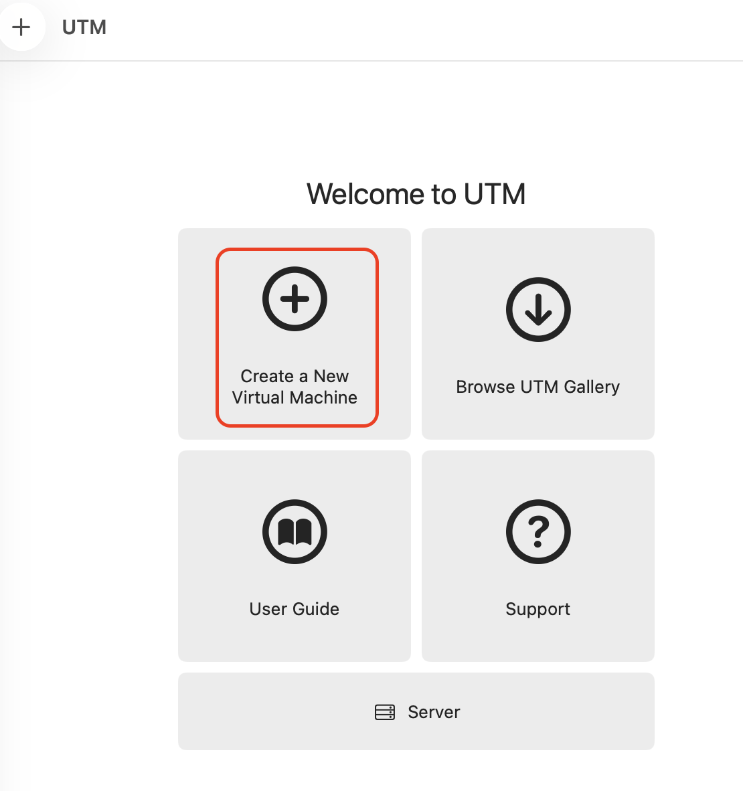

4. On the start screen, choose **Virtualize**.

> [!IMPORTANT]
> Always select **Virtualize** on Apple Silicon Macs when running ARM64 operating systems. Do **not** choose *Emulate* unless you must run legacy x86_64 software, as emulation incurs significant CPU overhead.

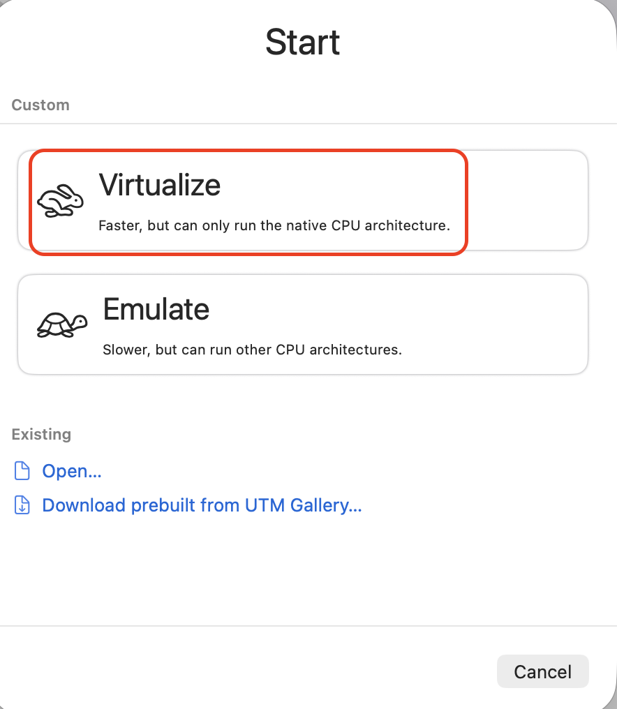

5. Select **Linux** as the Operating System.

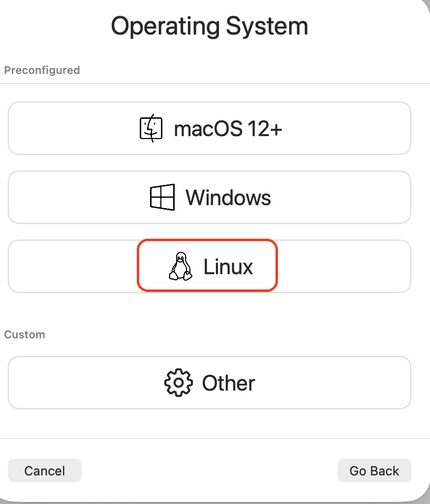

6. Browse and select your downloaded Ubuntu Server ARM64 ISO file.
7. Configure system hardware:
   - **RAM**: Allocate at least **4 GB** (or more depending on your host machine).
   - **CPU Cores**: Allocate at least **4 cores**.
   - **Storage**: Allocate **32 GB to 64 GB** of virtual disk space.
8. Specify a **Shared Directory** path on your Mac that you want to share with the guest (you can refine this later).

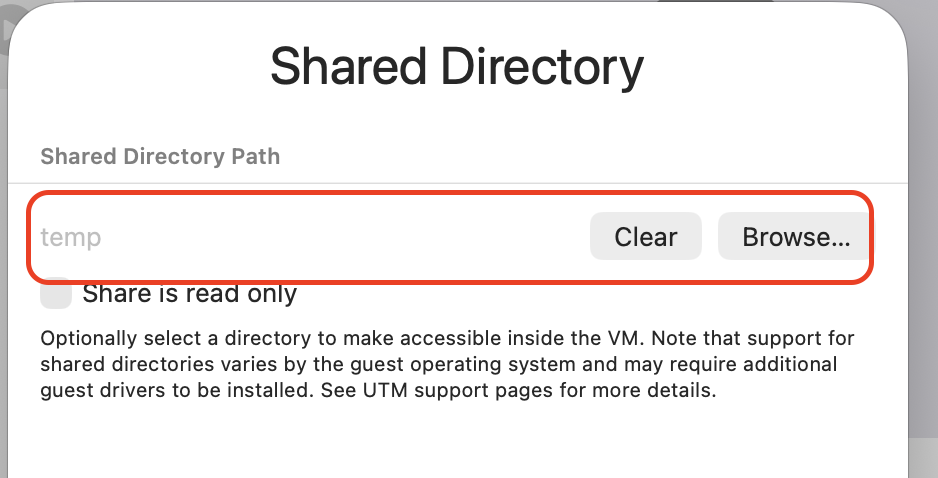

9. Review the settings in the **Summary** screen, check **Open VM Settings**, and click **Save**.

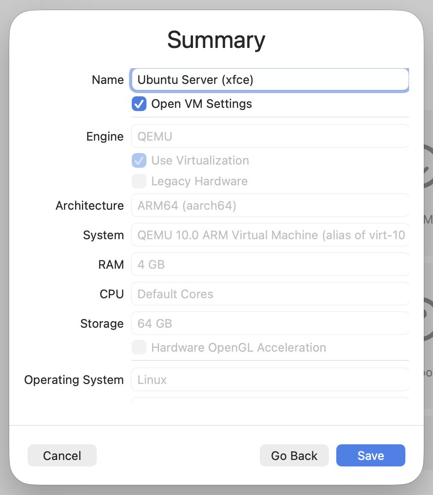

### 1.2 Verify Sharing and USB Settings

Before booting the VM, confirm two critical settings in the VM preferences window:

1. **Sharing Tab**: Confirm the **Directory Share Mode** is set to **VirtFS** (or WebDAV if you prefer the SPICE WebDAV daemon).

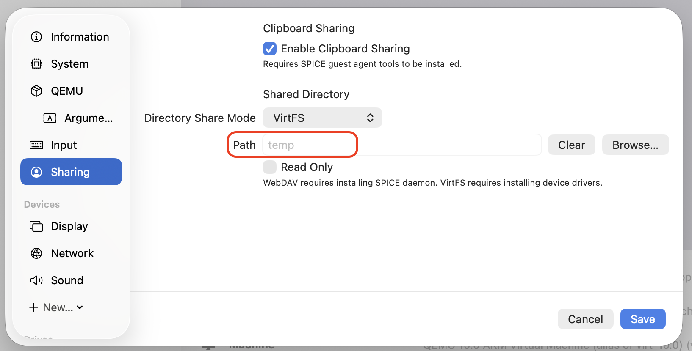

2. **Input Tab**: Under **USB Support**, ensure **USB 3.0 (XHCI)** is selected. This is required for high-speed external hard drive passthrough.

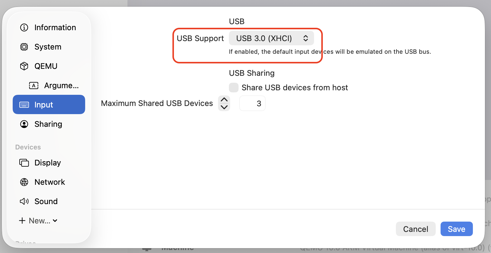

Start the VM and follow the standard Ubuntu installation wizard.

---

## 2. (Optional) Installing a Lightweight Desktop Environment

Ubuntu Server installs in minimal CLI mode. If you prefer a graphical desktop interface, you can install **XFCE (Xubuntu Desktop)** once the initial setup completes:

```bash
sudo apt update
sudo apt install xubuntu-desktop
```

> [!TIP]
> Standard Xubuntu desktop images are not distributed as standalone ARM64 ISOs for Apple Silicon. Installing the official Ubuntu Server ARM64 image and adding `xubuntu-desktop` is the recommended way to get a fast, lightweight XFCE GUI on UTM.

---

## 3. Mounting External ext4 Hard Drives via USB Passthrough

When you attach an ext4 hard drive to a Mac, macOS cannot read the filesystem. If the drive has multiple partitions (such as an EFI FAT partition alongside an ext4 data partition), macOS may automatically mount the FAT partition while locking the raw block device, preventing UTM from attaching the physical drive.

Follow these steps to pass the physical drive cleanly to Ubuntu.

### Step A: Release the Disk from macOS

1. Connect the USB external hard drive to your Mac.
2. If macOS displays the prompt **"The disk you attached was not readable by this computer"**, click **Ignore**.

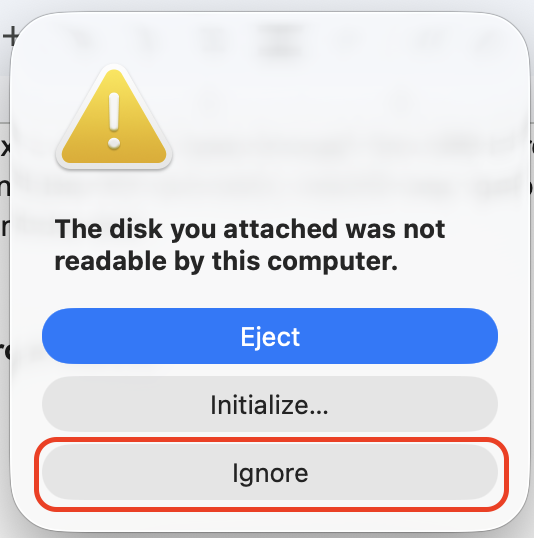

3. Open **Terminal** on macOS and identify the external disk identifier:

```bash
diskutil list
```

Example output:

```text
/dev/disk0 (internal, physical):
   #:                       TYPE NAME                    SIZE       IDENTIFIER
   0:      GUID_partition_scheme                        *1.0 TB     disk0
   ...

/dev/disk4 (external, physical):
   #:                       TYPE NAME                    SIZE       IDENTIFIER
   0:     FDisk_partition_scheme                        *2.0 TB     disk4
   1:                      Linux                         2.0 TB     disk4s1
```

4. Unmount all partitions on that disk without ejecting the physical USB hardware:

```bash
diskutil unmountDisk /dev/disk4
```

You should see:

```text
Unmount of all volumes on disk4 was successful
```

### Step B: Pass Through the USB Device in UTM

1. With the Ubuntu VM running, click the **USB icon** in the top-right toolbar of the UTM window.

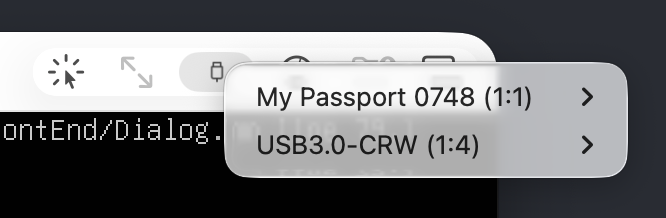

2. Highlight your external drive (for example, `My Passport 0748`) and click **Connect...**.

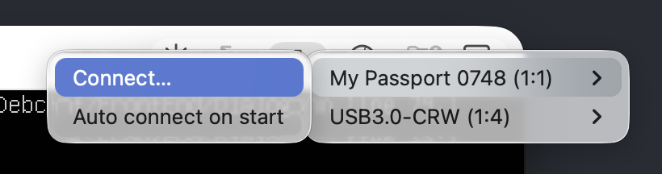

3. When macOS displays the security prompt **"UTM wants to access [Device Name]"**, click **Allow** (or **Always Allow**).

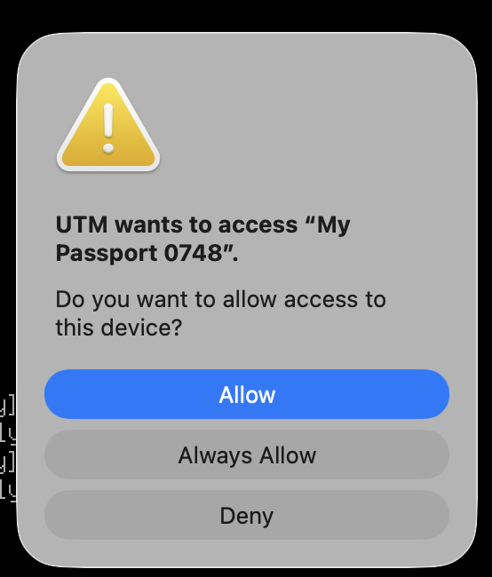

### Step C: Mount the ext4 Partition in Ubuntu

1. Inside your Ubuntu VM terminal, list available storage devices:

```bash
lsblk --output NAME,SIZE,FSTYPE,MOUNTPOINT
```

You will see the passed-through disk (for example, `sda` or `sdb`) along with its ext4 partition (`sda1`):

```shell
jose@ubuserver:~$ lsblk --output NAME,SIZE,FSTYPE,MOUNTPOINT
NAME                        SIZE FSTYPE      MOUNTPOINT
loop0                      43.4M squashfs    /snap/snapd/27709
loop1                      61.9M squashfs    /snap/core24/1644
loop2                         4K squashfs    /snap/bare/5
loop3                     552.9M squashfs    /snap/gnome-46-2404/154
loop4                      91.7M squashfs    /snap/gtk-common-themes/1535
loop5                     188.2M squashfs    /snap/mesa-2404/1836
loop6                     245.1M squashfs    /snap/firefox/8753
loop7                     213.9M squashfs    /snap/thunderbird/1229
sda                         1.8T
└─sda1                      1.8T ext4
sr0                        1024M
vda                          64G
├─vda1                        1G vfat        /boot/efi
├─vda2                        2G ext4        /boot
└─vda3                     60.9G LVM2_member
  └─ubuntu--vg-ubuntu--lv  30.5G ext4        /
```

2. Create a mount point and mount the partition:

```bash
sudo mkdir -p /mnt/external_storage
sudo mount -t ext4 /dev/sda1 /mnt/external_storage
```

3. Verify write permissions and available capacity:

```bash
df -h /mnt/external_storage
```

---

## 4. Shared Folders Setup with Permission Mapping (`bindfs`)

When sharing a folder between macOS (host) and Ubuntu (guest) using VirtFS/9p, you will often encounter permission issues. macOS assigns files to UID `501`, whereas the default non-root user in Ubuntu is UID `1000`.

To fix this seamlessly, we use **bindfs** to create a user-mapped mount overlay.

### Step A: Install Guest Agent and bindfs

Inside the Ubuntu guest terminal, install the required packages:

```bash
sudo apt update
sudo apt install spice-vdagent spice-webdavd bindfs
```

### Step B: Create Raw and Mapped Mount Directories

We create two directories in the user's home folder:
- `~/shares/raw_mac`: The direct VirtFS 9p mount from the host.
- `~/mac_shared`: The permission-remapped mount point with full read/write access.

```bash
mkdir -p ~/shares/raw_mac
mkdir -p ~/mac_shared
```

### Step C: Configure Persistent Mounts in `/etc/fstab`

Open `/etc/fstab` in your preferred editor:

```bash
sudo nano /etc/fstab
```

Add the following entries at the bottom of the file (replace `your_user` with your actual Ubuntu username):

```ini
# 1. Mount the raw 9p share from the macOS host
share  /home/your_user/shares/raw_mac  9p  trans=virtio,version=9p2000.L,uver=9p2000.L,nofail  0  0

# 2. Map macOS host UID 501 to the Ubuntu user for transparent write access
/home/your_user/shares/raw_mac  /home/your_user/mac_shared  fuse.bindfs  map=501/your_user,allow_other,nofail  0  0
```

> [!NOTE]
> The `nofail` option ensures your VM continues to boot cleanly even if the host share is temporarily unavailable.

### Step D: Apply and Verify Mounts

Mount all filesystems defined in `fstab`:

```bash
sudo mount -a
```

Now, any file created or modified in `~/mac_shared` inside Ubuntu will have full read/write permissions and appear immediately on your Mac, with ownership mapped transparently.

---

## 5. Troubleshooting & Edge Cases

| Issue | Likely Cause | Solution |
| :--- | :--- | :--- |
| **Shared folder icon is grayed out** | The guest OS has not mounted the share tag yet. | Verify that `spice-vdagent` is running and check `dmesg \| grep 9p` or run `sudo mount -a`. |
| **Permission Denied in shared folder** | UID mismatch between host (`501`) and guest (`1000`). | Ensure `bindfs` is installed and the `map=501/your_user` entry in `/etc/fstab` specifies your exact Ubuntu username. |
| **USB device not listed in Ubuntu (`lsblk`)** | macOS is still locking the disk or USB passthrough was not triggered in UTM. | Run `diskutil unmountDisk /dev/diskN` in macOS terminal, then open UTM's USB menu and click **Connect...**. |
| **USB connection drops upon guest sleep** | Sleep states can interrupt USB bus enumeration. | In Ubuntu power settings, disable automatic suspend when working with active external storage transfers. |

---

## Summary

With UTM and ARM64 virtualization, running Linux on Apple Silicon is fast and efficient. By pairing `diskutil unmountDisk` with UTM USB 3.0 passthrough and using `bindfs` for UID mapping, you get full read/write access to external ext4 hard drives and seamless host-guest file sharing without performance compromises.
