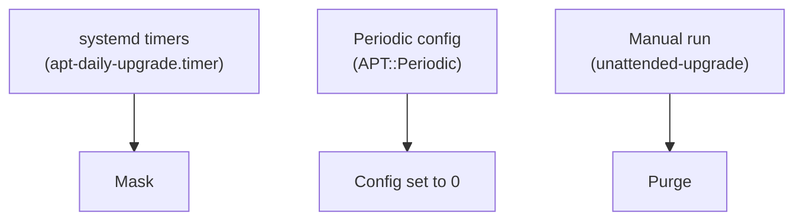

Some machines must not update themselves: they have their own patching process (Ansible, a maintenance window, a pipeline) and the last thing you want is `unattended-upgrades` sneaking in behind it. The question is how to turn it off **so that it stays off**.

It starts from a common case, several VMs in datacenters, and complements the guide on [masking systemd services](/en/docs/how-to/masking-systemd-services), which explains what `mask` does internally.

> [!NOTE]
> The package is called `unattended-upgrades` (with an *s*), but the command is `unattended-upgrade`, singular. An easy thing to mix up.

---

## Three ways to turn it off

Each mechanism covers a different slice.

### 1. Configuration: `APT::Periodic::Unattended-Upgrade "0"`

It goes in a file under `/etc/apt/apt.conf.d/`, usually `20auto-upgrades`:

```text
APT::Periodic::Unattended-Upgrade "0";
```

This is the **weakest option on its own**:

- It only closes the periodic path. The package and the binary stay installed and runnable.
- The config lives in `/etc/apt/apt.conf.d/`, where image tooling (cloud-init, for example) or a package update can touch it.
- It states your intent the least: a `0` in a file doesn't say "this is off on purpose".

### 2. systemd mask

Automatic runs are launched by the `apt-daily.timer` and `apt-daily-upgrade.timer` timers and their services. Masking them blocks them with an explicit error:

```bash
sudo systemctl mask --now apt-daily.timer apt-daily-upgrade.timer apt-daily.service apt-daily-upgrade.service
```

A mask is a symlink to `/dev/null` in `/etc/systemd/system/`, so it survives package updates and shows up in a plain `systemctl status`. But it only covers activation **through systemd**: a hand-run `unattended-upgrade` would still work.

> [!WARNING]
> Masking `apt-daily` also stops the automatic APT index refresh. If anything on the VM relies on it, your patching process has to do it.

### 3. Purge the package

```bash
sudo apt purge unattended-upgrades
```

No package means nothing to activate and nothing to run by hand. The gap: a metapackage or a future `Recommends` could reinstall it, and it would come back with live timers. The mask lives in `/etc` and stays even if the package returns.



Each layer closes one path: the mask the timers, the `0` the periodic path, and the purge the manual run.

---

## Which combination to pick

| Goal | Combination |
| :--- | :--- |
| Never starts on its own, but I can still call it | Mask + `"0"` |
| It must not be runnable, period | Purge + mask + `"0"` (three layers) |

Mask + `"0"` is solid: it covers every automatic path and leaves only the manual run, which is your call. To close that too, add the purge. Either way, put it in Ansible (or whatever you use), idempotent and applied to every VM, so a new or rebuilt machine starts out the same.

---

## What `unattended-upgrade` does when run by hand

It is not the same as `sudo apt update && sudo apt upgrade`:

- **Scope**: it only touches the origins allowed in `Unattended-Upgrade::Allowed-Origins`, which by default are basically the security repositories. It does not upgrade "everything".
- **No questions**: it is non-interactive by design and has its own policy for modified config files (by default it keeps yours, `--force-confold`).
- **Logged**: it writes a log to `/var/log/unattended-upgrades/`.
- **Synchronous**: run by hand, it starts in the foreground, holds your terminal until it finishes, and exits. "Unattended" means it doesn't ask questions, not that it goes to the background. The "I don't know when it runs" part comes from the timers.

Simulate it before trusting it:

```bash
sudo unattended-upgrade --dry-run --debug
```

It installs nothing and shows which candidates it sees. The log goes to `/var/log/unattended-upgrades/unattended-upgrades.log`.

---

## Summary

- Config at `"0"` alone is the most fragile: it closes one path and leaves the rest open.
- The mask covers the timers and is visible; the purge closes the manual run.
- If another explicit patching process exists, turn it off in layers and automate it.
- A hand-run `unattended-upgrade` is synchronous, limited to the allowed origins, and not equivalent to `apt upgrade`.

## References

- [unattended-upgrades documentation (official repository)](https://github.com/mvo5/unattended-upgrades)
- [Masking systemd services in Ubuntu](/en/docs/how-to/masking-systemd-services)
