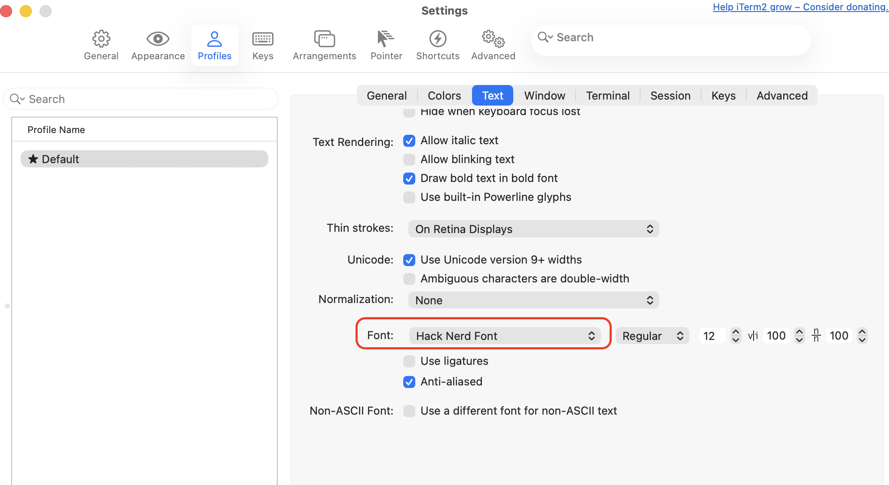
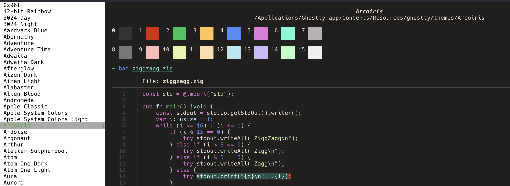

## Why This Matters

The terminal is where you spend 90% of your time as a developer. A slow or poorly configured terminal isn't just an annoyance; it's a bottleneck. Input lag, incorrect character rendering, and broken keyboard shortcuts break your flow.

A high-performance terminal setup ensures that the system reacts as fast as you think, with clear typography and the visual feedback necessary for complex DevOps tasks.

### Key Benefits
* **Reduced Latency**: Faster rendering means less eye strain and better "feel."
* **Visual Clarity**: Nerd Fonts enable icons that provide instant context (Git status, K8s clusters).
* **Efficiency**: Correct key mappings for word navigation save thousands of keystrokes daily.

---

## 1. Choosing Your Emulator: Ghostty vs iTerm2

While macOS comes with "Terminal.app," it lacks the features and performance required for professional work.

### Ghostty: The Modern Speed Demon (Recommended)
Ghostty is a cross-platform, GPU-accelerated terminal written in Zig. It is designed to be minimal, configuration-driven, and incredibly fast.

```bash
brew install --cask ghostty
```

### iTerm2: The Feature-Rich Veteran
iTerm2 has been the standard for years. It offers advanced features like session restoration, triggers, and a built-in password manager, but it can feel "heavier" and is harder to manage via text-based dotfiles.

```bash
brew install --cask iterm2
```


---

## 2. Essential Typography: Installing Nerd Fonts

Modern CLI tools (like `eza` or `starship`) use special icons to convey information. Without a **Nerd Font**, these will appear as broken boxes.

```bash
brew install --cask font-hack-nerd-font
```

### Configuration
* **Ghostty**: Edit `~/.config/ghostty/config` and add `font-family = Hack Nerd Font`.
* **iTerm2**: Go to `Profiles -> Text -> Font` and select `Hack Nerd Font`.



---

## 3. Ghostty Configuration for Power Users

Ghostty is configured via a plain text file, making it perfect for [dotfiles management](/en/docs/dotfiles-and-reproducibility).

You can find the available settings in the [Ghostty documentation](https://ghostty.org/docs/config/reference).

You can query the defaults values with `ghostty +show-config --default --docs`.

This is an example of `~/.config/ghostty/config`. I personally, leave this file empty and use the defaults.

```ini
font-family = Hack Nerd Font
font-size = 13
theme = Deep
scrollback-limit = 100000
copy-on-select = true
window-padding-x = 8
window-padding-y = 8
```

> [!NOTE]
> `copy-on-select` is a huge productivity booster. Just highlight text with your mouse, and it's already in your clipboard.

For some of these settings, you can use the `ghostty` command to find the available values. 
For example, to find the available themes, you can use the following command:

```bash
ghostty +list-themes
```




---

## 4. Fixing Keyboard Behavior (Word Navigation)

One of the most frustrating things on a new Mac is that `Option + Left/Right` doesn't navigate by word in the terminal by default.

### The Shell Fix
Add this to your `~/.zshrc` to make Zsh respect common word boundaries (treating `/` as a separator) and so `Alt+backspace` deletes the previous word:

```bash
# zsh completion
autoload -Uz compinit bashcompinit
compinit
bashcompinit

# Word style
autoload -U select-word-style
select-word-style bash

# Word navigation
bindkey "^[b" backward-word
bindkey "^[f" forward-word

# Alt + Left / Right for terminals that send CSI sequences
bindkey "^[[1;3D" backward-word
bindkey "^[[1;3C" forward-word

# Home / End
bindkey "^[[H" beginning-of-line
bindkey "^[[F" end-of-line
bindkey "^[[1~" beginning-of-line
bindkey "^[[4~" end-of-line
bindkey "^[[7~" beginning-of-line
bindkey "^[[8~" end-of-line

# Alt + Backspace
bindkey '^[^?' backward-kill-word
bindkey '^[\x7f' backward-kill-word
```


---

## 5. Performance and Rendering

Both Ghostty and iTerm2 use GPU acceleration (Metal) on macOS. This offloads text rendering from the CPU, keeping your system responsive even when tailing massive logs.

**Pro-Tip**: Avoid excessive transparency or "blur" effects if you value performance over aesthetics. Every pixel of blur requires GPU cycles that could be used for text rendering.

---

## Summary
You now have a high-performance window into your system. With **Ghostty** and **Nerd Fonts**, your environment is fast, readable, and ready for icons. Next, we'll secure your identity by [setting up SSH and Authentication](/en/docs/ssh-and-authentication).

