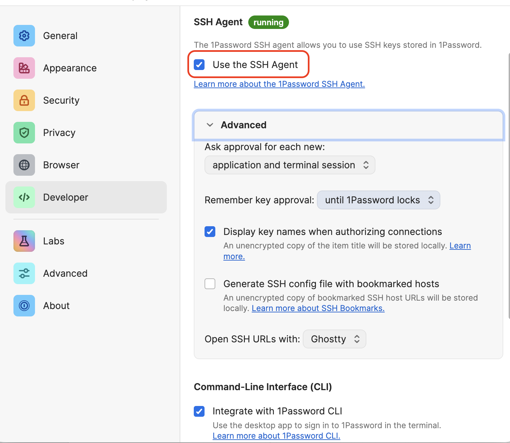
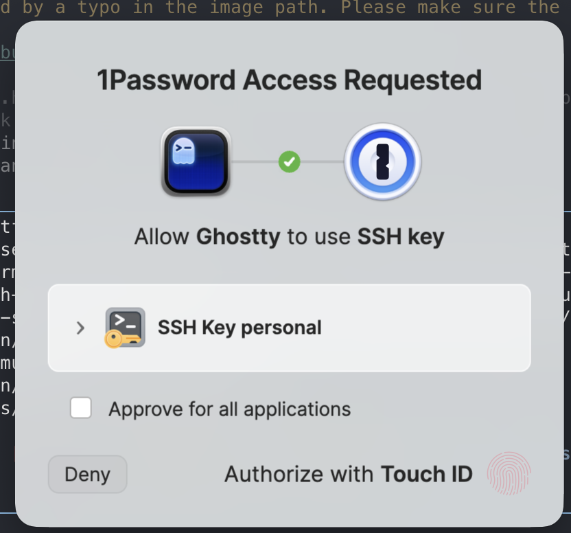

## Why This Matters

In the world of DevOps and software engineering, your identity is your most valuable asset. If your SSH keys are compromised, your infrastructure is at risk. Conversely, if your keys are messy, you'll waste hours debugging "Permission denied" errors when switching between personal and work repositories.

A modern, secure setup uses **biometric authentication** (via 1Password) so that private keys never live on your disk in plain text.

### Key Benefits
* **Maximum Security**: Private keys are stored in a secure enclave (1Password), not in `~/.ssh`.
* **Zero Friction**: Authenticate with Touch ID instead of typing long passphrases.
* **Organization**: Seamlessly handle multiple GitHub accounts without key collisions.

---

## 1. The Modern Way: 1Password SSH Agent

Stop managing `.pub` and private key files manually. 1Password can act as your SSH Agent, meaning your keys are encrypted and require biometric approval to be used.

### Enable the Agent
1. Open 1Password Settings.
2. Go to **Developer**.
3. Check **Use the SSH Agent**.



### Configure SSH to use 1Password

On macOS, 1Password automatically configures the necessary socket. The 1Password app will ask you for permission to set the identity agent in `~/.ssh/config` for you. If you don't see the prompt, you can manually add the following to `~/.ssh/config`:

```sshconfig
Host *
  IdentityAgent "~/Library/Group Containers/2BUA8C4S2C.com.1password/t/agent.sock"
```

Now, when `git` needs to use your private key, it will use 1Password's SSH agent to sign the data. You will be prompted to enter your 1Password master password or use Touch ID to authorize the SSH operation.



In my case, I keep only the public keys on my `~/.ssh` folder, while the private keys are stored in 1Password. I keep the public keys so that I can choose which key to use depending on the project.

```shell
~/.ssh
❯ la
Permissions Size User Date Modified Name
drwx------     - jose 25 Apr 21:09   agent
.rw-------@ 1.4k jose  1 May 20:40  󱁻 config
.rw-------@   99 jose 20 Mar 11:25  󰷖 id_ed25519_personal.pub
.rw-------@  101 jose 15 Apr 22:08  󰷖 id_ed25519_work.pub
.rw-------@ 5.5k jose 28 Apr 11:02  󰣀 known_hosts
```

---

## 2. Managing Multiple Identities

If you have a personal GitHub account and a work account, SSH needs to know which key to send to which host. 

### The Identity Collision Problem
By default, SSH tries the first key it finds. If that key is valid but belongs to the wrong account, GitHub will reject you.

### The Solution: Host Aliases
Use unique hostnames in your `~/.ssh/config`:

```sshconfig
# Personal Account
Host github.com-personal
  HostName github.com
  User git
  IdentityFile ~/.ssh/id_ed25519_personal.pub
  IdentitiesOnly yes

# Work Account
Host github.com-work
  HostName github.com
  User git
  IdentityFile ~/.ssh/id_ed25519_work.pub
  IdentitiesOnly yes
```

### Updating Your Git Remotes
Once you have defined these aliases, you must update your Git remote URLs to use them. Instead of the standard `git@github.com:user/repo.git`, use your alias:

```bash
# For a personal project
git remote set-url origin git@github.com-personal:username/repo.git

# For a work project
git remote set-url origin git@github.com-work:company/repo.git
```

This tells Git to use the specific SSH configuration (and thus the specific key) defined for that alias.

> [!IMPORTANT]
> Always use `IdentitiesOnly yes`. This prevents SSH from "spamming" the server with every key in your agent, which can lead to getting temporarily banned from the server.

---

## 3. Verifying and Debugging Authentication

When things go wrong, don't guess. Use the built-in diagnostic tools.

### Test Your Connection
```bash
ssh -T git@github.com
```

You can test host aliases too:
```bash
ssh -T git@github.com-personal
ssh -T git@github.com-work
```

If you see a message like `Hi username! You've successfully authenticated...` you're good to go. If not, you'll need to debug.

### See the "Handshake"
If it fails, add the verbose flag to see exactly which keys are being offered:
```bash
ssh -vT git@github.com
```

### List Active Keys
Check what's currently available in your agent (including 1Password keys):
```bash
ssh-add -l
```

---

## 4. Best Practices for SSH Security

1. **Use Ed25519**: It is faster and more secure than RSA.
2. **Set a Passphrase**: If you *must* use local files, never leave them without a passphrase.
3. **Audit Your Keys**: Regularly check `github.com/settings/keys` and remove old machines.
4. **Biometrics First**: Whenever possible, use 1Password with Touch ID.

---

## Summary
You've now secured the "front door" of your development environment. Your keys are managed, your identities are separated, and your authentication is biometric. Now that we have identity, let's [configure Git](git-and-version-control) to use it properly.

