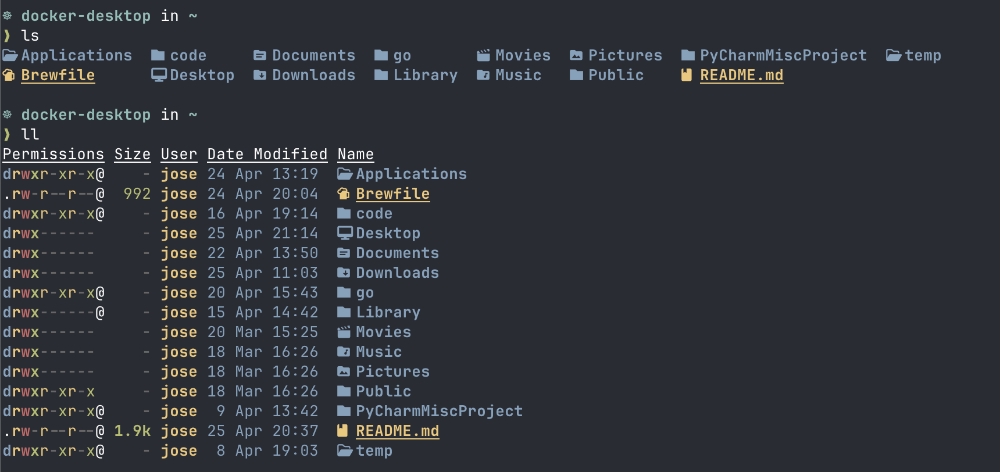
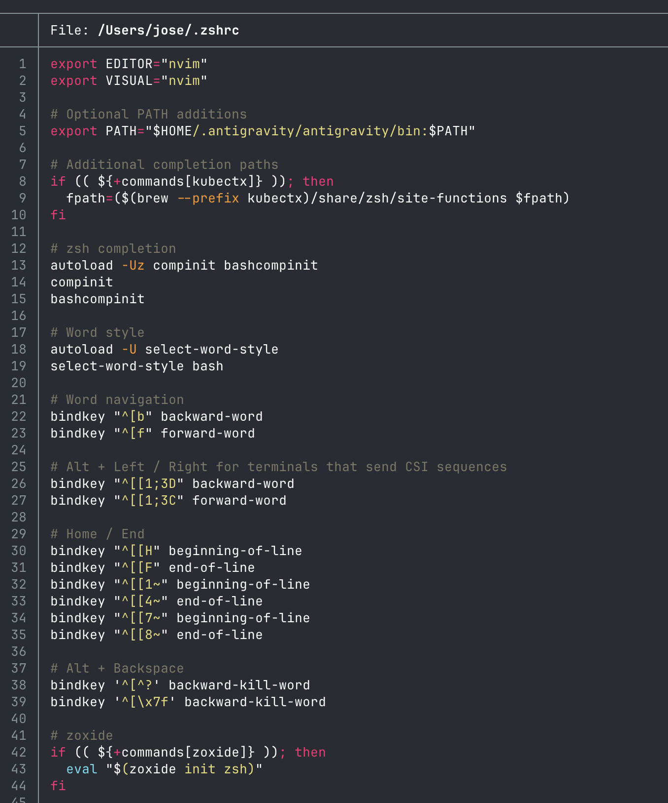
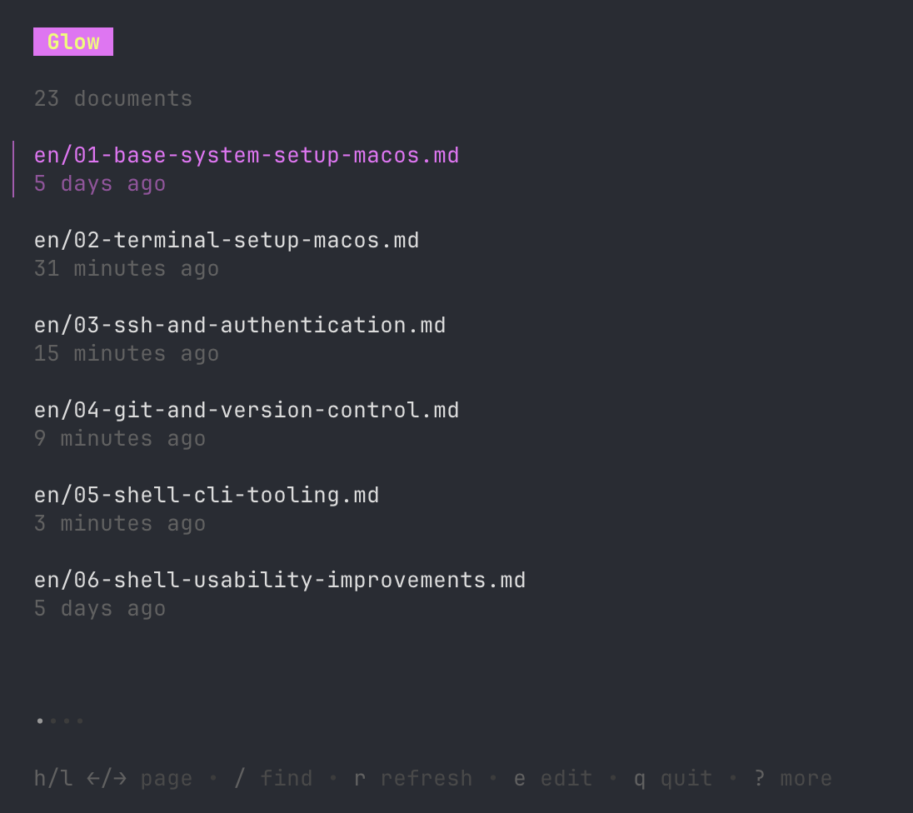

## Why This Matters

Standard Unix tools like `ls`, `grep`, and `find` were designed decades ago for a different era of computing. While they are reliable, they are slow and lack the visual cues modern developers need.

By switching to a **Modern Toolkit** (mostly written in Rust), you get tools that are not only faster but also provide syntax highlighting, better defaults (like ignoring `.git` directories automatically), and a more intuitive user experience.

### Key Benefits
* **Performance**: `ripgrep` can search millions of lines in milliseconds.
* **Intelligent Defaults**: `fd` and `rg` respect your `.gitignore` by default.
* **Visual Aid**: `eza` and `bat` use colors and icons to help you parse information faster.

---

## 1. The Replacement Guide: Legacy vs Modern

Here is the map of tools you should start using today to improve your productivity.

| Legacy Tool | Modern Replacement | Why? |
| :--- | :--- | :--- |
| `ls` | `eza` | Adds colors, icons, and Git status to file listings. |
| `cat` | `bat` | Adds syntax highlighting and line numbers. |
| `grep` | `ripgrep` (`rg`) | Orders of magnitude faster; respects `.gitignore`. |
| `find` | `fd` | Simplified syntax and much faster performance. |
| `cd` | `zoxide` (`z`) | Remembers your frequent folders; navigate with 1-2 letters. |


---

## 2. Setting Up the Tools

If you followed the [Base System Setup](/en/docs/macos-setup-guide/base-system-setup-macos), you've already installed these via Homebrew. If not:

```bash
brew install bat eza fd ripgrep zoxide
```

### Configuring Aliases
To make the transition seamless, add these aliases to your `~/.zshrc`:

```bash
alias ls="eza --icons --group-directories-first"
alias ll="eza -lh --icons --git"
alias cat="bat"
alias grep="rg"
alias find="fd"
```

Example of `eza` output:



Example of `bat` output:


---

## 3. Intelligent Navigation with Zoxide

`zoxide` is a smarter `cd`. It tracks which directories you visit most often.

### Usage
Instead of typing `cd ~/code/projects/my-awesome-app`, you just type:
```bash
z awesome
```
Zoxide will find the best match and jump there instantly.

Interactive selection

```bash
zi
```

Replace cd

```bash
alias cd="z"
```


[RECORDING: asciinema - Demonstrating fast navigation between deep directories using zoxide]

---

## 4. High-Speed Searching with Ripgrep (rg)

`ripgrep` is the ultimate search tool. It is so fast that it is used as the engine behind VS Code's search.

### Common Commands
```bash
# Search for "TODO" in all files, ignoring node_modules and .git
rg "TODO"

# Search for "TODO" only in the current directory
rg "TODO" .

# Search for "TODO" in all files, including hidden files
rg --hidden "TODO"


# Search only in Markdown files
rg -t md "DevOps"

# Search and replace (pipe to sed or use a tool like fastmod)
rg "OldName" --replace "NewName"

# Combine with fzf to search in files
rg "TODO" | fzf
```

---

## 5. Better File Inspection with Bat

`bat` is `cat` with wings. It detects file extensions and applies syntax highlighting automatically.

### Pro-Tip: Integration with Git
`bat` can show you exactly which lines have changed in a file relative to your last Git commit.

```bash
bat src/main.rs
```

## 6. Better find with fd

fd is a replacement for find, but with better defaults and faster performance.

### Usage
```bash
# Find all files in the current directory
fd

# Find all files in the current directory, including hidden files
fd --hidden

# Find all files in the current directory, ignoring node_modules and .git
fd --exclude node_modules --exclude .git

# Find all files in the current directory, ignoring node_modules and .git
fd --exclude node_modules --exclude .git

# Find by extension
fd -e yaml

# Combine with fzf
fd | fzf
```

## 7. Glow

Glow is a Markdown viewer that renders Markdown with beautiful ANSI colors and styles in the terminal.




### Why use Glow?

Standard Markdown viewers often show plain text, which can be hard to read. Glow transforms Markdown into a rich, formatted document right in your terminal, making it perfect for quick README reviews or viewing documentation on the go.


#### Common Commands

```bash
# View a Markdown file
glow README.md

# View multiple Markdown files
glow README.md CHANGES.md

# View all Markdown files in a directory
glow my-dir/

# Enable pager (scrollable view for large files)
glow -p README.md

# Disable line wrapping
glow --width 100 README.md
```


---

## Summary
By replacing legacy Unix tools with their modern counterparts, you've removed friction from your daily terminal usage. Your searches are faster, your navigation is smarter, and your files are easier to read. Next, we'll take these tools to the next level with [Shell Usability Improvements](/en/docs/macos-setup-guide/shell-usability-improvements).
