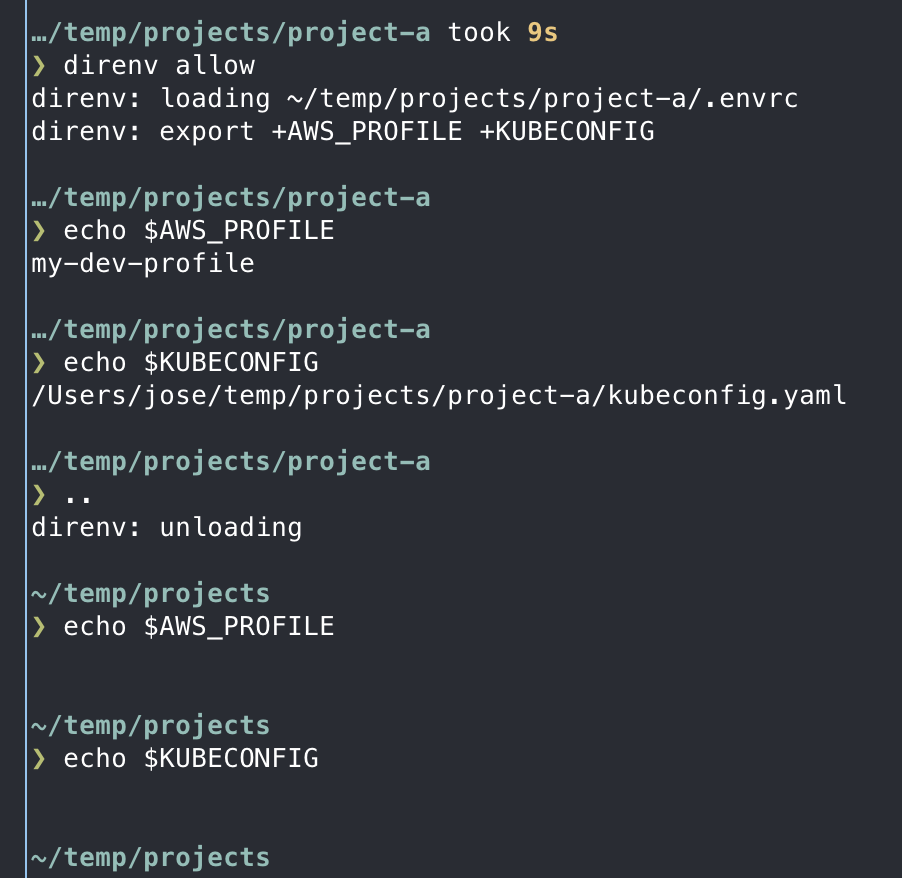

## Why This Matters

As a developer, you handle dozens of API keys, database passwords, and cloud credentials daily. Storing these in `.zshrc` or plain text `.env` files is a major security risk. If you accidentally push a secret to GitHub, your infrastructure could be compromised in minutes.

A professional setup solves this with two tools: **1Password CLI** (for secure storage) and **direnv** (for automatic, project-specific environment loading). This ensures that secrets are only available when you are in the relevant project directory and never leak into your global shell.

### Key Benefits
* **Isolation**: Environment variables for "Project A" don't interfere with "Project B."
* **Security**: Secrets stay encrypted in 1Password until the moment they are needed.
* **Automation**: No more typing `export AWS_PROFILE=...` every time you switch tasks.

---

## 1. Context-Aware Environments with Direnv

**direnv** is a shell extension that loads and unloads environment variables depending on your current directory. It looks for a file named `.envrc`.

### Installation
```bash
brew install direnv
```

### Enabling in Zsh
Add this to your `~/.zshrc`:
```bash
eval "$(direnv hook zsh)"
```

### Usage: The `.envrc` File
Create a `.envrc` file in your project root:
```bash
# ~/.envrc
export AWS_PROFILE="my-dev-profile"
export KUBECONFIG="$PWD/kubeconfig.yaml"
```
When you `cd` into this folder, direnv will ask you to authorize the file:
```bash
direnv allow
```



---

## 2. Secure Secret Injection with 1Password CLI

The **1Password CLI (`op`)** allows you to reference secrets stored in your vault using a URI format (e.g., `op://Vault/Item/Field`).

### Installation
```bash
brew install --cask 1password-cli
```

### The "No-Secrets-On-Disk" Workflow
Instead of storing a real API key in `.env`, store the reference:
```bash
# .env file (Safe to have on disk, but don't commit it!)
STRIPE_API_KEY=op://Private/Stripe/api_key
```

### Running Commands with Secrets
Use `op run` to inject the real values into a process without ever exporting them to your shell:
```bash
op run --env-file=.env -- npm run dev
```

> [!TIP]
> 1Password will pop up a Touch ID prompt. Once approved, `npm run dev` gets the real key, but if you run `echo $STRIPE_API_KEY` in another terminal tab, it remains empty.


---

## 3. Synergy: Combining Direnv and 1Password

The ultimate DevOps workflow uses `direnv` to set non-sensitive config and `1Password` to handle the secrets.

### Example `.envrc` for a Cloud Project
```bash
# Set non-sensitive cloud context
export AWS_PROFILE=production
export AWS_REGION=us-east-1

# Use op run for the actual deployment
alias deploy="op run --env-file=.env -- terraform apply"
```

---

## 4. Best Practices for Secret Safety

1. **Global Gitignore**: Ensure `.env` and `.envrc` are in your [global gitignore](/en/docs/macos-setup-guide/git-and-version-control#4-handling-global-ignores).
2. **Biometrics**: Always enable Touch ID for the 1Password CLI to avoid typing passwords.
3. **Use Profiles**: Use `AWS_PROFILE` or `GOOGLE_CLOUD_PROJECT` instead of hardcoding access keys.
4. **Short-Lived Tokens**: Prefer `op signin` sessions that expire over long-lived environment variables.

---

## Summary
You now have a secure, automated way to handle project contexts and sensitive credentials. Your secrets are safe, and your terminal is "context-aware." Next, let's [set up your Python and automation environment](/en/docs/macos-setup-guide/python-and-automation-tooling) using these new security foundations.

