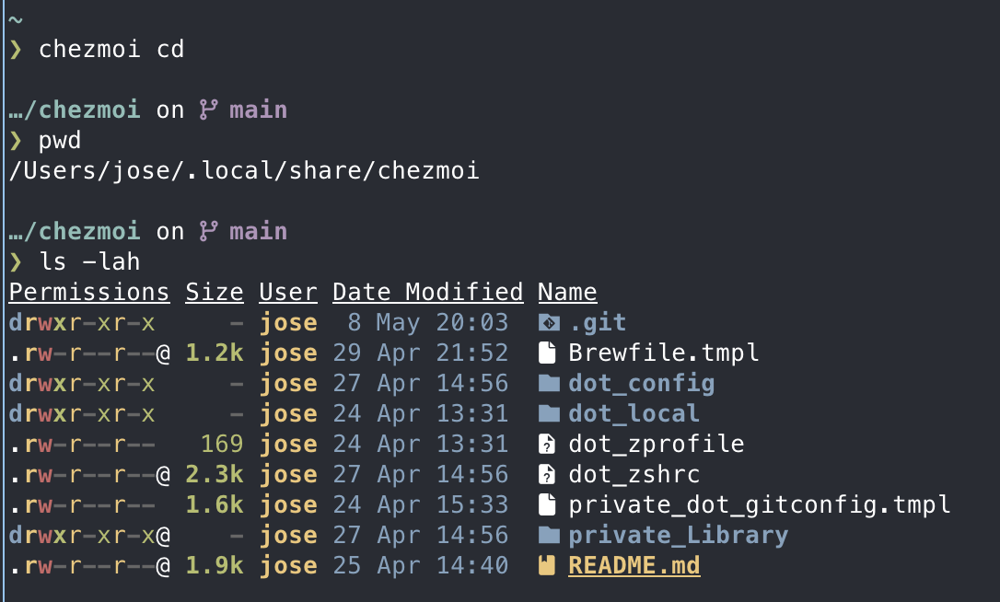

## Why This Matters

You have spent hours fine-tuning your terminal, editor, and shell. If your laptop died tomorrow, how long would it take you to get back to this exact state? For most developers, the answer is "days of frustration."

By treating your configuration as **Infrastructure as Code (IaC)**, you ensure that your environment is permanent, version-controlled, and reproducible. **Chezmoi** is the professional choice for this: it manages your "dotfiles" (hidden config files) securely and allows you to recreate your entire workstation on a brand-new Mac with a single command.

### Key Benefits
* **Disposability**: Your laptop is now cattle, not a pet. You can switch machines in minutes.
* **Version Control**: See exactly when and why you changed a setting in your editor.
* **Security**: Manage sensitive templates safely without committing secrets to Git.

---

## 1. Chezmoi: The Git-Friendly Dotfiles Manager

Chezmoi works by keeping a "source of truth" in a hidden Git repository and "applying" those files to your actual home directory.

### Installation
```bash
brew install chezmoi
```

### Initializing Your Repo
```bash
# Start a new local repository
chezmoi init

# Add your first files
chezmoi add ~/.zshrc
chezmoi add ~/.config/nvim
chezmoi add ~/.config/starship.toml

chezmoi status
```

The files you add to chezmoi will be stored in `~/.local/share/chezmoi`. This is a real Git repository.




---

## 2. The Golden Rule: Edit the Source, Not the File

Once a file is managed by Chezmoi, you should no longer edit it directly in your home folder. If you do, your changes will be overwritten next time you "apply" your dotfiles.

### The Workflow
1. **Edit**: `chezmoi edit ~/.zshrc` (This opens the file in your [configured Neovim](/en/docs/macos-setup-guide/editor-setup-neovim)).
2. **Preview**: `chezmoi diff` (See what's about to change).
3. **Apply**: `chezmoi apply` (Make the changes live).


---

## 3. Pushing to GitHub: Backing Up Your Config

Chezmoi stores your "source" files in `~/.local/share/chezmoi`. This is a real Git repository. To backup your dotfiles, you need to commit and push from that directory.

```bash
# Go to the source directory
chezmoi cd

# Commit and push your changes
git add .
git commit -m "Add my developer configuration"
git remote add origin https://github.com/your-username/dotfiles.git
git push -u origin main
```

---

## 4. 100% Reproducibility with Brewfile

To make your machine truly reproducible, you need to manage your applications too. We do this by adding the `Brewfile` we created in the [Base System Setup](/en/docs/macos-setup-guide/base-system-setup-macos) to Chezmoi.

```bash
# Update your Brewfile
brew bundle dump --file="$HOME/Brewfile" --force

# Add it to chezmoi
chezmoi add ~/Brewfile
```

---

## 5. Setting Up a New Mac in One Command

When you get a new computer, the setup is now just two steps:

1. **Install Homebrew**.
2. **Install chezmoi**.
3. **Add custom data for chezmoi**
```bash
mkdir -p ~/.config/chezmoi
cat > ~/.config/chezmoi/chezmoi.toml <<EOF
data:
  email: "[EMAIL_ADDRESS]"
EOF
```
4. **Run Chezmoi**:
```bash
chezmoi init --apply https://github.com/your-username/dotfiles.git
```
5. **Install with brew**
```bash
brew bundle install --file="$HOME/Brewfile"
```

This will clone your repo, install every tool in your `Brewfile`, and place every configuration file exactly where it belongs.

---

## 6. Dynamic Configuration with Templates

What if you want your `.zshrc` to be slightly different on your work laptop versus your personal one? Chezmoi handles this with **templates**.

### Step 1: Create a Template
To turn a regular file into a template, use the `--template` flag when adding it:
```bash
chezmoi add --template ~/.zshrc
chezmoi add --template ~/.gitconfig
```
This adds `.zshrc.tmpl` and `.gitconfig.tmpl` to your source directory.

### Step 2: Add Logic and Variables
You can now use Go template syntax to make your files dynamic.

**Example 1: Conditional lines in `.zshrc`**
```bash
# ~/.zshrc.tmpl
{{ if eq .chezmoi.hostname "macbook-pro-work" }}
# Added by Antigravity
export PATH="/Users/jose/.antigravity/antigravity/bin:$PATH"
{{ end }}
```

**Example 2: Different email in `.gitconfig`**
```ini
# ~/.gitconfig.tmpl
[user]
    name = Jose OC
    email = {{ .email }}
```

### Step 3: Define Your Data
To fill in the `{{ .email }}` variable, create a configuration file on each machine at `~/.config/chezmoi/chezmoi.yaml`:

```yaml
# Personal Machine
data:
  email: "personal@email.com"

# Work Machine
data:
  email: "work@company.com"
```

Now, when you run `chezmoi apply`, it will generate the correct file for that specific machine.

---

## 7. Best Practices for Dotfiles

---

## Summary
Congratulations! You have transformed your Mac from a collection of manual settings into a **fully automated, version-controlled developer workstation**. You are now part of the 1% of developers who can survive a hardware failure without losing a single line of configuration. 

**Happy Hacking!**

