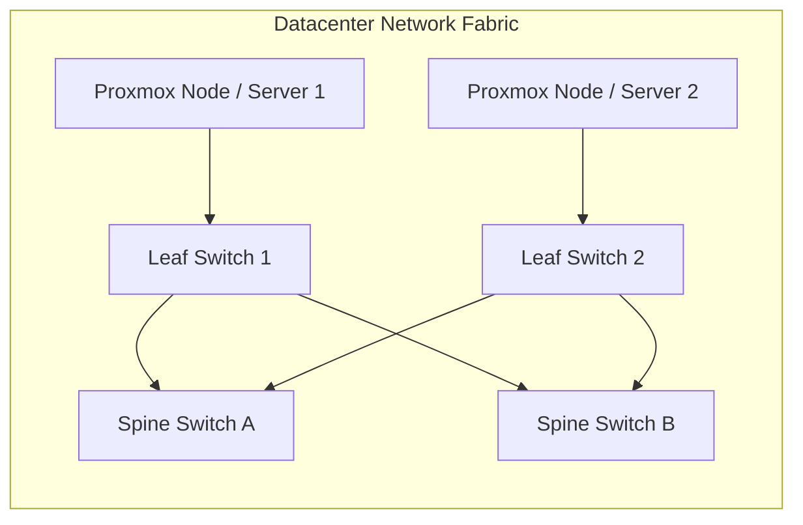

If you are a developer, systems administrator, or technical manager, you probably know how to write code, configure servers, or orchestrate containers. But when you have to discuss datacenter infrastructure with NetOps or Network Engineers, it can feel like they are speaking an entirely different language. 

Terms like **Fabric**, **Leaf-Spine**, **SDN**, **BGP**, and **OSPF** fly around, leaving you wondering how they connect to your applications or virtualization host (like Proxmox or VMware).

This glossary breaks down these concepts into plain English, using developer-friendly analogies, diagrams, and illustrations.

---

## The Big Picture: A Quick Mental Model

Before diving into the terms, here is how they fit together:

- **SDN** is the **control system** (software that manages network rules).
- **Fabric** is the **physical/logical structure** of the datacenter network.
- **Leaf-Spine** is the **shape** (topology) of that structure.
- **BGP, OSPF, IS-IS, and OpenFabric** are the **routing protocols** (the rules of the road) that tell network packets how to navigate the fabric or cross between different networks.

---

## 1. The Network Layout (The Physical Grid)

### Fabric
* **What it is:** A datacenter network layout where multiple switches are interconnected to create a highly redundant, high-bandwidth grid. 
* **The Analogy:** Think of it like a **highly optimized grid system of highways** inside a large industrial park. No matter which warehouse (server) you start from, there is a fast, predictable path to any other warehouse.
* **Why you should care:** In modern datacenters, you don't just connect servers to a single switch. You connect them to a "Fabric" so that if a switch or a cable fails, traffic instantly reroutes without dropping your database connections or API requests.

### Leaf Switch
* **What it is:** A switch positioned at the edge of the fabric. Servers, virtualization hosts (like Proxmox nodes), and storage arrays plug directly into Leaf switches.
* **The Analogy:** The **on-ramps** to the highway system. Every journey starts and ends here.
* **Why you should care:** Your application servers live here. If you are configuring a physical server, its network cables will plug directly into a Leaf switch (usually two of them for redundancy).

### Spine Switch
* **What it is:** A core backbone switch that interconnects Leaf switches. Spine switches do not connect directly to servers; they only connect to Leaf switches.
* **The Analogy:** The **main interstate highways** that connect the local on-ramps.
* **Why you should care:** Spine switches ensure that any Leaf switch is only "one hop" away from any other Leaf switch, guaranteeing low latency and predictable performance.

---

## 2. The Protocols (The GPS Navigation)

To move data across the fabric, switches need to know which paths are open, which are congested, and where to send packets. They use **routing protocols** to dynamically build this map.

### BGP (Border Gateway Protocol)
* **What it is:** The routing protocol of the internet itself. It exchanges routing and reachability information between different "Autonomous Systems" (large networks owned by ISPs, universities, or tech giants). In modern datacenters, it is also used *internally* to route traffic between servers within the fabric.
* **The Analogy:** The **international shipping customs and postal treaties network**. BGP doesn't handle the internal local roads of your town (OSPF/IS-IS do that). Instead, BGP handles how packages cross international borders between different sovereign countries (Autonomous Systems).
* **Why you should care:** BGP is the protocol that keeps the global internet running. When BGP has a configuration mistake, entire services (like Facebook or Cloudflare) or even whole countries go offline. Inside modern datacenters, NetOps teams use "BGP-to-the-Host" to scale routing and assign IP addresses directly to servers or Kubernetes nodes.

### OSPF (Open Shortest Path First)
* **What it is:** A Layer 3 (routing layer) protocol. Routers and switches share their local connections with each other, allowing every device to build a complete map of the network and calculate the fastest path using Dijkstra's algorithm.
* **The Analogy:** A **crowdsourced GPS system** (like Waze). Every intersection (router) reports its traffic and road status. Your car (packet) uses this map to find the fastest route.
* **Why you should care:** It is highly reliable and widely used. If you configure dynamic routing in a system like **FRR (FRRouting)** on Linux or Proxmox, OSPF is often the default choice to advertise your virtual machine IP addresses to the physical network.

### IS-IS (Intermediate System to Intermediate System)
* **What it is:** Another Layer 3 routing protocol that does a very similar job to OSPF. However, it was designed to run directly on the link layer (Layer 2) rather than depending on IP (Layer 3), making it highly robust and customizable.
* **The Analogy:** Similar to OSPF, but it operates like a **private radio dispatch system** used by shipping lines. It doesn't rely on the public postal address system (IP) to communicate layout changes.
* **Why you should care:** IS-IS is favored by internet service providers (ISPs) and very large datacenters because it scales exceptionally well and handles multiple protocol types (like IPv4 and IPv6) cleanly.

### OpenFabric
* **What it is:** A specialized routing protocol derived from IS-IS, designed specifically for Leaf-Spine datacenter architectures.
* **The Analogy:** A **highly optimized GPS map tailored only for city grid networks**. It strips away the complex routing features needed for chaotic internet routes and focuses strictly on routing within a clean, predictable leaf-spine layout.
* **Why you should care:** If you use modern open-source routing suites like FRR in your private cloud, OpenFabric dramatically simplifies the configuration and resource overhead compared to full-blown IS-IS.

---

## 3. The Management Plane (The Orchestrator)

### SDN (Software-Defined Networking)
* **What it is:** An approach to networking that separates the *control plane* (the brain deciding where traffic goes) from the *data plane* (the physical hardware forwarding the packets). Instead of configuring every switch individually via command-line interfaces, you define your network policies centrally using software APIs.
* **The Analogy:** **Smart Home Lighting**. Instead of walking to every room and flipping physical switches on the wall (traditional networking), you have a central hub app. You program a rule like "Turn off all lights at 10 PM," and the hub automatically configures all the bulbs for you.
* **Why you should care:** 
  > [!TIP]
  > **SDN vs. IaC (Infrastructure as Code):** SDN is the network model itself, while tools like Terraform or Ansible are used to define and deploy it. Think of SDN as the smart home API, and Terraform as the script that calls that API.
  
  In modern hypervisors like **Proxmox VE 8/9**, SDN allows you to create virtual zones, VNets, and private subnets directly from the web interface without touching the physical core switches.

---

## Summary Cheat Sheet

| Term | Category | What it does | Plain English Analogy |
| :--- | :--- | :--- | :--- |
| **SDN** | Management | Centralized control of networks via software APIs | A smart home app controlling all light bulbs centrally |
| **Fabric** | Structure | A highly interconnected, redundant network layout | A well-planned grid of highways |
| **Leaf** | Hardware | The edge switch where servers plug in | The local on-ramp to the highway |
| **Spine** | Hardware | The core switch connecting Leaf switches | The interstate highway connecting local on-rams |
| **BGP** | Protocol | Interconnects large networks and routes the global internet | International shipping customs and postal treaties |
| **OSPF** | Protocol | Calculates the best IP path through the network | Waze/GPS calculating paths based on road state |
| **IS-IS** | Protocol | A highly scalable carrier-grade routing protocol | A private dispatch radio system independent of postal addresses |
| **OpenFabric** | Protocol | An optimized version of IS-IS for Leaf-Spine grids | A GPS app specialized only for grid-based downtown layouts |
