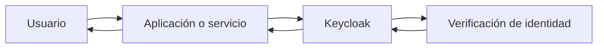
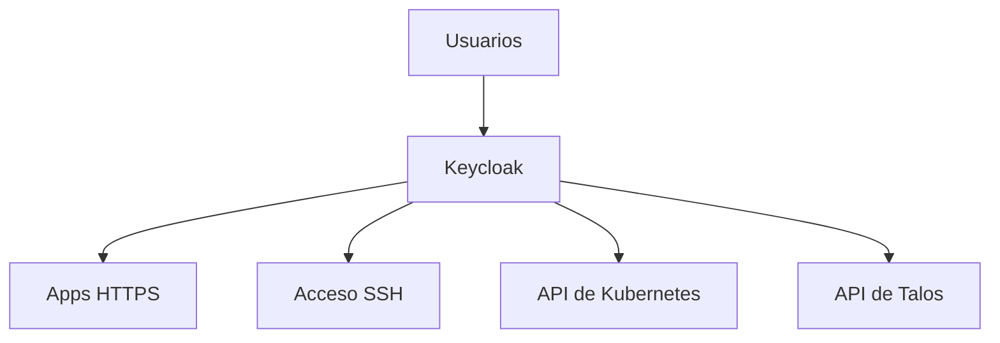
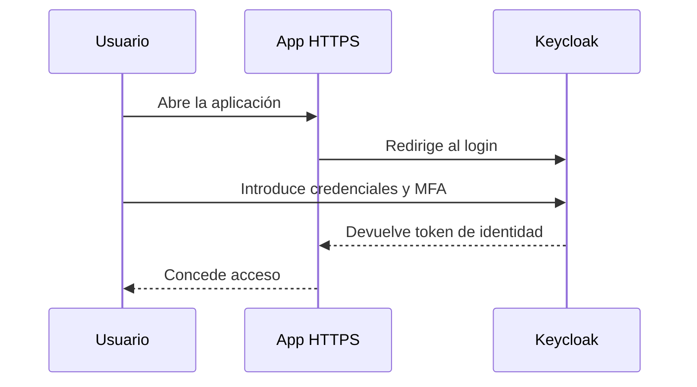
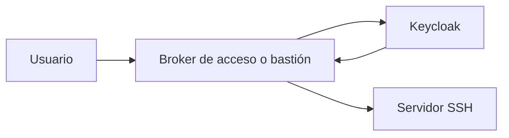
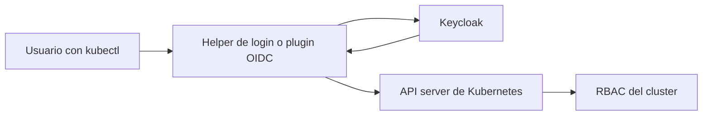
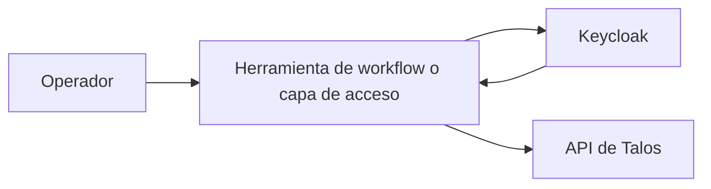

Keycloak es una plataforma de gestión de identidad y acceso. Dicho en lenguaje simple, es un sistema que te ayuda a evitar tener un usuario, una contraseña y un flujo de login distinto para cada herramienta.

En lugar de que cada aplicación gestione la autenticación por su cuenta, las aplicaciones pueden confiar en Keycloak para responder unas preguntas importantes:

- quién es este usuario
- ha iniciado sesión correctamente
- debería tener acceso a este sistema

Eso simplifica la vida tanto para usuarios como para operadores. Los usuarios tienen un único lugar donde iniciar sesión. Los operadores tienen un único lugar donde gestionar cuentas, grupos, políticas y controles de seguridad más fuertes como MFA.

## Por qué la gente usa Keycloak

Sin autenticación centralizada, los equipos suelen acabar con:

- cuentas locales separadas en cada aplicación
- políticas de contraseña inconsistentes
- accesos difíciles de revocar de forma limpia
- ningún lugar único para forzar MFA
- poca visibilidad sobre quién entró en cada sitio

Keycloak resuelve éso convirtiéndose en la capa compartida de autenticación.

## La idea principal

Éste es el flujo básico de login web:

La aplicación no necesita guardar la contraseña del usuario. Delega el proceso de login en Keycloak y recibe de vuelta información de identidad confiable.

## Glosario: los términos que importan

Estas palabras aparecen constantemente cuando se habla de Keycloak.

### IdP

`IdP` significa **Identity Provider**.

Es el sistema que confirma quién es un usuario. Keycloak puede actuar como el IdP de tus aplicaciones.

### SSO

`SSO` significa **Single Sign-On**.

Quiere decir que el usuario inicia sesión una vez y luego puede acceder a varias aplicaciones conectadas sin volver a autenticarse en cada una.

### MFA

`MFA` significa **Multi-Factor Authentication**.

Requiere más de una prueba de identidad, por ejemplo:

- contraseña + código TOTP
- contraseña + llave de seguridad hardware

MFA hace que una contraseña robada sea mucho menos útil para un atacante.

### Realm

Un realm es un espacio principal de Keycloak para identidades, clientes, grupos y políticas.

Puedes pensar en él como un límite de seguridad o un tenant. Una empresa puede tener un solo realm. Un proveedor de servicios puede tener muchos.

### Client

Un client es una aplicación o servicio que confía en Keycloak.

Ejemplos:

- un dashboard web
- Grafana
- Argo CD
- una integración con la API de Kubernetes

### Token

Un token es una pieza firmada de información de identidad emitida después de un login correcto.

Las aplicaciones usan tokens para verificar que el usuario se autenticó y para leer claims como nombre, correo, grupos o roles.

### Claims

Los claims son datos dentro de un token.

Ejemplos:

- nombre de usuario
- correo
- grupos
- roles

### RBAC

`RBAC` significa **Role-Based Access Control**.

Quiere decir que los permisos se asignan mediante roles en vez de configurar cada usuario uno por uno.

### LDAP o Active Directory

Son sistemas de directorio usados para almacenar usuarios y grupos.

Keycloak puede conectarse a ellos, de modo que no tengas que recrear cada cuenta manualmente.

## Dónde encaja Keycloak

Un modelo mental simple se ve así:

Keycloak no es la aplicación. Es la capa compartida de login e identidad en la que otros sistemas confían.

## Ejemplo 1: autenticación centralizada para aplicaciones HTTPS

Éste es el caso de uso más común de Keycloak.

Imagina que tienes:

- Grafana
- Argo CD
- una wiki interna
- un portal de administración propio

Sin Keycloak, cada herramienta puede tener su propia pantalla de login y su propia base de usuarios.

Con Keycloak, cada herramienta redirige al usuario a Keycloak para autenticarse.

### Por qué ésto es útil

- una experiencia de login común para muchas herramientas
- un solo lugar para forzar MFA
- desactivar cuentas es más fácil cuando alguien se va
- el control de acceso por grupos es más sencillo

### Nota práctica

Esto suele usar estándares como:

- OpenID Connect (OIDC)
- OAuth 2.0
- a veces SAML

No necesitas entender todos los detalles el primer día. Lo importante es que la aplicación confía en Keycloak en vez de pedir una contraseña local.

## Ejemplo 2: autenticación centralizada para SSH

SSH no suele redirigirte a un login web por sí solo, así que esta configuración normalmente necesita una capa extra de integración.

Patrones comunes:

- usar certificados SSH de corta duración
- usar un bastión o proxy de acceso
- integrarse con una plataforma como Teleport u otro broker que confíe en Keycloak

El flujo se parece más a esto:

### Qué cambia aquí

Keycloak sigue siendo la fuente de identidad, pero otro componente traduce esa identidad a algo que SSH entiende.

Éso puede ser:

- un certificado SSH
- una clave temporal
- una decisión de política en un jump host

### Por qué ésto es útil

- no dependes de cuentas SSH compartidas y duraderas
- el offboarding es más sencillo
- puedes exigir MFA antes del acceso shell
- queda un rastro más claro de quién accedió a qué

> [!NOTE]
> Keycloak normalmente no sustituye a `sshd` por sí mismo. Suele trabajar con otra herramienta que hace de puente entre la identidad web y SSH.

## Ejemplo 3: autenticación centralizada para la API de Kubernetes

Kubernetes soporta proveedores externos de identidad, así que encaja bastante bien con Keycloak.

Un patrón común es:

- el usuario se autentica contra Keycloak
- Kubernetes confía en el token emitido
- RBAC mapea grupos o roles del token a permisos dentro del cluster

### Por qué ésto es útil

- el acceso al cluster sigue reglas centrales de identidad
- los grupos de Keycloak pueden mapearse a roles de Kubernetes
- quitar un usuario del sistema de identidad puede retirar el acceso práctico rápidamente

### Lo primero que conviene entender

Hay dos pasos separados:

1. autenticación: Keycloak demuestra quién es el usuario
2. autorización: Kubernetes RBAC decide qué puede hacer ese usuario

Están relacionados, pero no son lo mismo.

## Ejemplo 4: autenticación centralizada para la API de Talos

Talos es un sistema operativo orientado a API para nodos Kubernetes. Igual que ocurre con SSH, no se comporta directamente como una aplicación web normal, así que la autenticación centralizada suele depender de cómo se integre el entorno.

En la práctica, los equipos suelen usar uno de estos patrones:

- una capa de acceso con conciencia de identidad delante del flujo operativo
- credenciales de corta duración emitidas tras autenticarse en Keycloak
- una plataforma que conecte la identidad de Keycloak con acciones de gestión sobre Talos

### La idea importante

La meta no es que "Talos hable Keycloak mágicamente en todas partes".

La meta real es:

- la identidad empieza en un lugar confiable
- el acceso es temporal y auditable
- los operadores usan menos credenciales estáticas

Eso importa mucho en APIs de infraestructura sensibles.

## Qué mejora Keycloak a nivel operativo

Aunque los detalles cambien según el protocolo, los beneficios suelen ser los mismos:

- una sola fuente de identidad en vez de muchos almacenes locales de usuarios
- política central de MFA
- onboarding y offboarding más sencillos
- acceso basado en grupos
- menos dispersión de contraseñas
- mejor auditoría

## Malentendidos comunes

### "Keycloak sólo sirve para webs"

No. Las aplicaciones web son el ejemplo más sencillo, pero el mismo modelo de identidad puede servir para acceso a infraestructura si existe la integración adecuada.

### "Autenticación y autorización son lo mismo"

No.

- autenticación responde: quién eres
- autorización responde: qué puedes hacer

Keycloak suele ser muy fuerte en la primera pregunta, mientras que el sistema destino sigue aplicando la segunda.

### "Si instalo Keycloak, todos los protocolos funcionarán igual"

No. HTTPS, SSH, Kubernetes y Talos no consumen identidad exactamente del mismo modo. Algunos necesitan un proxy, plugin, broker o flujo con certificados por medio.

## Cuándo Keycloak encaja bien

Keycloak es una muy buena opción cuando quieres:

- gestión de identidad self-hosted
- SSO para muchas herramientas internas
- forzar MFA
- integración con directorios existentes
- acceso basado en grupos y roles

Puede ser más de lo que necesitas si solo tienes una aplicación interna pequeña y ningún problema más amplio de identidad.

## Idea final

La mejor forma de entender Keycloak es como un hub central de identidad.

Ayuda a que distintos sistemas confíen en la misma identidad de usuario, aunque la integración exacta cambie entre:

- aplicaciones web
- acceso SSH
- Kubernetes
- Talos

Si tienes que recordar una sola cosa, que sea ésta:

Keycloak no sustituye a todos los sistemas destino. Les da una forma compartida y mucho más manejable de saber quién es el usuario.
