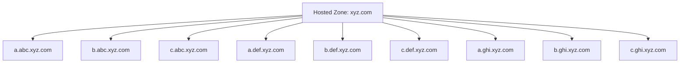
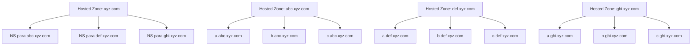
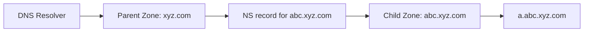
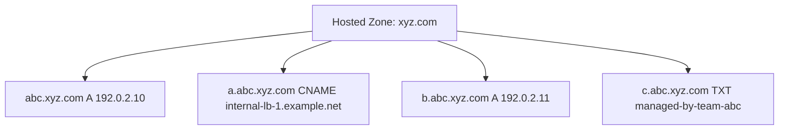
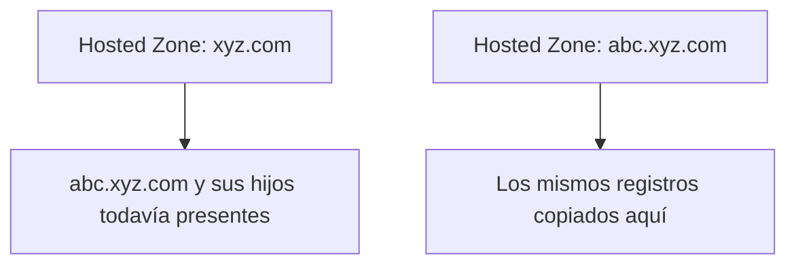
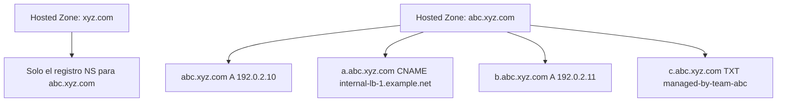

## TLDR;

Todo esto se ha automatizado con una CLI y está disponible en GitHub: [route53-delegation-cli](https://github.com/jose-oc/route53-delegation-cli).

# Dividir una Hosted Zone de Route 53 en subdominios delegados

Si ya gestionas `xyz.com` en Amazon Route 53 y tus registros empiezan a verse así:

- `a.abc.xyz.com`
- `b.abc.xyz.com`
- `c.abc.xyz.com`
- `a.def.xyz.com`
- `b.def.xyz.com`
- `c.def.xyz.com`
- `a.ghi.xyz.com`
- `b.ghi.xyz.com`
- `c.ghi.xyz.com`

puede que te interese dividir esa única hosted zone grande en subdominios delegados más pequeños:

- `abc.xyz.com`
- `def.xyz.com`
- `ghi.xyz.com`

Este es un patrón DNS común y técnicamente sencillo. La parte importante es hacer la migración en el orden correcto para que las respuestas DNS sigan siendo consistentes.

Este artículo explica los principales términos de DNS en lenguaje sencillo, muestra la estructura objetivo y proporciona un runbook práctico de Route 53 que puedes seguir.

## Términos usados en este artículo

Antes del runbook, aquí tienes los términos de DNS explicados de forma simple.

### Dominio

Un dominio es un nombre DNS que usan personas o sistemas. En este artículo, `xyz.com` es el dominio principal.

Ejemplos:

- `xyz.com`
- `abc.xyz.com`
- `a.abc.xyz.com`

### Subdominio

Un subdominio es un nombre que cuelga de otro dominio.

Ejemplos:

- `abc.xyz.com` es un subdominio de `xyz.com`
- `a.abc.xyz.com` es un subdominio de `abc.xyz.com`

### Hosted Zone

Una hosted zone en Route 53 es el contenedor que guarda los registros DNS de un dominio o subdominio.

Ejemplos:

- una hosted zone para `xyz.com`
- otra hosted zone para `abc.xyz.com`

Piensa en una hosted zone como el lugar donde Route 53 guarda las reglas DNS para ese nombre.

### Registro DNS

Un registro DNS es una entrada individual dentro de una hosted zone.

Ejemplos:

- un registro `A` que mapea un nombre a una dirección IPv4
- un registro `CNAME` que apunta un nombre a otro
- un registro `MX` para correo
- un registro `NS` que indica al mundo qué name servers son autoritativos

### Name Server

Un name server es un servidor DNS que responde preguntas sobre un dominio o subdominio.

Cuando creas una hosted zone pública en Route 53, AWS asigna a esa zona cuatro name servers autoritativos.

### Registro NS

Un registro `NS` es un registro DNS que dice: "para este dominio o subdominio, consulta estos name servers".

Esta es la clave de la delegación.

Ejemplo:

Si `xyz.com` contiene un registro `NS` para `abc.xyz.com`, los resolvers aprenden que `abc.xyz.com` se gestiona en otro lugar, usando los name servers listados en ese registro.

### Delegación

Delegación es el acto de ceder la responsabilidad de un subdominio desde la zona padre a una zona hija.

Ejemplo:

- zona padre: `xyz.com`
- zona hija: `abc.xyz.com`

Después de la delegación, registros como `a.abc.xyz.com` deben gestionarse en la hosted zone `abc.xyz.com`, no en la hosted zone `xyz.com`.

### Zona padre y zona hija

La zona padre es la zona de nivel superior que delega autoridad.
La zona hija es la zona de nivel inferior que recibe esa autoridad.

Ejemplos:

- padre: `xyz.com`
- hija: `abc.xyz.com`

### TTL

TTL significa "time to live". Indica a los resolvers DNS cuánto tiempo pueden cachear una respuesta antes de volver a consultar.

Valores de TTL más bajos suelen hacer que los cambios se vean antes, pero también aumentan el tráfico de consultas.

### Apex

El apex es el nombre raíz de una hosted zone.

Ejemplos:

- el apex de la zona `xyz.com` es `xyz.com`
- el apex de la zona `abc.xyz.com` es `abc.xyz.com`

Si creas una zona hija para `abc.xyz.com`, los registros en `abc.xyz.com` también deben moverse allí.

## Qué queremos conseguir

Partimos de una única hosted zone padre:



Queremos terminar con esto:



La zona padre mantiene el control de `xyz.com`, pero delega cada subdominio a su propia hosted zone.

## La única regla que más importa

El orden seguro de migración es:

1. Copiar los registros a la hosted zone hija.
2. Añadir el registro `NS` de delegación en la zona padre.
3. Eliminar los registros antiguos de la zona padre.

No borres antes los registros antiguos.

Eso crearía un hueco en el que la zona hija todavía no sería autoritativa y los clientes podrían recibir errores.

Tampoco dejes registros duplicados en ambos sitios durante más tiempo del necesario tras la delegación. Una vez delegado el subárbol, Route 53 espera que ese subárbol se sirva desde la zona hija.

## Escenario de ejemplo

Supongamos que la zona padre `xyz.com` contiene actualmente:

- `abc.xyz.com A 192.0.2.10`
- `a.abc.xyz.com CNAME internal-lb-1.example.net`
- `b.abc.xyz.com A 192.0.2.11`
- `c.abc.xyz.com TXT "managed-by-team-abc"`

El objetivo es crear una hosted zone dedicada `abc.xyz.com` y mover allí esos registros.

## Runbook: migrar `abc.xyz.com` a su propia hosted zone

Este runbook describe la migración de un subdominio. Repite el mismo patrón para `def.xyz.com`, `ghi.xyz.com` y cualquier otro.

### Paso 1: inventariar los registros que pertenecen a la zona hija

Lista todos los registros que pertenecen a `abc.xyz.com`.

Eso incluye:

- registros en el apex `abc.xyz.com`
- registros por debajo, como `a.abc.xyz.com`, `b.abc.xyz.com` y `c.abc.xyz.com`

Crea una checklist temporal como esta:

| Name | Type | Value |
| --- | --- | --- |
| `abc.xyz.com` | `A` | `192.0.2.10` |
| `a.abc.xyz.com` | `CNAME` | `internal-lb-1.example.net` |
| `b.abc.xyz.com` | `A` | `192.0.2.11` |
| `c.abc.xyz.com` | `TXT` | `"managed-by-team-abc"` |

Ten cuidado de no olvidar el registro apex en `abc.xyz.com`.

Ejemplo de comando AWS CLI:

```bash
aws route53 list-resource-record-sets \
  --hosted-zone-id ZPARENT123456 \
  --profile myprofile \
  --output json |
jq -r '
  .ResourceRecordSets[]
  | select(.Name == "abc.xyz.com." or (.Name | endswith(".abc.xyz.com.")))
'
```

Si quieres un formato de revisión más parecido a un zone file para registros estándar, puedes usar la salida con el botón `import zone file` de la consola web de AWS en los detalles de la zona hija:

```bash
aws route53 list-resource-record-sets \
  --hosted-zone-id ZPARENT123456 \
  --profile myprofile \
  --output json |
jq -r '
  .ResourceRecordSets[]
  | select(.Name == "abc.xyz.com." or (.Name | endswith(".abc.xyz.com.")))
  | select(has("ResourceRecords"))
  | select(.Type != "SOA")
  | . as $r
  | $r.ResourceRecords[]
  | "\($r.Name) \($r.TTL // 300) IN \($r.Type) \(.Value)"
'
```

Qué debes revisar:

- todos los registros en `abc.xyz.com.`
- todos los registros hijos bajo `.abc.xyz.com.`
- ningún hermano no relacionado como `abc2.xyz.com.`
- cualquier registro `NS`, `SOA`, alias, weighted o enlazado a health checks que pueda requerir cuidado extra

### Paso 2: bajar los TTL antes de la ventana de migración

Si los registros actuales tienen TTL altos, considera bajarlos con antelación.

Ejemplo:

- TTL anterior: `3600`
- TTL temporal de migración: `300`

Hazlo con tiempo suficiente para que las cachés expiren antes de la ventana de corte.

Este paso es opcional, pero facilita la observación de la migración y también el rollback.

Ejemplo de change batch para reducir TTL en registros seleccionados:

```json
{
  "Changes": [
    {
      "Action": "UPSERT",
      "ResourceRecordSet": {
        "Name": "abc.xyz.com.",
        "Type": "A",
        "TTL": 300,
        "ResourceRecords": [
          { "Value": "192.0.2.10" }
        ]
      }
    },
    {
      "Action": "UPSERT",
      "ResourceRecordSet": {
        "Name": "a.abc.xyz.com.",
        "Type": "CNAME",
        "TTL": 300,
        "ResourceRecords": [
          { "Value": "internal-lb-1.example.net." }
        ]
      }
    }
  ]
}
```

Aplica el cambio con:

```bash
aws route53 change-resource-record-sets \
  --hosted-zone-id ZPARENT123456 \
  --change-batch file://reduce-ttl-abc.json \
  --profile myprofile
```

Qué debes revisar:

- que los registros no cambien salvo el `TTL`
- que solo incluyas los registros que de verdad quieres bajar
- que conserves la forma completa del registro original al hacer el `UPSERT`

### Paso 3: crear la hosted zone hija

Crea una nueva hosted zone pública en Route 53 para:

- `abc.xyz.com`

Route 53 asignará automáticamente cuatro name servers autoritativos a esta nueva hosted zone.

En este punto la zona existe, pero todavía no está delegada desde la zona padre.

Créala con:

```bash
aws route53 create-hosted-zone \
  --name abc.xyz.com \
  --caller-reference abc-xyz-com-20260504T120000Z \
  --hosted-zone-config Comment="Child zone for abc.xyz.com",PrivateZone=false \
  --profile myprofile
```

Qué debes revisar en la salida:

- `HostedZone.Id`: el nuevo ID de la hosted zone hija
- `DelegationSet.NameServers`: los cuatro name servers autoritativos de Route 53
- `Config.PrivateZone`: debe ser `false` para una delegación pública

### Paso 4: recrear los registros hijos en la nueva hosted zone

Añade todos los registros de `abc.xyz.com` a la nueva hosted zone `abc.xyz.com`.

En nuestro ejemplo, la zona hija debería contener:

- `abc.xyz.com A 192.0.2.10`
- `a.abc.xyz.com CNAME internal-lb-1.example.net`
- `b.abc.xyz.com A 192.0.2.11`
- `c.abc.xyz.com TXT "managed-by-team-abc"`

Al final de este paso, los mismos registros funcionales existirán en ambos sitios:

- todavía presentes en la zona padre
- ahora también presentes en la zona hija

Esa duplicación temporal es esperable antes de la delegación.

Ejemplo de change batch para la zona hija:

```json
{
  "Changes": [
    {
      "Action": "UPSERT",
      "ResourceRecordSet": {
        "Name": "abc.xyz.com.",
        "Type": "A",
        "TTL": 300,
        "ResourceRecords": [
          { "Value": "192.0.2.10" }
        ]
      }
    },
    {
      "Action": "UPSERT",
      "ResourceRecordSet": {
        "Name": "a.abc.xyz.com.",
        "Type": "CNAME",
        "TTL": 300,
        "ResourceRecords": [
          { "Value": "internal-lb-1.example.net." }
        ]
      }
    },
    {
      "Action": "UPSERT",
      "ResourceRecordSet": {
        "Name": "b.abc.xyz.com.",
        "Type": "A",
        "TTL": 300,
        "ResourceRecords": [
          { "Value": "192.0.2.11" }
        ]
      }
    },
    {
      "Action": "UPSERT",
      "ResourceRecordSet": {
        "Name": "c.abc.xyz.com.",
        "Type": "TXT",
        "TTL": 300,
        "ResourceRecords": [
          { "Value": "\"managed-by-team-abc\"" }
        ]
      }
    }
  ]
}
```

Aplica el cambio con:

```bash
aws route53 change-resource-record-sets \
  --hosted-zone-id ZCHILD123456 \
  --change-batch file://child-zone-records-abc.json \
  --profile myprofile
```

Qué debes revisar:

- que todos los registros deseados estén presentes en la zona hija
- que los registros apex en `abc.xyz.com.` estén incluidos
- que los valores de los registros coincidan exactamente con los de la zona padre antes de la delegación

### Paso 5: capturar los name servers de la zona hija

En la nueva hosted zone `abc.xyz.com`, busca el registro `NS` que Route 53 crea automáticamente.

Contendrá cuatro name servers, algo así:

- `ns-123.awsdns-45.com`
- `ns-678.awsdns-90.net`
- `ns-234.awsdns-56.org`
- `ns-789.awsdns-12.co.uk`

Esos son los name servers autoritativos de la hosted zone hija.

Recupéralos con:

```bash
aws route53 get-hosted-zone \
  --id ZCHILD123456 \
  --profile myprofile
```

Qué debes revisar en la salida:

- `DelegationSet.NameServers`
- los cuatro nombres de Route 53 que copiarás en el registro `NS` de la zona padre
- que el nombre de la hosted zone sea exactamente `abc.xyz.com.`

### Paso 6: delegar la zona hija desde la zona padre

En la hosted zone padre `xyz.com`, crea un registro `NS` para:

- nombre: `abc.xyz.com`

Sus valores deben ser los cuatro name servers de Route 53 asignados a la hosted zone hija.

Conceptualmente, esto dice:

"Para cualquier cosa bajo `abc.xyz.com`, deja de preguntar a la zona `xyz.com` y empieza a preguntar a estos name servers de la zona hija."

La delegación queda así:



Ejemplo de change batch para la zona padre:

```json
{
  "Changes": [
    {
      "Action": "UPSERT",
      "ResourceRecordSet": {
        "Name": "abc.xyz.com.",
        "Type": "NS",
        "TTL": 300,
        "ResourceRecords": [
          { "Value": "ns-123.awsdns-45.com." },
          { "Value": "ns-678.awsdns-90.net." },
          { "Value": "ns-234.awsdns-56.org." },
          { "Value": "ns-789.awsdns-12.co.uk." }
        ]
      }
    }
  ]
}
```

Aplica el cambio con:

```bash
aws route53 change-resource-record-sets \
  --hosted-zone-id ZPARENT123456 \
  --change-batch file://delegate-abc-ns.json \
  --profile myprofile
```

Qué debes revisar:

- que el `Name` sea exactamente `abc.xyz.com.`
- que estén los cuatro name servers de la zona hija
- que estás cambiando la zona padre, no la hija

### Paso 7: eliminar los antiguos registros hijos de la zona padre

Después de que el registro `NS` de delegación exista en `xyz.com`, elimina de la zona padre los registros que pertenecen al namespace hijo delegado.

Elimina registros como:

- `abc.xyz.com A 192.0.2.10`
- `a.abc.xyz.com CNAME internal-lb-1.example.net`
- `b.abc.xyz.com A 192.0.2.11`
- `c.abc.xyz.com TXT "managed-by-team-abc"`

No elimines el registro `NS` de delegación que acabas de añadir.

Después de la limpieza, la zona padre debería conservar solo:

- sus propios registros de `xyz.com`
- la delegación `NS` para `abc.xyz.com`

Y la zona hija debería ser ahora el único lugar que contiene registros del subárbol `abc.xyz.com`.

Ejemplo de change batch para borrar los registros movidos de la zona padre:

```json
{
  "Changes": [
    {
      "Action": "DELETE",
      "ResourceRecordSet": {
        "Name": "abc.xyz.com.",
        "Type": "A",
        "TTL": 300,
        "ResourceRecords": [
          { "Value": "192.0.2.10" }
        ]
      }
    },
    {
      "Action": "DELETE",
      "ResourceRecordSet": {
        "Name": "a.abc.xyz.com.",
        "Type": "CNAME",
        "TTL": 300,
        "ResourceRecords": [
          { "Value": "internal-lb-1.example.net." }
        ]
      }
    },
    {
      "Action": "DELETE",
      "ResourceRecordSet": {
        "Name": "b.abc.xyz.com.",
        "Type": "A",
        "TTL": 300,
        "ResourceRecords": [
          { "Value": "192.0.2.11" }
        ]
      }
    },
    {
      "Action": "DELETE",
      "ResourceRecordSet": {
        "Name": "c.abc.xyz.com.",
        "Type": "TXT",
        "TTL": 300,
        "ResourceRecords": [
          { "Value": "\"managed-by-team-abc\"" }
        ]
      }
    }
  ]
}
```

Aplica el cambio con:

```bash
aws route53 change-resource-record-sets \
  --hosted-zone-id ZPARENT123456 \
  --change-batch file://delete-parent-abc-records.json \
  --profile myprofile
```

Qué debes revisar:

- que no borres el nuevo registro `NS` de delegación
- que las definiciones de los registros eliminados coincidan exactamente con los registros actuales de la zona padre
- que, tras borrar, en la zona padre solo permanezca la delegación para `abc.xyz.com.`

### Paso 8: validar la resolución

Comprueba que DNS ahora resuelve a través de la hosted zone hija.

Objetivos de validación:

- `abc.xyz.com` resuelve correctamente
- `a.abc.xyz.com` resuelve correctamente
- `b.abc.xyz.com` resuelve correctamente
- `c.abc.xyz.com` resuelve correctamente

Puedes verificar ambas cosas:

- respuestas funcionales, como `A`, `CNAME` o `TXT` correctos
- la delegación, confirmando que `abc.xyz.com` devuelve las respuestas `NS` esperadas

Usa estos comandos.

Comprueba los name servers delegados publicados por la resolución recursiva normal:

```bash
dig NS abc.xyz.com
```

Ejemplo de salida:

```text
; <<>> DiG 9.10.6 <<>> NS abc.xyz.com
;; QUESTION SECTION:
;abc.xyz.com.                 IN      NS

;; ANSWER SECTION:
abc.xyz.com.          300     IN      NS      ns-123.awsdns-45.com.
abc.xyz.com.          300     IN      NS      ns-678.awsdns-90.net.
abc.xyz.com.          300     IN      NS      ns-234.awsdns-56.org.
abc.xyz.com.          300     IN      NS      ns-789.awsdns-12.co.uk.
```

Qué debes revisar:

- que la `ANSWER SECTION` contiene los cuatro nuevos name servers de Route 53 de la zona hija
- que el nombre sea exactamente `abc.xyz.com.`
- que el TTL esté en el rango esperado para tu registro de delegación

Consulta directamente uno de esos name servers autoritativos de la zona hija para el registro apex:

```bash
dig @ns-123.awsdns-45.com abc.xyz.com
```

Ejemplo de salida:

```text
; <<>> DiG 9.10.6 <<>> @ns-123.awsdns-45.com abc.xyz.com
;; flags: qr aa rd; QUERY: 1, ANSWER: 1

;; ANSWER SECTION:
abc.xyz.com.          300     IN      A       192.0.2.10
```

Qué debes revisar:

- que la flag `aa` significa que el servidor que responde es autoritativo
- que la `ANSWER SECTION` contiene el registro apex esperado de la zona hija
- que el TTL coincide con lo que configuraste en la hosted zone hija

Consulta directamente uno de esos name servers autoritativos de la zona hija para un registro hijo:

```bash
dig @ns-123.awsdns-45.com a.abc.xyz.com
```

Ejemplo de salida:

```text
; <<>> DiG 9.10.6 <<>> @ns-123.awsdns-45.com a.abc.xyz.com
;; flags: qr aa rd; QUERY: 1, ANSWER: 1

;; ANSWER SECTION:
a.abc.xyz.com.        300     IN      CNAME   internal-lb-1.example.net.
```

Qué debes revisar:

- de nuevo, la flag `aa` muestra una respuesta autoritativa
- que el valor del registro sea el que copiaste a la zona hija
- esto demuestra que la hosted zone hija en sí es correcta, independientemente de la caché del resolver

Traza el camino completo de delegación:

```bash
dig +trace a.abc.xyz.com
```

Ejemplo de salida:

```text
com.                   172800  IN      NS      a.gtld-servers.net.
xyz.com.               172800  IN      NS      ns-111.awsdns-11.org.
abc.xyz.com.           300     IN      NS      ns-123.awsdns-45.com.
abc.xyz.com.           300     IN      NS      ns-678.awsdns-90.net.
a.abc.xyz.com.         300     IN      CNAME   internal-lb-1.example.net.
```

Qué debes revisar:

- que el trace llega a la zona padre `xyz.com`
- que la zona padre redirige al resolver hacia los nuevos name servers de la zona hija `abc.xyz.com`
- que la respuesta final llega después de esa derivación, no desde los registros antiguos de la zona padre

Si quieres comprobar directamente los cuatro name servers de Route 53 de la zona hija:

```bash
for ns in \
  ns-123.awsdns-45.com \
  ns-678.awsdns-90.net \
  ns-234.awsdns-56.org \
  ns-789.awsdns-12.co.uk
do
  dig @"$ns" a.abc.xyz.com +short
done
```

Qué debes revisar:

- que los cuatro servidores autoritativos devuelven la respuesta esperada
- que no haya `SERVFAIL` ni respuestas vacías en un servidor mientras otros sí funcionan

Nota importante:

- las pruebas directas con `dig @<child-ns>` te dicen si la nueva hosted zone es correcta
- las consultas recursivas normales pueden seguir mostrando respuestas antiguas cacheadas hasta que expire el TTL

### Paso 9: observar durante un periodo corto

Vigila los nombres migrados durante la primera ventana de caché después del corte.

Busca:

- `NXDOMAIN` inesperados
- respuestas procedentes de cachés obsoletas
- registros ausentes que no se hayan copiado a la zona hija

Si bajaste los TTL antes de la migración, esta ventana de observación será más corta y más fácil de razonar.

Comandos útiles de observación:

```bash
dig abc.xyz.com
dig a.abc.xyz.com
dig NS abc.xyz.com
dig +trace a.abc.xyz.com
```

Qué debes revisar:

- que las respuestas converjan gradualmente hacia los nuevos datos de la zona hija
- que no haya `NXDOMAIN` intermitentes
- que no haya diferencias entre respuestas autoritativas directas y respuestas recursivas después de expirar la caché

## Visualizar el cutover

### Antes de la migración



### Durante la migración, antes de la delegación



### Después de la delegación y la limpieza



## Por qué importa el orden

El orden importa porque la autoridad DNS cambia por etapas.

Si eliminas los registros de la zona padre antes de crear la zona hija y su delegación:

- los clientes pueden recibir respuestas ausentes
- los resolvers pueden cachear fallos

Si delegas la zona hija antes de copiar los registros en ella:

- la zona hija pasa a ser autoritativa
- pero es posible que los registros todavía no existan allí
- los clientes pueden recibir respuestas incompletas o `NXDOMAIN`

Si dejas los mismos registros en las zonas padre e hija después de la delegación:

- el comportamiento puede volverse inconsistente
- distintos resolvers pueden seguir rutas cacheadas diferentes

Así que la secuencia segura es siempre:

1. preparar la zona hija
2. delegar la zona hija
3. limpiar la zona padre

## Plan de rollback

Si algo va mal justo después de la delegación, la ruta de rollback suele ser sencilla.

### Rollback rápido

1. Restaura en la hosted zone padre `xyz.com` los registros movidos, si fueron borrados.
2. Elimina de la zona padre el registro `NS` de delegación para `abc.xyz.com`.

Esto devuelve la autoridad de `abc.xyz.com` a la zona padre.

### Nota importante sobre el rollback

El rollback está afectado por el TTL y por las cachés DNS.

Incluso después de restaurar la configuración anterior, algunos resolvers pueden seguir usando la delegación cacheada o respuestas cacheadas hasta que expire su TTL.

Esa es otra razón para bajar los TTL antes de la migración cuando sea posible.

## Repetir el patrón para otros subdominios

Una vez que `abc.xyz.com` esté completo, repite el mismo proceso para:

- `def.xyz.com`
- `ghi.xyz.com`

Cada uno tendrá:

- su propia hosted zone
- sus propios name servers de Route 53
- su propio registro `NS` de delegación en la zona padre

## Un detalle habitual de diseño futuro

Si algún día también quieres separar `jkl.abc.xyz.com` en su propia hosted zone, la zona padre de esa delegación ya no será `xyz.com`.

En su lugar:

- zona padre: `abc.xyz.com`
- zona hija: `jkl.abc.xyz.com`

Eso es así porque la delegación siempre ocurre desde el padre autoritativo más cercano.

## Checklist final

Usa esta checklist para cada migración de subdominio:

1. Inventariar todos los registros del namespace hijo.
2. Bajar los TTL si hace falta.
3. Crear la hosted zone hija.
4. Copiar todos los registros relevantes a la hosted zone hija.
5. Capturar los name servers de la zona hija.
6. Añadir el registro `NS` de delegación de la hija en la zona padre.
7. Borrar de la zona padre los registros movidos.
8. Validar respuestas y delegación.
9. Observar hasta que las cachés se estabilicen.

## Reflexión final

Dividir una hosted zone grande de Route 53 en subdominios delegados es un diseño DNS bien soportado y una forma sensata de separar ownership, reducir ruido y aislar cambios.

La migración no es difícil, pero la secuencia importa:

primero copiar, después delegar y por último limpiar.
