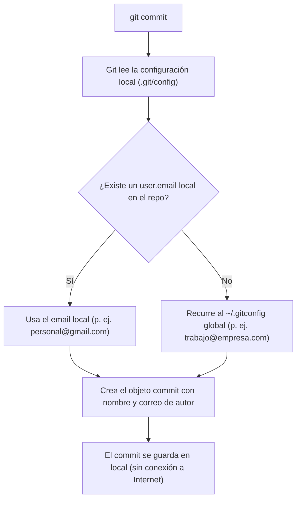
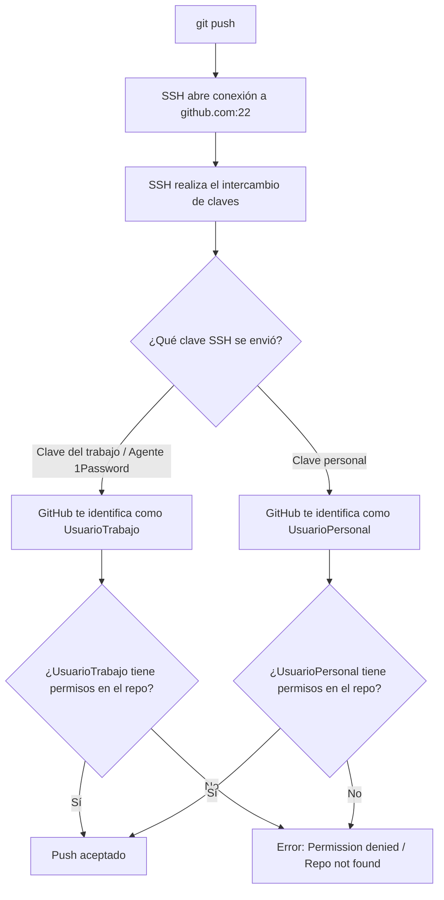

Si utilizas tu portátil de trabajo tanto para tu empleo diario como para proyectos personales o contribuciones open source, tarde o temprano te toparás con dos problemas clásicos:

1. **Permiso denegado al hacer push**: Intentas subir cambios a un repositorio personal y GitHub te rechaza con un mensaje como `Permission to user/repo denied to work-user` o `Repository not found`.
2. **Filtración de identidad en los commits**: Consigues hacer push a tu repositorio personal, pero en GitHub el commit aparece con tu avatar corporativo y la dirección de correo de tu empresa.

Ambos problemas ocurren porque Git y SSH gestionan la **autenticación de red** y la **autoría de los commits** como dos capas completamente independientes.

En esta guía entenderás por qué ocurre esto, cómo funciona cada mecanismo y cuáles son las dos formas principales de configurarlo sin fricción.

---

## Por qué ocurre esto: Autenticación vs. Autoría

Para gestionar varias cuentas con soltura, conviene tener muy claro qué ocurre al hacer `git commit` (autoría) frente a lo que ocurre al hacer `git push` (autenticación).

### 1. La capa Git: Autoría (`git commit`)

Al ejecutar `git commit`, Git no se conecta a Internet ni verifica claves SSH. Simplemente genera un commit local con los valores configurados en tu entorno:



Si en tu configuración global tienes tu correo corporativo (`git config --global user.email "trabajo@empresa.com"`), **cualquier repositorio donde no hayas definido un email local usará silenciosamente tu correo corporativo**.

> [!IMPORTANT]
> GitHub utiliza el correo registrado dentro del commit para asociar la autoría a un perfil y mostrar tu avatar. Por eso es posible autenticarse y hacer push con tu clave SSH personal, pero ver el commit firmado con tu correo del trabajo si no sobreescribiste `user.email` en ese repositorio.

### 2. La capa SSH: Autenticación de red (`git push`)

Al ejecutar `git push` o `git fetch`, Git no le dice a GitHub cuál es tu correo. Git delega la conexión de red en **SSH**.



SSH envía una firma criptográfica con tu clave privada. GitHub consulta su base de datos para ver a qué usuario pertenece la clave pública correspondiente:
- Si SSH presenta tu clave de trabajo, GitHub asume que eres tu usuario de trabajo.
- Si ese usuario de trabajo no tiene permisos en tu repositorio personal `jose-oc/mi-proyecto`, GitHub rechaza la operación de inmediato.

---

## Método 1: Alias de Host en `~/.ssh/config` (Recomendado)

Este es el enfoque estándar y más cómodo a largo plazo. Consiste en definir alias de "Host" en `~/.ssh/config` para que SSH sepa automáticamente qué clave usar según el host indicado.

### Paso 1: Configurar `~/.ssh/config`

Edita o crea el archivo `~/.ssh/config`:

```text
# Cuenta por defecto: Trabajo (con agente de 1Password o clave del trabajo)
Host github.com
  HostName github.com
  User git
  IdentityAgent "~/Library/Group Containers/2BUA8C4S2C.com.1password/t/agent.sock"
  IdentityFile ~/.ssh/id_ed25519_work.pub
  IdentitiesOnly yes

# Cuenta personal de GitHub
Host github-jose
  HostName github.com
  User git
  IdentityFile ~/.ssh/id_ed25519_personal
  IdentitiesOnly yes
```

> [!WARNING]
> Añade siempre `IdentitiesOnly yes`. Sin esta directiva, SSH puede ofrecer todas las claves cargadas en tu agente o archivos por defecto. Si el servidor recibe primero la clave del trabajo y la reconoce, GitHub rechazará el acceso a tu repositorio personal antes de que SSH llegue a probar tu clave personal.

### Paso 2: Usar el alias en repositorios personales

Al clonar un repositorio personal, sustituye `github.com` por tu alias `github-jose`:

```bash
git clone git@github-jose:jose-oc/mi-proyecto-personal.git
```

Si el repositorio ya estaba clonado con la URL estándar de `github.com`, actualiza el remote:

```bash
git remote set-url origin git@github-jose:jose-oc/mi-proyecto-personal.git
```

### Paso 3: Configurar tu correo de autor local

Dentro de la carpeta del repositorio personal, configura tu identidad:

```bash
git config user.name "Jose"
git config user.email "jose@mail.com"
```

> [!TIP]
> Observa que no usamos la opción `--global`. Esto guarda los ajustes directamente en `.git/config` dentro de ese repositorio específico, sobreescribiendo el correo de trabajo global.

---

## Método 2: `core.sshCommand` por repositorio

Si prefieres mantener las URLs remotas estándar (`git@github.com:usuario/repo.git`) sin definir alias en `~/.ssh/config`, Git permite personalizar el comando SSH que se ejecuta para cada repositorio individual.

### Paso 1: Configurar el repositorio

Dentro de tu repositorio personal, ejecuta:

```bash
git config core.sshCommand 'ssh -i ~/.ssh/id_ed25519_personal -o IdentitiesOnly=yes'
git config user.email "jose@mail.com"
```

### Cómo funciona

- `core.sshCommand` le indica a Git: *"Cada vez que ejecutes operaciones de red (push, pull, fetch) en este repositorio, usa exactamente este comando SSH con esta clave privada e ignora las demás identidades."*
- `user.email` asegura que los commits creados en este repositorio lleven tu correo personal.

### Comparativa de ambos métodos

| Característica | Método 1: Alias SSH (`~/.ssh/config`) | Método 2: `core.sshCommand` |
| :--- | :--- | :--- |
| **URL del remote** | Modificada (`git@github-jose:...`) | Estándar (`git@github.com:...`) |
| **Archivo SSH config** | Requiere entradas en `~/.ssh/config` | Funciona sin tocar `~/.ssh/config` |
| **Integración con 1Password / Agente** | Nativa y muy limpia por host | Configurada en la cadena de comando |
| **Experiencia al clonar** | Se puede clonar directo con `git clone git@github-jose:...` | Requiere clonar y luego ejecutar comandos locales |

---

## Consejo extra: Automatizar con `includeIf` (Sin olvidar el email)

El mayor descuido con ambos métodos suele ser olvidar ejecutar `git config user.email` cada vez que se clona un repositorio personal nuevo.

Git incluye una directiva para cargar configuraciones condicionales según el directorio donde se encuentre el repositorio.

### 1. Organiza tus repositorios en carpetas separadas

Estructura tus proyectos por carpetas principales:

```text
~/code/
├── work/
│   ├── api-backend/
│   └── frontend-dashboard/
└── personal/
    ├── blog/
    └── open-source-tool/
```

### 2. Configura `~/.gitconfig`

En tu `~/.gitconfig` global, mantén tu cuenta del trabajo por defecto e incluye una configuración condicional para la carpeta personal:

```ini
[user]
    name = Jose
    email = jose.work@empresa.com

# Aplica automáticamente la configuración personal a todo lo que esté en ~/code/personal/
[includeIf "gitdir:~/code/personal/"]
    path = ~/.gitconfig-personal
```

### 3. Crea `~/.gitconfig-personal`

Crea el archivo `~/.gitconfig-personal`:

```ini
[user]
    name = Jose
    email = jose@mail.com

[core]
    sshCommand = ssh -i ~/.ssh/id_ed25519_personal -o IdentitiesOnly=yes
```

A partir de este momento, cualquier repositorio dentro de `~/code/personal/` aplicará automáticamente tu correo personal y tu clave SSH personal, sin necesidad de comandos manuales adicionales.

---

## Verificación y resolución de problemas

### 1. Comprobar la conexión SSH
Verifica que GitHub reconozca tus claves correctamente:

```bash
# Probar la cuenta de trabajo por defecto:
ssh -T git@github.com
# Salida esperada: Hi work-user! You've successfully authenticated...

# Probar el alias personal:
ssh -T git@github-jose
# Salida esperada: Hi jose-oc! You've successfully authenticated...
```

Si falla o te autentica con el usuario incorrecto, ejecuta `ssh -vT git@github-jose` para examinar qué claves está enviando SSH.

### 2. Comprobar qué correo está usando Git
Dentro de cualquier repositorio, comprueba el correo activo y de dónde proviene:

```bash
git config --show-origin user.email
```

Ejemplo de salida:
```text
file:.git/config    jose@mail.com
```

### 3. Cómo arreglar commits hechos con el correo equivocado

Si creaste commits locales (aún no subidos al remote) con el correo corporativo en un proyecto personal:

1. Configura el correo correcto en el repositorio:
   ```bash
   git config user.email "jose@mail.com"
   ```

2. Reescribe la autoría del último commit:
   ```bash
   git commit --amend --reset-author --no-edit
   ```

3. Si son varios commits, ejecuta un rebase interactivo (`git rebase -i HEAD~N`) y actualiza los commits con `--reset-author`.

---

## Resumen rápido

Para usar tu cuenta de GitHub personal en un repositorio de tu equipo de trabajo:

```bash
# 1. Configura el remote para usar tu alias SSH
git remote set-url origin git@github-jose:PROPIETARIO/REPO.git

# 2. Configura tu correo personal para los commits
git config user.email "jose@mail.com"
```

O usando la opción por comando directo:

```bash
git config core.sshCommand 'ssh -i ~/.ssh/id_ed25519_personal -o IdentitiesOnly=yes'; \
git config user.email "jose@mail.com"
```
