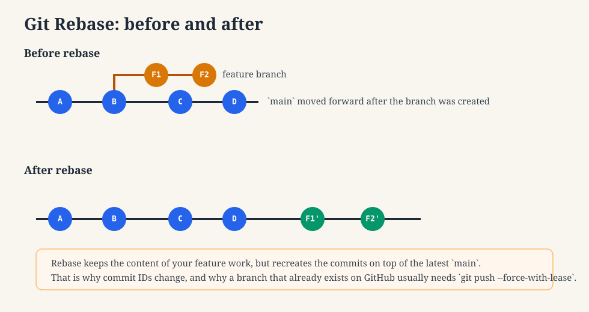
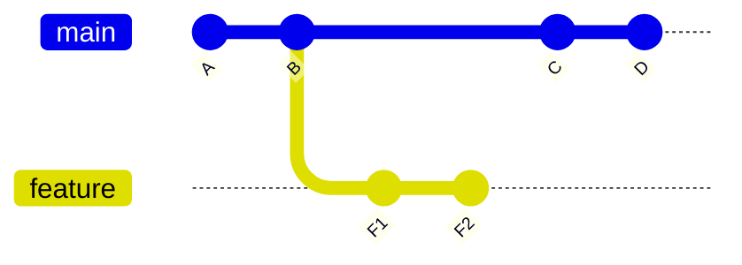
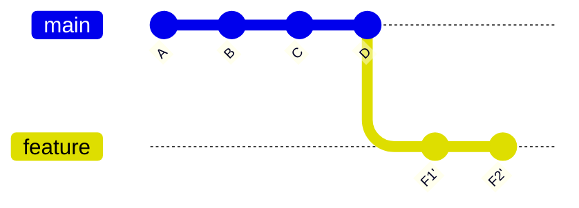
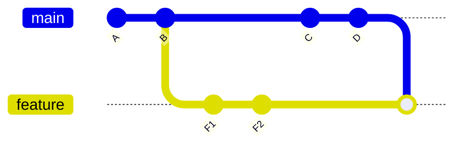
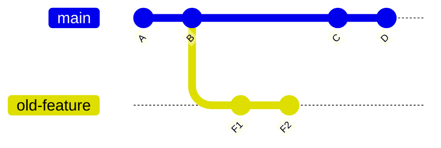
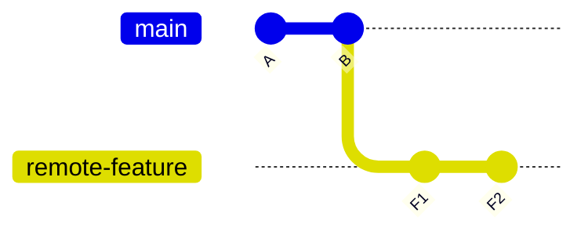
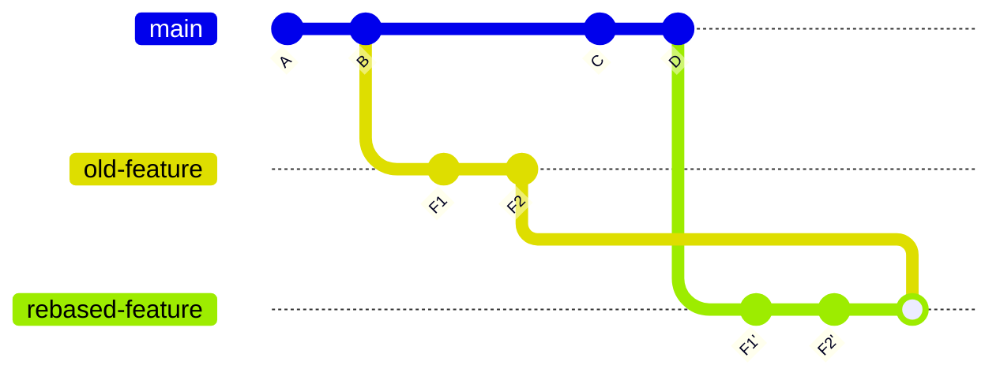

# Git Rebase sin miedo

Esta guía es para personas que usan Git a diario para `commit` y `push`, pero se sienten perdidas cuando alguien dice:

- "haz rebase de tu rama"
- "has reescrito el historial"
- "usa `--force-with-lease`"
- "no hagas merge después de hacer rebase"

Si eso te suena familiar, esta guía es para ti.



## La versión corta

`git rebase` toma los commits de tu rama y los reproduce encima de otra rama, normalmente `main`.

Eso significa:

- tu código se mantiene
- los IDs de tus commits cambian
- el historial de Git queda lineal y más fácil de revisar

La consecuencia más importante es esta:

Después de un rebase, tu rama ya no es el mismo historial que existe en GitHub.

Así que, si la rama ya existe en GitHub, normalmente tendrás que hacer push con:

```bash
git push --force-with-lease
```

> [!IMPORTANT]
> No con un `git push` normal.

## Qué significa rebase

Imagina este historial:



`feature` nació a partir de `B`.

Después, `main` avanzó hasta `C` y `D`.

Ahora tu rama se basa en un historial antiguo. Un rebase dice:

"Toma `F1` y `F2` y reprodúcelos como si se hubieran creado encima de `D`."

Después del rebase:



Fíjate en las comillas simples.

`F1'` y `F2'` no son los commits originales. Son commits nuevos con la misma intención, pero con IDs nuevos.

Por eso se dice que rebase "reescribe el historial".

## Por qué los equipos piden rebase

Rebase se usa a menudo para:

- mantener un PR limpio
- evitar commits de merge extra
- hacer que el diff sea más fácil de revisar
- colocar los commits de la feature encima del `main` más reciente

Para quien revisa, ésto:



suele ser más ruidoso que ésto:


## La forma segura de hacer rebase en tu rama

Si tu objetivo es "actualizar mi rama con el `main` más reciente y mantener el PR limpio", éste suele ser el flujo normal:

```bash
git fetch origin
git checkout <your-branch>
git rebase origin/main
git push --force-with-lease
```

### Qué hace cada comando

`git fetch origin`

- descarga la información más reciente de las ramas desde GitHub
- no cambia tus archivos

`git checkout <your-branch>`

- te mueve a tu rama de trabajo

`git rebase origin/main`

- reproduce los commits de tu rama encima del `main` más reciente

`git push --force-with-lease`

- actualiza la rama remota con tu nuevo historial reescrito
- falla de forma segura si alguien cambió la rama sin que te dieras cuenta

## Por qué `--force-with-lease` importa

Después de un rebase, GitHub sigue teniendo la versión antigua de tu rama.

Tu rama local ahora apunta a IDs de commit nuevos.

Un `git push` normal suele fallar porque Git interpreta esto como "el historial retrocedió".

`--force-with-lease` le dice a Git:

"Sí, sé que el historial cambió. Sustituye la rama remota, pero solo si nadie la modificó desde entonces."

Éso es mucho más seguro que `--force`.

## Qué no deberías hacer

Esta es la parte que evita PRs desordenados.

### 1. No hagas rebase y luego olvides hacer force-push

Mal flujo:

```bash
git fetch origin
git checkout my-feature
git rebase origin/main
```

Y después:

```bash
git pull
```

o:

```bash
git merge origin/my-feature
```

Aquí es donde suelen empezar los problemas.

Porque:

- tu rama local ahora tiene commits reescritos
- la rama remota sigue teniendo los commits antiguos
- Git puede intentar combinar ambos historiales en lugar de sustituir uno por otro

Éso puede producir una rama que contenga:

- los commits antiguos de la feature
- los commits nuevos del rebase
- un commit de merge uniendo ambos

Resultado: un PR ruidoso con historial duplicado.

### 2. No mezcles la rama remota antigua que viene del origin en tu rama rebaseada

Éste es el error clásico detrás de "¿Por qué mi PR muestra un montón de commits raros?"

Antes del rebase:



Después del rebase, en local:


Pero GitHub sigue teniendo la rama antigua:



Si ahora haces merge de la rama remota en tu rama rebaseada, terminas con ambos historiales:



Ése es el caos.

### 3. No uses rebase a la ligera en ramas compartidas si no sabes quién más la usa

Rebase cambia los IDs de los commits.

Si dos personas trabajan sobre la misma rama, hacer rebase puede confundir el historial local de la otra persona.

Si la rama es compartida:

- avisa antes de hacer rebase
- coordina el force-push
- o crea una rama nueva

## Qué hacer si rebase muestra conflictos

Si Git se detiene durante el rebase, significa que dos cambios tocaron la misma zona.

Flujo típico:

```bash
git fetch origin
git checkout my-feature
git rebase origin/main
```

Después Git se pausa.

En ese punto:

1. Corrige los archivos que Git te indique.
2. Márcalos como resueltos:

```bash
git add <file>
```

3. Continúa:

```bash
git rebase --continue
```

Si te bloqueas y quieres cancelar:

```bash
git rebase --abort
```

Éso te devuelve al punto de partida antes del rebase.

## Un buen modelo mental

Piensa en rebase como:

"Toma mi trabajo, conserva el contenido y reconstruye el camino."

Piensa en merge como:

"Une dos caminos."

Por eso hacer rebase y luego volver a hacer merge del camino antiguo suele ser la combinación equivocada.

## Una regla simple para recordar

Si hiciste rebase en una rama que ya existe en GitHub:

1. haz rebase
2. prueba si hace falta
3. haz push con `--force-with-lease`
4. no vuelvas a mezclar la rama remota antigua en esa rama

## Ejemplo práctico

Flujo limpio:

```bash
git fetch origin
git checkout feature/mejora-A
git rebase origin/main
git push --force-with-lease
```

Flujo desordenado:

```bash
git fetch origin
git checkout feature/mejora-A
git rebase origin/main
git pull
```

o:

```bash
git fetch origin
git checkout feature/mejora-A
git rebase origin/main
git merge origin/feature/mejora-A
```

El segundo patrón es cómo la gente termina con historial duplicado en un PR.

## Cuándo conviene crear una rama nueva

A veces el historial ya está demasiado enredado.

En ese caso, la solución más limpia suele ser:

1. crear una rama nueva a partir del `main` actual
2. hacer cherry-pick o re-aplicar los commits reales de la feature
3. subir esa nueva rama
4. abrir un PR nuevo

Muchas veces ésto es menos arriesgado que intentar rescatar una rama muy enredada en el mismo sitio.

## Consejo final

Si no tienes total confianza, usa esta lista de verificación:

- `git fetch origin`
- asegúrate de estar en tu rama de feature
- ejecuta `git rebase origin/main`
- si hay conflictos, resuélvelos con cuidado
- cuando termines, haz push con `git push --force-with-lease`
- no mezcles la rama remota de vuelta en tu rama rebaseada

Ese hábito evita mucho trabajo tedioso de limpieza en PRs.

Si quieres una referencia más corta, mira la [Hoja de referencia de Git Rebase](/es/docs/git/rebase-cheat-sheet).

## Referencia rápida

El flujo diario más seguro para rebase:

```bash
git fetch origin
git checkout <your-branch>
git rebase origin/main
git push --force-with-lease
```

La lección en una línea:

**Un rebase cambia los IDs de los commits, así que la rama remota normalmente debe actualizarse con `--force-with-lease`, no volver a mezclarse con tu rama local rebaseada.**
