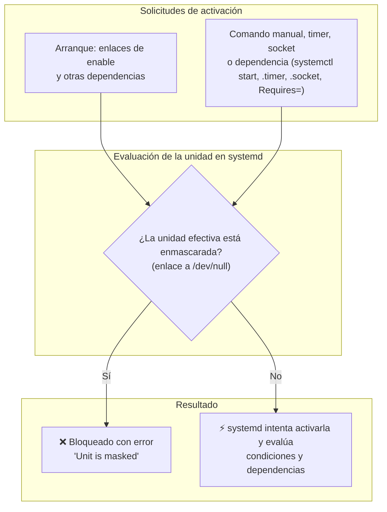

Al administrar servicios en segundo plano en Ubuntu y sistemas basados en Debian, es muy habitual necesitar que ciertos servicios no se ejecuten bajo ningún concepto. Ya sea para optimizar una imagen ligera para la nube, evitar que las actualizaciones automáticas en segundo plano de Ubuntu bloqueen la base de datos de APT en tareas de CI/CD, o solucionar conflictos de puertos entre demonios, controlar el ciclo de vida de los servicios es fundamental.

Sin embargo, los comandos habituales de systemd como `systemctl stop` y `systemctl disable` no garantizan que un servicio permanezca inactivo.

Para impedir que systemd inicie una unidad—ya sea por temporizadores, sockets, dependencias de otros servicios o comandos manuales accidentales—puedes **enmascararla** (*mask*). Una máscara efectiva bloquea la activación a través de systemd mientras siga instalada.

A continuación se explica cómo funciona el enmascaramiento en systemd, en qué se diferencia de `stop` y `disable`, y cómo utilizarlo con ejemplos prácticos.

---

## Los tres niveles de control: Stop vs. Disable vs. Mask

Es común confundir el alcance real de `stop`, `disable` y `mask`:



> [!NOTE]
> `enable` no es una puerta para todo inicio: un `systemctl start` manual no necesita que la unidad esté habilitada, y estar habilitada tampoco garantiza que el proceso termine arrancando bien. `enable` solo añade enlaces que generan solicitudes de activación en el arranque.

### 1. `systemctl stop` (Solo en tiempo de ejecución)
* **Qué hace**: Detiene el proceso en ejecución de forma inmediata.
* **Qué no hace**: No altera la configuración en disco ni los enlaces de inicio.
* **Por qué vuelve a iniciarse**: Tras un `stop`, el servicio puede volver a iniciarse si otro servicio, temporizador (`.timer`), socket o administrador lo invoca. En un reinicio solo volverá si algo lo activa en el arranque (por ejemplo, un enlace de `enable` o una dependencia), pero no hay garantía de que no lo haga.

```bash
sudo systemctl stop apt-daily.service
```

### 2. `systemctl disable` (Eliminación de los enlaces de habilitación)
* **Qué hace**: Elimina los enlaces de habilitación de la unidad (como `/etc/systemd/system/multi-user.target.wants/<unidad>.service`), de modo que ese mecanismo deje de activarla en el arranque. No la detiene ni impide otras activaciones, incluso durante el arranque (dependencias, timers, sockets).
* **Unidades `static`**: una unidad sin sección `[Install]`, como `apt-daily.service`, es `static`; no tiene enlaces de enable que eliminar, así que `disable` no le hace nada. En ese caso actúa sobre el timer que la activa.
* **Qué no hace**: No detiene una instancia que ya esté corriendo en memoria, ni impide que se active bajo demanda.
* **Por qué vuelve a iniciarse**: Cualquier administrador puede ejecutar `systemctl start`, o un servicio activo con directiva `Wants=` o `Requires=` puede iniciarlo, o una unidad `.timer` / `.socket` asociada puede activarlo.

```bash
sudo systemctl disable apt-daily.timer

# disable no detiene el timer si ya está activo.
# Para deshabilitarlo y detenerlo a la vez:
sudo systemctl disable --now apt-daily.timer
```

### 3. `systemctl mask` (Bloqueo total)
* **Qué hace**: Crea un enlace simbólico de la unidad apuntando directamente a `/dev/null`.
* **Qué consigue**: Mientras la máscara sea efectiva, systemd rechaza cualquier intento de inicio a través de él—manual, en el arranque, por temporizador o por dependencias—con un error explícito. No aísla el binario ni es una barrera frente a un administrador que pueda cambiar la configuración.
* **Cómo restaurarlo**: El método habitual es `systemctl unmask`.

```bash
sudo systemctl mask apt-daily.service
```

> [!NOTE]
> `mask` es especialmente útil para unidades de paquetes situadas en el directorio vendor. Si creaste la unidad tú en `/etc/systemd/system` o `/run/systemd/system`, `mask` puede fallar porque el archivo ya existe (`already exists`). Inspecciona el origen de la unidad y conserva su definición antes de decidir cómo gestionarla; no borres una unidad local a ciegas.

---

## Tabla comparativa

| Característica / Comportamiento | `systemctl stop` | `systemctl disable` | `systemctl mask` |
| :--- | :---: | :---: | :---: |
| **¿Detiene el proceso en ejecución?** | ✅ Sí | ❌ No (requiere stop manual) | ❌ No (requiere stop manual) |
| **¿Elimina los enlaces de habilitación del arranque?** | ❌ No | ✅ Sí (si la unidad tiene `[Install]`) | ⚠️ No los elimina, pero bloquea la activación |
| **¿Impide el inicio manual con `systemctl start`?** | ❌ No | ❌ No | ✅ Sí (falla con error) |
| **¿Impide la activación por temporizador o socket?** | ❌ No | ❌ No | ✅ Sí |
| **¿Impide el inicio por dependencias (`Requires=`)?** | ❌ No | ❌ No | ✅ Sí |
| **¿Sobrevive a actualizaciones de paquetes?** | N/A | ⚠️ A veces se sobrescribe | ✅ Sí |

> [!NOTE]
> `systemctl mask` y `systemctl disable` modifican cómo systemd carga la configuración de la unidad. Para detener inmediatamente un servicio en ejecución al enmascararlo, añade el parámetro `--now`:
> ```bash
> sudo systemctl mask --now <nombre-servicio>
> ```

---

## Cómo funciona el enmascaramiento internamente

Systemd busca y resuelve las unidades siguiendo un orden de prioridad estricto en el sistema de archivos:

Como simplificación para unidades habituales instaladas por paquetes:

1. `/etc/systemd/system/` (Configuración local del administrador — prioridad alta)
2. `/run/systemd/system/` (Unidades en tiempo de ejecución / efímeras generadas en el arranque)
3. `/lib/systemd/system/` o `/usr/lib/systemd/system/` (Unidades por defecto instaladas por paquetes — prioridad baja)

El load path completo incluye otras rutas, por ejemplo unidades transient y `generator.early`. El manual también lista directorios `system.control` por encima de `/etc/systemd/system`.

Cuando ejecutas `sudo systemctl mask apt-daily.service`, systemd genera un enlace simbólico:

```bash
/etc/systemd/system/apt-daily.service -> /dev/null
```

*Salida ilustrativa; el formato y los detalles pueden variar según la versión de systemd y el estado de la unidad.*

```text
$ ls -l /etc/systemd/system/apt-daily.service
lrwxrwxrwx 1 root root 9 Oct  1 12:00 /etc/systemd/system/apt-daily.service -> /dev/null
```

Dado que `/etc/systemd/system/` tiene prioridad sobre `/lib/systemd/system/`, systemd lee el enlace a `/dev/null` en lugar del archivo original del paquete. Como resultado, systemd considera que la unidad está bloqueada y rechaza las solicitudes de arranque mientras ese enlace siga siendo la definición efectiva.

### Qué NO hace el enmascaramiento

El enmascaramiento opera exclusivamente dentro del gestor de servicios systemd:
* **No desinstala el paquete**: Los binarios en `/usr/bin/` y las configuraciones en `/etc/` siguen intactos.
* **No impide la ejecución directa por línea de comandos**: Si ejecutas el binario directamente (por ejemplo, ejecutando `sudo apt update` o arrancando un proceso manualmente en terminal), funcionará con normalidad porque no pasa a través de systemd.

---

## Ejemplos prácticos paso a paso

### Ejemplo 1: Silenciar las tareas automáticas de APT en Ubuntu

Los servidores Ubuntu ejecutan actualizaciones y comprobaciones de paquetes en segundo plano mediante dos servicios principales:
* `apt-daily.service` (descarga índices y listas de paquetes)
* `apt-daily-upgrade.service` (descarga e instala actualizaciones de seguridad desatendidas)

Estos servicios se activan mediante sus respectivos temporizadores: `apt-daily.timer` y `apt-daily-upgrade.timer`.

En entornos automatizados, pipelines de CI/CD o tareas de aprovisionamiento con Ansible, estas ejecuciones automáticas pueden dispararse en el momento menos oportuno, bloqueando `/var/lib/dpkg/lock-frontend` y provocando errores de despliegue.

> [!WARNING]
> Enmascarar estos servicios y timers desactiva esta vía de actualización automática, **incluidas las actualizaciones de seguridad**. Úsalo solo en imágenes CI desechables o en sistemas con otro proceso explícito de parcheado, y documenta cuándo restaurarlo. Antes de usar `--now`, comprueba que no hay una instalación o configuración de paquetes en curso: no fuerces la interrupción de `dpkg`/`apt` para liberar un lock.

#### Alternativa más limitada: `Persistent=false`

Si el problema son las ejecuciones pendientes que se disparan al arrancar, Canonical documenta una opción menos agresiva: modificar `Persistent` en los timers en lugar de bloquear todo el mecanismo.

```bash
sudo systemctl edit apt-daily.timer
sudo systemctl edit apt-daily-upgrade.timer
```

En cada override:

```ini
[Timer]
Persistent=false
```

`Persistent=false` evita recuperar una ejecución perdida mientras la máquina estaba apagada y conserva las próximas ejecuciones programadas. No elimina toda posibilidad de que dos procesos de paquetes coincidan.

#### Paso 1: Detener y enmascarar servicios y temporizadores

Si, aun así, necesitas anular tanto los temporizadores como los servicios:

```bash
# Detener instancias en ejecución y enmascarar todo simultáneamente
sudo systemctl mask --now apt-daily.service apt-daily.timer apt-daily-upgrade.service apt-daily-upgrade.timer
```

Systemd confirmará la creación de los enlaces (salida ilustrativa; el formato puede variar según la versión de systemd):

```text
Created symlink /etc/systemd/system/apt-daily.service → /dev/null.
Created symlink /etc/systemd/system/apt-daily.timer → /dev/null.
Created symlink /etc/systemd/system/apt-daily-upgrade.service → /dev/null.
Created symlink /etc/systemd/system/apt-daily-upgrade.timer → /dev/null.
```

#### Paso 2: Verificar el estado enmascarado

Comprueba el estado de cualquiera de los servicios:

```bash
systemctl status apt-daily.service
```

Salida ilustrativa; el formato y los detalles pueden variar según la versión de systemd y el estado de la unidad:
```text
○ apt-daily.service
     Loaded: masked (Reason: Unit apt-daily.service is masked.)
     Active: inactive (dead)
```

#### Paso 3: Probar qué ocurre al intentar iniciarlo

Si otro proceso o administrador intenta iniciar el servicio:

```bash
sudo systemctl start apt-daily.service
```

Systemd rechazará la petición inmediatamente:

```text
Failed to start apt-daily.service: Unit apt-daily.service is masked.
```

#### Paso 4: Comprobar que los comandos manuales siguen funcionando

Enmascarar la unidad de systemd no afecta al uso interactivo de las herramientas. La máscara de estas unidades no impide ejecutar APT manualmente:

```bash
sudo apt update
sudo apt upgrade
```

La operación sigue sujeta a los locks de otros procesos, al estado de `dpkg` y a los errores habituales del gestor de paquetes. Ejecutar los comandos por separado te permite revisar los cambios antes de aceptarlos.

---

### Ejemplo 2: Listar todos los servicios enmascarados en el sistema

Para auditar qué unidades están actualmente enmascaradas en la máquina:

```bash
systemctl list-unit-files --state=masked,masked-runtime
```

`masked` identifica las máscaras persistentes y `masked-runtime` las temporales (`--runtime`). Si solo filtras por `masked`, no verás estas últimas.

Salida de ejemplo (ilustrativa; el formato puede variar):
```text
UNIT FILE                  STATE  PRESET 
apt-daily-upgrade.service  masked enabled
apt-daily-upgrade.timer    masked enabled
apt-daily.service          masked enabled
apt-daily.timer            masked enabled

4 unit files listed.
```

---

### Ejemplo 3: Enmascaramiento temporal para mantenimiento (`--runtime`)

Si necesitas evitar que un servicio se inicie durante una ventana de mantenimiento o pruebas de diagnóstico, pero quieres que el bloqueo desaparezca automáticamente en el próximo reinicio, utiliza el parámetro `--runtime`:

```bash
sudo systemctl mask --runtime --now nginx.service
```

`--runtime` crea el enlace simbólico en `/run/systemd/system/nginx.service -> /dev/null`, y `--now` detiene además el servicio si ya estaba activo (sin `--now`, `mask --runtime` no para un nginx que ya esté en marcha). Como `/run` es un sistema de archivos temporal en memoria (`tmpfs`), la máscara se descarta al reiniciar el servidor.

Para retirarla sin reiniciar, y arrancar el servicio solo cuando corresponda:

```bash
sudo systemctl unmask --runtime nginx.service
sudo systemctl start nginx.service
```

> [!NOTE]
> Una definición con el mismo nombre en `/etc/systemd/system` tiene precedencia sobre la máscara en `/run/systemd/system`. Reiniciar elimina la máscara runtime, pero no garantiza por sí solo que el servicio arranque: depende de la configuración restante.

---

## Cómo desenmascarar y restaurar un servicio

Cuando quieras volver a habilitar el servicio, utiliza `systemctl unmask`:

```bash
# 1. Eliminar los enlaces a /dev/null
sudo systemctl unmask apt-daily.service apt-daily.timer apt-daily-upgrade.service apt-daily-upgrade.timer

# 2. Habilitar e iniciar los temporizadores si deseas que se ejecuten en el arranque
sudo systemctl enable --now apt-daily.timer apt-daily-upgrade.timer
```

Salida tras desenmascarar (ilustrativa; el formato puede variar):
```text
Removed /etc/systemd/system/apt-daily.service.
Removed /etc/systemd/system/apt-daily.timer.
Removed /etc/systemd/system/apt-daily-upgrade.service.
Removed /etc/systemd/system/apt-daily-upgrade.timer.
```

> [!WARNING]
> Desenmascarar un servicio únicamente elimina el enlace a `/dev/null`; no habilita ni inicia la unidad automáticamente. Recuerda ejecutar `systemctl enable` o `systemctl start` tras el desenmascaramiento si necesitas que vuelva a estar activa.

---

## Buenas prácticas y recomendaciones

1. **Enmascara también los temporizadores y sockets asociados**: Si el servicio tiene un archivo `.timer` (como `apt-daily.timer`) o `.socket` (como `cups.socket`), enmascarar solo el `.service` provocará que el temporizador siga activándose y genere advertencias en los logs. Enmascara ambos.
2. **Utiliza `--now` para detener inmediatamente**: Por defecto, `systemctl mask` solo bloquea ejecuciones futuras. Combínalo con `systemctl mask --now <unidad>` para detener el proceso inmediatamente, tras comprobar que no hay una operación crítica en curso.
3. **No borres archivos en `/lib/systemd/system/`**: Nunca elimines manualmente las definiciones de paquetes del sistema. Las actualizaciones de paquetes volverán a crearlos. El enmascaramiento en `/etc/systemd/system/` es la vía oficial y limpia.
4. **Revisa unidades enmascaradas en auditorías**: Si un servicio no arranca y arroja `Unit is masked`, consulta `systemctl list-unit-files --state=masked,masked-runtime` para verificar el motivo del bloqueo.
