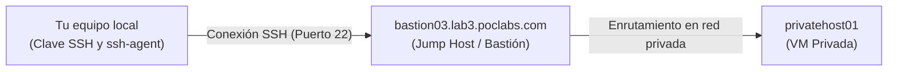
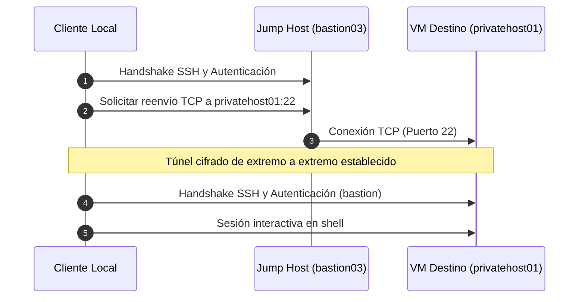

Al gestionar infraestructuras en la nube o entornos on-premise, los servidores ubicados en subredes privadas o VLANs aisladas carecen intencionadamente de acceso directo a Internet. Para administrar estas máquinas virtuales privadas, los administradores suelen enrutar sus conexiones a través de un **jump host** (también conocido como **bastion host** o servidor de salto).

Un jump host SSH te permite acceder de forma segura a máquinas internas sin necesidad de copiar tus claves SSH privadas en servidores intermedios ni de recurrir a contraseñas.

---

## Escenario de ejemplo

En esta guía utilizaremos el siguiente entorno práctico:

- **Jump host (Bastión público)**: `bastion03.lab3.poclabs.com`
- **VM de destino (Privada interna)**: `privatehost01`
- **Usuario de destino**: `bastion`
- **Clave SSH local**: `~/.ssh/id_ed25519`

### Diagrama de red



> [!NOTE]
> Que `bastion03.lab3.poclabs.com` cuente con un registro DNS público no significa que `privatehost01` deba tener una dirección IP pública. El DNS únicamente traduce un nombre de host a una dirección IP. El jump host resuelve y alcanza a `privatehost01` de forma directa a través de su interfaz de red privada.

Existen dos métodos principales para conectarse a VMs privadas a través de un jump host: **Reenvío de agente o Agent Forwarding (`-A`)** y **ProxyJump (`-J`)**.

---

## Método 1: Reenvío de agente SSH / Agent Forwarding (`-A`)

El reenvío de agente hace que tu agente de autenticación SSH local (`ssh-agent`) esté disponible dentro de la sesión interactiva del jump host.

### Cómo funciona

1. Estableces una conexión SSH con el jump host indicando que se reenvíe el socket de tu agente local.
2. Desde la terminal del jump host, inicias una segunda conexión SSH hacia la VM privada.
3. Cuando la VM de destino solicita autenticación, el jump host reenvía el desafío criptográfico a tu `ssh-agent` local.
4. Tu agente local firma el desafío y devuelve la firma. **Tu clave privada nunca sale de tu equipo local.**

```bash
# Paso 1: Conectarse al jump host con reenvío de agente
ssh -A bastion03.lab3.poclabs.com

# Paso 2: Desde el jump host, conectarse a la VM privada de destino
ssh bastion@privatehost01
```

### Configuración en el cliente (`~/.ssh/config`)

En lugar de escribir flags manualmente, puedes configurar el reenvío de agente en tu archivo `~/.ssh/config`:

```ssh-config
Host *.poclabs.com
  User bastion
  IdentityFile ~/.ssh/id_ed25519
  ForwardAgent yes
```

### Cargar la clave en el agente local

Antes de conectarte, asegúrate de que tu clave SSH esté cargada en tu agente local:

```bash
# Comprobar las claves cargadas actualmente
ssh-add --list

# Añadir la clave si no aparece en la lista
ssh-add ~/.ssh/id_ed25519
```

Una vez dentro del jump host, puedes verificar que el agente reenviado está disponible:

```bash
ssh-add -L
```

### Ventajas

- **Flexibilidad interactiva**: Ideal si necesitas iniciar sesión en el jump host y ejecutar comandos o scripts directamente desde su terminal.
- **Acceso a múltiples destinos**: Facilita saltar entre varias máquinas internas desde una única sesión abierta en el bastión.

### Riesgos y consideraciones de seguridad

> [!WARNING]
> El reenvío de agente crea un socket de autenticación en el jump host remoto (accesible mediante la variable de entorno `$SSH_AUTH_SOCK`). Aunque los usuarios o administradores remotos **no pueden extraer tu clave privada**, cualquier usuario con privilegios de root (o acceso a tu cuenta) en un jump host comprometido podría realizar peticiones a tu socket activo y autenticarse en otros sistemas en tu nombre mientras mantengas la sesión abierta.
>
> Evita activar `ForwardAgent yes` de forma global para todos los hosts (`Host *`). Actívalo únicamente para bastiones de confianza.

---

## Método 2: ProxyJump (`-J`) — El estándar moderno

`ProxyJump` (incorporado de forma nativa en OpenSSH 7.3) utiliza el jump host estrictamente como un proxy de red a nivel de transporte. Tu cliente local de OpenSSH establece una conexión cifrada de extremo a extremo directamente con la VM de destino a través de un túnel cifrado sobre el jump host.

### Cómo funciona

```bash
ssh -J bastion03.lab3.poclabs.com bastion@privatehost01
```

Este único comando realiza automáticamente lo siguiente:

1. Se conecta y autentica contra `bastion03.lab3.poclabs.com`.
2. Solicita al jump host que abra un canal de reenvío TCP (`ssh -W`) hacia `privatehost01:22`.
3. Negocia el cifrado SSH de extremo a extremo y autentica directamente a `privatehost01` como `bastion` desde tu equipo local.



### Ventajas

- **Un solo comando**: Acceso directo a la máquina privada en un único paso.
- **Cifrado de extremo a extremo**: El jump host solo ve paquetes de tráfico cifrados; no puede inspeccionar el contenido de tu sesión.
- **Sin socket remoto del agente**: No se crea ningún `$SSH_AUTH_SOCK` en el jump host, eliminando el riesgo de abuso del socket.
- **Compatibilidad con herramientas**: Funciona directamente con `scp`, `rsync`, `sftp` y extensiones como VS Code Remote SSH.

### Detalle importante: usuario de destino

Si omites el usuario en el argumento de la VM de destino:

```bash
# Incompleto: usará por defecto tu usuario local (ej. 'jose')
ssh -J bastion03.lab3.poclabs.com privatehost01
```

SSH intentará iniciar sesión en `privatehost01` usando tu nombre de usuario local. Especifica siempre el usuario de destino de forma explícita:

```bash
# Correcto: especifica explícitamente 'bastion' en privatehost01
ssh -J bastion03.lab3.poclabs.com bastion@privatehost01
```

---

## Configuración recomendada (`~/.ssh/config`)

Para optimizar tu flujo de trabajo y evitar escribir los parámetros del jump host en cada conexión, define la VM de destino en tu archivo `~/.ssh/config`:

```ssh-config
# VM privada de destino
Host privatehost01
  HostName privatehost01
  User bastion
  ProxyJump bastion03.lab3.poclabs.com
  IdentityFile ~/.ssh/id_ed25519
  IdentitiesOnly yes

# Opcional: configuración por defecto del jump host
Host bastion03.lab3.poclabs.com
  User bastion
  IdentityFile ~/.ssh/id_ed25519
  IdentitiesOnly yes
```

Con esta configuración guardada, podrás conectarte directamente con:

```bash
ssh privatehost01
```

Cualquier otra herramienta estándar aprovechará esta configuración de forma transparente:

```bash
# Copiar un archivo a la VM privada
scp ./backup.tar.gz privatehost01:/tmp/

# Sincronizar directorios con rsync
rsync -avz ./src/ privatehost01:/opt/app/
```

---

## Comparativa: Agent Forwarding frente a ProxyJump

| Característica | Agent Forwarding (`-A`) | ProxyJump (`-J`) |
|---|---|---|
| **Número de comandos** | Habitualmente dos (salto y destino) | Un solo comando directo |
| **Objetivo principal** | Exponer el agente local en el jump host | Enrutar la conexión cifrada a través del jump host |
| **Autenticación final** | Se ejecuta desde la shell del jump host | Gestionada directamente por tu cliente SSH local |
| **Clave privada copiada al jump host** | No | No |
| **Socket del agente expuesto en el jump host** | Sí (`$SSH_AUTH_SOCK`) | No |
| **Cifrado de sesión extremo a extremo** | No (el jump host descifra su tramo) | Sí (el túnel es opaco para el jump host) |
| **Transferencia de archivos (`scp`/`rsync`)** | Requiere transferencias manuales en pasos | Transferencia directa en un solo paso |
| **Recomendado para acceso simple** | Generalmente no | **Sí (Buena práctica)** |

---

## ¿Qué método deberías elegir?

### Utiliza `ProxyJump` (`-J`) cuando:
- Quieras acceso directo y seguro a uno o varios servidores privados desde tu equipo local.
- Necesites transferir archivos con `scp`, `sftp` o `rsync`.
- Utilices entornos de desarrollo como VS Code Remote SSH o JetBrains Gateway.
- Busques la opción más segura por defecto sin dejar sockets de autenticación en bastiones intermedios.

```bash
ssh -J bastion03.lab3.poclabs.com bastion@privatehost01
# O mediante ~/.ssh/config:
ssh privatehost01
```

### Utiliza Agent Forwarding (`-A`) cuando:
- Necesites realizar trabajo interactivo de administración directamente en la shell del jump host.
- Ejecutes scripts de despliegue en el jump host que deban clonar repositorios Git privados o conectarse a nodos internos usando tus credenciales personales.

```bash
ssh -A bastion03.lab3.poclabs.com
ssh bastion@privatehost01
```

### Regla práctica de resumen

- **`-J` sirve para enrutar conexiones de red** (más limpio, seguro y recomendado para acceder directamente a VMs).
- **`-A` sirve para delegar capacidades de autenticación** (útil cuando el propio jump host forma parte de tu flujo de trabajo interactivo).
