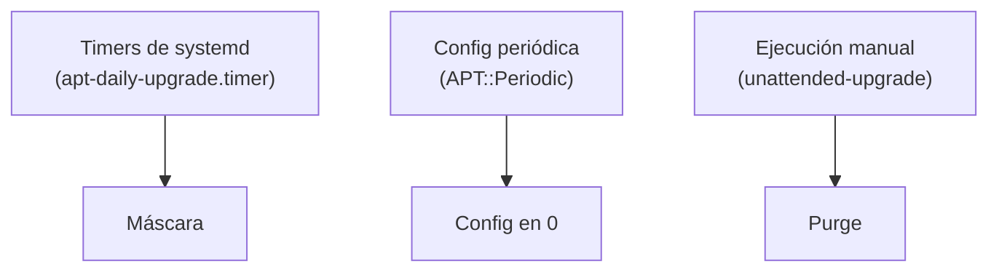

Hay máquinas que no deben actualizarse solas: tienen su propio proceso de parcheado (Ansible, una ventana de mantenimiento, un pipeline) y lo último que quieres es que `unattended-upgrades` se cuele por detrás. La pregunta es cómo dejarlo apagado **de forma que se quede apagado**.

Este artículo parte de una conversación real sobre varias VMs en datacenters, y complementa la guía de [enmascarar servicios de systemd](/es/docs/how-to/masking-systemd-services), donde se explica qué hace `mask` por dentro.

> [!NOTE]
> El paquete se llama `unattended-upgrades` (con *s*), pero el comando es `unattended-upgrade`, en singular. Es una confusión muy habitual.

---

## Las tres formas de apagarlo

Hay tres mecanismos, y cada uno cubre un trozo distinto.

### 1. Configuración: `APT::Periodic::Unattended-Upgrade "0"`

Se pone en un fichero de `/etc/apt/apt.conf.d/`, normalmente `20auto-upgrades`:

```text
APT::Periodic::Unattended-Upgrade "0";
```

Es la opción **más débil si va sola**:

- Solo cierra la vía periódica. El paquete y el binario siguen instalados y se pueden ejecutar.
- La configuración vive en `/etc/apt/apt.conf.d/`, y la puede tocar el tooling de imágenes (por ejemplo cloud-init) o una actualización del paquete.
- Es la que menos deja ver la intención: un `0` en un fichero no dice "esto está apagado a propósito".

### 2. Máscara de systemd

Los lanzamientos automáticos los hacen los timers `apt-daily.timer` y `apt-daily-upgrade.timer`, junto con sus servicios. Enmascararlos los bloquea con un error explícito:

```bash
sudo systemctl mask --now apt-daily.timer apt-daily-upgrade.timer apt-daily.service apt-daily-upgrade.service
```

La máscara es un enlace a `/dev/null` en `/etc/systemd/system/`, así que sobrevive a actualizaciones del paquete y se ve con un simple `systemctl status`. Pero solo cubre la activación **vía systemd**: un `unattended-upgrade` lanzado a mano seguiría funcionando.

> [!WARNING]
> Enmascarar `apt-daily` también apaga el refresco automático de índices de APT. Si algo en la VM depende de él, tendrás que hacerlo en tu proceso de parcheado.

### 3. Purgar el paquete

```bash
sudo apt purge unattended-upgrades
```

Sin paquete no hay nada que activar ni que ejecutar a mano. El hueco: un metapaquete o un `Recommends` futuro podría reinstalarlo, y volvería con los timers vivos. La máscara, en cambio, vive en `/etc` y sigue ahí aunque el paquete vuelva.



Cada capa tapa un camino: la máscara los timers, el `0` la vía periódica y el purge la ejecución manual.

---

## Qué combinación elegir

| Objetivo | Combinación |
| :--- | :--- |
| Que no se lance solo, pero poder llamarlo yo | Máscara + `"0"` |
| Que no se pueda ejecutar, punto | Purge + máscara + `"0"` (tres capas) |

Máscara + `"0"` es sólido: cubre todos los caminos automáticos y deja solo la ejecución manual, que decides tú. Si quieres cerrar también esa, añade el purge. En cualquier caso, codifícalo en Ansible (o lo que uses), de forma idempotente y aplicado a todas las VMs: así una máquina nueva o reconstruida nace igual.

---

## Qué hace `unattended-upgrade` si lo ejecutas a mano

No es lo mismo que `sudo apt update && sudo apt upgrade`:

- **Alcance**: solo toca los orígenes permitidos en `Unattended-Upgrade::Allowed-Origins`, que por defecto son básicamente los repositorios de seguridad. No actualiza "todo".
- **Sin preguntas**: es no interactivo por diseño, y tiene su propia política con los ficheros de configuración modificados (por defecto conserva los tuyos, `--force-confold`).
- **Con registro**: deja log en `/var/log/unattended-upgrades/`.
- **Síncrono**: ejecutarlo a mano lo lanza en primer plano, ocupa tu terminal hasta que termina y sale. "Unattended" quiere decir que no pregunta, no que se vaya a segundo plano. Lo de "no sé cuándo se ejecuta" es cosa de los timers.

Antes de fiarte, simúlalo:

```bash
sudo unattended-upgrade --dry-run --debug
```

No instala nada y te enseña qué candidatos ve. El log queda en `/var/log/unattended-upgrades/unattended-upgrades.log`.

---

## Resumen

- La config en `"0"` sola es lo más frágil: cierra una vía y deja el resto abierto.
- La máscara cubre los timers y es visible; el purge cierra la ejecución manual.
- Si hay otro proceso de parcheado explícito, apágalo en capas y automatízalo.
- `unattended-upgrade` a mano es síncrono, acotado a los orígenes permitidos y no equivale a `apt upgrade`.

## Referencias

- [Documentación de unattended-upgrades (repositorio oficial)](https://github.com/mvo5/unattended-upgrades)
- [Enmascarar servicios de systemd en Ubuntu](/es/docs/how-to/masking-systemd-services)
