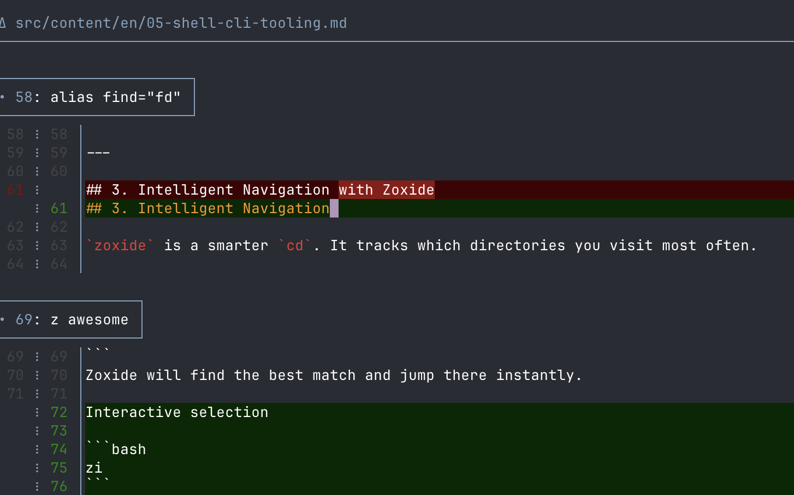

## Por qué importa

Git es la fuente de verdad de todos tus proyectos. Sin embargo, la experiencia por defecto de Git es visualmente ruidosa y carece de la automatización que necesitas para trabajar a gran velocidad.

Un `.gitconfig` bien afinado no solo hace que tu terminal se vea mejor; también evita que subas archivos basura (como `.DS_Store`), te ayuda a resolver conflictos más rápido con mejor contexto y garantiza que tus contribuciones queden atribuidas correctamente a tu identidad profesional o personal.

### Beneficios clave
* **Legibilidad**: los diffs con resaltado de sintaxis hacen más fáciles las revisiones de código.
* **Seguridad**: evita pushes accidentales a la rama equivocada.
* **Eficiencia**: los alias personalizados convierten comandos largos en 2 o 3 pulsaciones.

---

## 1. Mejorar la visibilidad con Git-Delta

El `git diff` por defecto es difícil de leer. **Delta** es un reemplazo moderno que aporta resaltado de sintaxis, números de línea y vistas lado a lado.

### Instalación
```bash
brew install git-delta
```

### Configuración
Añade esto a tu `~/.gitconfig` para que Delta sea tu pager por defecto:

```ini
[core]
    pager = delta

[interactive]
    diffFilter = delta --color-only

[delta]
    navigate = true
    line-numbers = true
    side-by-side = false
    syntax-theme = Monokai Extended
```

Ejemplo de salida de `git diff` con Delta:


---

## 2. Ajustes globales esenciales

Estos ajustes mejoran la calidad de vida de cualquier desarrollador al automatizar tareas repetitivas.

```bash
# General Identity
git config --global user.name "Your Name"
git config --global user.email "your@email.com"

# Productivity & Safety
git config --global init.defaultBranch main
git config --global pull.rebase true        # Keep a clean, linear history
git config --global fetch.prune true        # Auto-remove deleted remote branches
git config --global rebase.autoStash true   # Automatically stash changes before a rebase
git config --global push.autoSetupRemote true # Push new branches without --set-upstream
```

---

## 3. Alias personalizados: trabajar a velocidad

Deja de escribir `git status` cien veces al día. Usa alias para acelerar tu flujo.

### Alias recomendados
```ini
[alias]
    st = status --short --branch
    lg = log --graph --decorate --oneline --all
    df = diff
    ds = diff --staged
    unstage = restore --staged --
    co = switch
    cob = switch -c
    last = log -1 --stat
```

---

## 4. Gestionar ignores globales

No dejes que los archivos del sistema de macOS ni la configuración local del IDE ensucien tus repositorios. Crea un archivo de ignore global.

### Paso 1: crear el archivo
```bash
mkdir -p ~/.config/git
touch ~/.config/git/ignore
```

### Paso 2: añadir basura habitual
```text
.DS_Store
.AppleDouble
.LSOverride
Icon
.vscode/
.idea/
*.swp
```

### Paso 3: decirle a Git que lo use
```bash
git config --global core.excludesfile ~/.config/git/ignore
```

> [!TIP]
> Puedes evitar este paso porque esa ya es la ruta por defecto de Git.

---

## 5. Seguridad: firmado de commits

En un entorno DevOps es crucial verificar que un commit realmente salió de ti.

Si has seguido la [guía de SSH y autenticación](/es/docs/macos-setup-guide/ssh-and-authentication), puedes usar tu clave SSH para firmar commits sin necesidad de GPG.

```bash
git config --global gpg.format ssh
git config --global user.signingkey "your-ssh-public-key-or-1password-path"
git config --global commit.gpgsign true
```

---

## Resumen
Tu flujo de trabajo con Git ahora es más rápido, más limpio y más seguro. Tienes mejor visibilidad sobre tus cambios y menos pasos manuales. Ahora que el control de versiones está sólido, vamos a [instalar las herramientas esenciales de la shell](/es/docs/macos-setup-guide/shell-cli-tooling) que harán que tu navegación diaria sea mucho más fluida.
