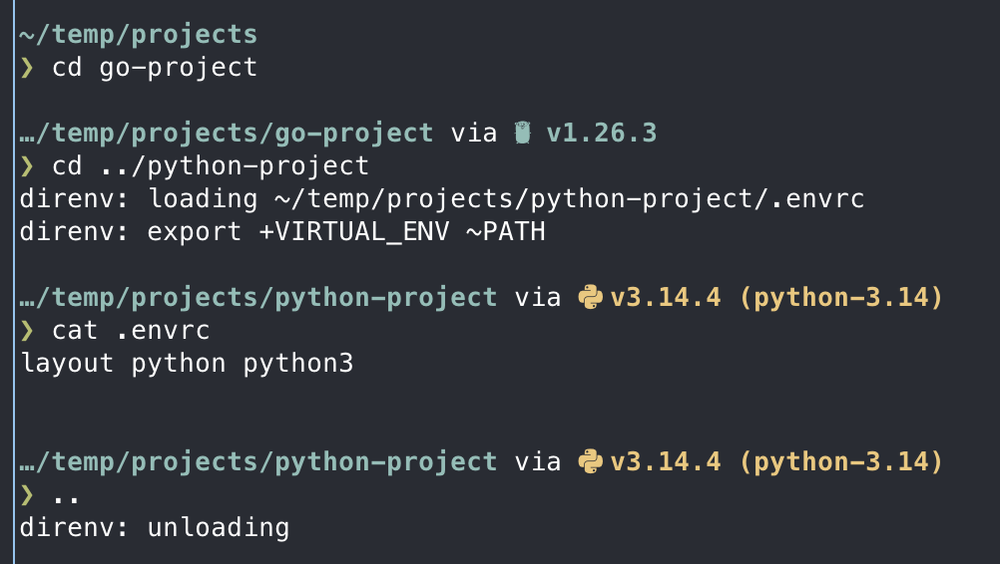

## Por qué importa

El prompt de tu shell es el bucle de feedback visual más frecuente de tu flujo de trabajo. Un prompt "tonto" solo te dice quién eres y dónde estás. Un prompt "inteligente" te dice **en qué estado estás**:
* ¿Estás en la rama `main` o en una feature branch?
* ¿Estás en un contexto de Kubernetes de producción o de staging?
* ¿Está activo tu entorno virtual de Python?
* ¿Falló el último comando y por qué?

Al usar **Starship**, consigues un prompt rapidísimo que solo muestra todo ese contexto cuando hace falta, manteniendo tu espacio de trabajo limpio e informativo.

### Beneficios clave
* **Velocidad**: al estar escrito en Rust, no añade latencia perceptible a tu shell.
* **Contextual**: muestra automáticamente tu estado de Git, el contexto cloud y la versión del lenguaje.
* **Consistencia**: usa exactamente la misma configuración en macOS, Linux e incluso Windows.

---

## 1. Instalar Starship

Starship es un único binario que funciona con Zsh, Bash, Fish e incluso PowerShell.

```bash
brew install starship
```

### Activarlo en Zsh
Añade esto al final de tu `~/.zshrc`:

```bash
eval "$(starship init zsh)"
```

> [!IMPORTANT]
> Esta línea debe ir al **final** de la configuración. Si otras herramientas intentan definir la variable `PROMPT` después de Starship, su diseño quedará sobrescrito.

---

## 2. Configuración: `starship.toml`

A diferencia de prompts antiguos que requerían scripts complejos de shell, Starship usa un archivo TOML limpio en `~/.config/starship.toml`.

Yo uso el preset `tokyo_night_storm`. Es un gran punto de partida y luego puedes personalizarlo a tu gusto.

```toml
starship preset nerd-font-symbols -o ~/.config/starship.toml
```

Después añadí algunos cambios menores que puedes ver en mi repositorio de [dotfiles](https://github.com/jose-oc/dotfiles/blob/main/dot_config/starship.toml).

---

## 3. Feedback visual en acción

El prompt cambia dinámicamente según el directorio en el que estés.

* **En un repo Git**: muestra el nombre de la rama y si tienes cambios sin commitear.
* **En un proyecto Python**: muestra la versión de Python (requiere un archivo `.python-version` o `pyproject.toml`).
* **En una carpeta de K8s**: muestra el contexto actual del clúster y el namespace.

En la captura de abajo puedes ver el prompt cambiando al pasar de un proyecto Python a un directorio Terraform.



---

## 4. Ajuste de rendimiento

Aunque Starship es rápido, comprobar cosas como el estado del proveedor cloud o repositorios Git enormes puede ralentizarlo.

### Consejos de optimización
1. **Desactiva módulos que no uses**: si no usas Go o Ruby, desactívalos explícitamente para ahorrar milisegundos.
2. **Scan timeout**: fija un tiempo máximo de escaneo para repositorios Git grandes.
3. **Usa Nerd Fonts**: asegúrate de que tu terminal usa una [Nerd Font](/es/docs/macos-setup-guide/terminal-setup-macos) para renderizar correctamente los iconos.

---

## Resumen
Tu terminal ahora se ve profesional y aporta el contexto crítico que requiere el trabajo DevOps moderno. Ya no vas "a ciegas". Ahora que el entorno está listo visualmente, vamos a [gestionar tus secretos y entornos de proyecto](/es/docs/macos-setup-guide/secrets-and-environment-management).
