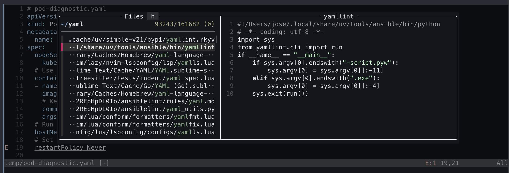

## Por qué importa

Como ingeniero DevOps, no solo escribes código; también navegas YAML enormes, depuras scripts de shell y gestionas módulos de Terraform. Los IDE tradicionales como VS Code son potentes, pero pueden ser lentos, consumir muchos recursos y resultar difíciles de usar solo con el teclado.

**Neovim** es un editor modal que vive dentro de tu terminal. Es rapidísimo y, cuando está bien configurado, ofrece todas las funciones "inteligentes" de un IDE, como ir a definición, autocompletado o refactorización, manteniendo las manos sobre la fila base del teclado.

### Beneficios clave
* **Velocidad**: se abre al instante incluso en repositorios enormes.
* **Ergonomía**: puedes hacerlo todo sin tocar el ratón.
* **Especializado para DevOps**: gran soporte para YAML, HCL (Terraform) y scripts de shell mediante LSP.

---

## 1. Instalar Neovim y sus fundamentos

Queremos la versión estable más reciente de Neovim.

```bash
brew install neovim
```

### La regla del "editor por defecto"
Asegúrate de que tus herramientas, como Git o la shell, usen Neovim al editar. Añade esto a tu `~/.zshrc`:

```bash
export EDITOR="nvim"
export VISUAL="nvim"
```

---

## 2. Gestión de plugins con Lazy.nvim

La configuración moderna de Neovim se escribe en **Lua**. Usamos `lazy.nvim` para gestionar los plugins porque permite "lazy loading", es decir, cargar plugins solo cuando realmente los necesitas, lo que mantiene el arranque por debajo de 50 ms.

### Instalación
Neovim busca su configuración en `~/.config/nvim/init.lua`.

```lua
-- ~/.config/nvim/init.lua snippet
local lazypath = vim.fn.stdpath("data") .. "/lazy/lazy.nvim"
if not vim.loop.fs_stat(lazypath) then
  vim.fn.system({ "git", "clone", "--filter=blob:none", "https://github.com/folke/lazy.nvim.git", lazypath })
end
vim.opt.rtp:prepend(lazypath)

require("lazy").setup("plugins")
```

---

## 3. El "big three" de Neovim

Para convertir Neovim en un IDE necesitas tres componentes básicos:

### A. Treesitter (mejor sintaxis)
El resaltado clásico de sintaxis se basa en regex. Treesitter construye un árbol sintáctico real de tu código, con colores más precisos y mejor rendimiento.
```lua
{ "nvim-treesitter/nvim-treesitter", build = ":TSUpdate" }
```

### B. LSP (Language Server Protocol)
Este es el "cerebro". Proporciona autocompletado y validación de errores. Para DevOps nos centramos en:
* **Yamlls**: para Kubernetes y Ansible.
* **Terraform-ls**: para HCL.
* **Basedpyright**: para Python, gestionado con [UV](/es/docs/macos-setup-guide/python-and-automation-tooling).

### C. FZF-Lua (búsqueda difusa)
Integrado con [FZF](/es/docs/macos-setup-guide/shell-usability-improvements), te permite encontrar cualquier archivo o función en una fracción de segundo.



> [!NOTE]
> En la captura anterior puedes ver que el LSP me está diciendo que hay un error en la línea 19; eso es LSP en acción.
> También puedes ver FZF buscando archivos cuyo nombre empieza por `yaml` simplemente tecleando el nombre. Puedes abrir la búsqueda de FZF con `<Leader>ff` y, por defecto, la tecla leader es la barra espaciadora.

---

## 4. Navegación y atajos de teclado

La idea es moverte tan rápido como piensas.

* **`gd`**: ir a la definición.
* **`gr`**: ir a las referencias, para ver dónde se usa una variable.
* **`<leader>ff`**: buscar archivo.
* **`<leader>fg`**: buscar texto globalmente.

---

## 5. Funciones avanzadas para DevOps: Oil.nvim

En trabajo DevOps a menudo necesitas mover o renombrar archivos en bloque. **Oil.nvim** te permite editar tu sistema de archivos como si fuera un buffer de texto normal. Abres un directorio, cambias un nombre de archivo en el texto y guardas; Neovim se encarga del `mv`.

---

## Resumen
Ahora tienes una forja de alto rendimiento y controlada por teclado para tu código e infraestructura. Tu editor está integrado con tu shell, con tus herramientas de búsqueda y con tus language servers. Ahora que el entorno está completo, toca [asegurarse de que todo sea reproducible y esté gestionado con dotfiles](/es/docs/macos-setup-guide/dotfiles-and-reproducibility).
