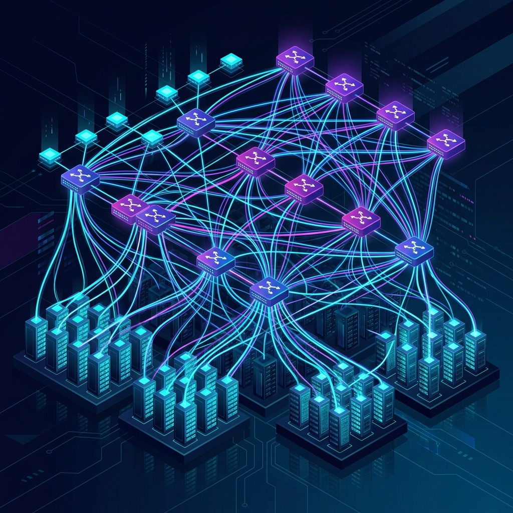
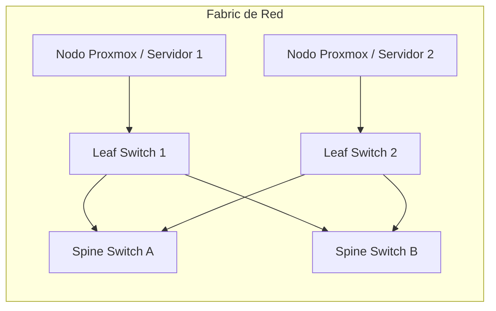
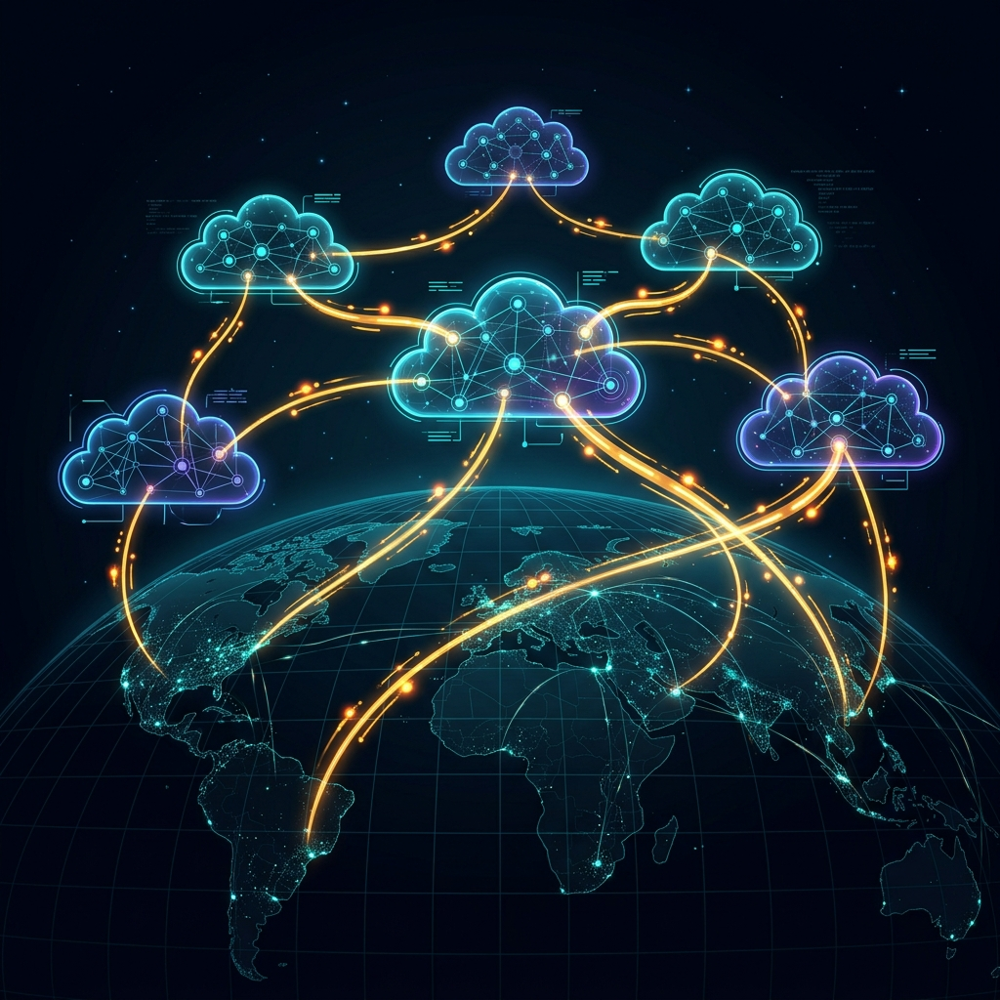

Si eres programador, administrador de sistemas o responsable técnico, probablemente sepas escribir código, configurar servidores u orquestar contenedores. Sin embargo, cuando te toca hablar de infraestructura de red con los ingenieros de redes (NetOps), puede parecer que hablan un idioma completamente diferente.

Términos como **Fabric**, **Leaf-Spine**, **SDN**, **BGP** u **OSPF** suelen aparecer en las conversaciones, dejándote con la duda de cómo se conectan con tus aplicaciones o tus entornos de virtualización (como Proxmox o VMware).

Este glosario explica estos conceptos de forma sencilla, utilizando analogías del mundo real, diagramas e ilustraciones fáciles de entender.

---

## La idea general: Un modelo mental rápido

Antes de entrar en detalle, esta es la relación básica entre los conceptos:

- **SDN** es el **sistema de control** (el software que gestiona las reglas de red).
- **Fabric** es la **estructura física y lógica** de la red en el centro de datos.
- **Leaf-Spine** es la **forma** (topología) de esa estructura.
- **BGP, OSPF, IS-IS y OpenFabric** son los **protocolos de enrutamiento** (las normas de tráfico) que indican a los paquetes de datos qué camino tomar a través del fabric o al cruzar entre redes distintas.

---

## 1. La estructura de la red (La infraestructura física)

### Fabric (Red en malla o tejido)
* **Qué es:** Un diseño de red de centro de datos donde múltiples switches están interconectados entre sí, creando una red en malla (o "tejido") de alta velocidad y muy redundante.
* **La analogía:** Imagínalo como una **red de autopistas en cuadrícula perfectamente planificada** en un gran parque industrial. No importa desde qué almacén (servidor) empieces, siempre hay un camino rápido y predecible hacia cualquier otro almacén.
* **Por qué te interesa:** En los datacenters modernos, los servidores no se conectan a un único switch. Se conectan a un "Fabric" para que, si un cable o un switch falla, el tráfico se redirija instantáneamente sin interrumpir tus conexiones a bases de datos o peticiones API.

### Leaf Switch (Switch de hoja o acceso)
* **Qué es:** Un switch situado en el \"borde\" del fabric. Los servidores, los hosts de virtualización (como nodos Proxmox) y los sistemas de almacenamiento se conectan directamente a los switches Leaf.
* **La analogía:** Las **rampas de entrada** a la autopista. Cualquier viaje de datos empieza y termina aquí.
* **Por qué te interesa:** Aquí es donde viven tus aplicaciones. Si estás configurando un servidor físico, sus cables de red irán directamente a un switch Leaf (habitualmente a dos de ellos por redundancia).

### Spine Switch (Switch de columna o núcleo)
* **Qué es:** Un switch de la capa central que interconecta todos los switches Leaf. Los switches Spine no se conectan directamente a servidores; solo se conectan a los switches Leaf.
* **La analogía:** Las **grandes autopistas interestatales** que conectan las rampas de entrada locales.
* **Por qué te interesa:** Los switches Spine aseguran que cualquier switch Leaf esté a un solo \"salto\" de distancia de cualquier otro switch Leaf, garantizando una latencia mínima y un rendimiento predecible.

---

## 2. Los protocolos (El navegador GPS)

Para mover datos en el fabric, los switches necesitan saber qué caminos están libres, cuáles están congestionados y hacia dónde enviar cada paquete. Para ello utilizan **protocolos de enrutamiento** que calculan este mapa de forma dinámica.

### BGP (Border Gateway Protocol / Protocolo de Pasarela de Frontera)
* **Qué es:** El protocolo de enrutamiento que sostiene el internet global. Intercambia información de enrutamiento y accesibilidad entre distintos "Sistemas Autónomos" (redes gigantescas propiedad de ISPs, universidades o gigantes tecnológicos). En los datacenters modernos, también se utiliza *internamente* para enrutar el tráfico entre servidores dentro del propio fabric.
* **La analogía:** La **red internacional de aduanas y tratados postales**. BGP no se encarga de las carreteras locales de tu municipio (de eso se encargan OSPF/IS-IS). En cambio, BGP gestiona cómo los paquetes cruzan las fronteras internacionales entre diferentes países soberanos (Sistemas Autónomos).
* **Por qué te interesa:** BGP es el protocolo que mantiene en funcionamiento internet. Cuando hay un error de configuración en BGP, servicios enteros (como Facebook o Cloudflare) o países completos se quedan desconectados. En centros de datos modernos, los equipos de NetOps usan BGP directamente en los servidores físicos ("BGP-to-the-Host") para escalar el enrutamiento y asignar IPs dinámicas a contenedores o nodos Kubernetes.

### OSPF (Open Shortest Path First)
* **Qué es:** Un protocolo de enrutamiento de Capa 3 (enrutamiento). Los routers y switches comparten entre sí el estado de sus conexiones locales. Con esta información, cada dispositivo construye un mapa completo de la red y calcula la ruta más rápida usando el algoritmo de Dijkstra.
* **La analogía:** Un **GPS colaborativo** (como Waze). Cada intersección (router) informa del estado del tráfico en tiempo real. Tu coche (paquete de datos) utiliza este mapa para calcular la ruta más rápida disponible.
* **Por qué te interesa:** Es muy fiable y se usa en casi todas partes. Si configuras enrutamiento dinámico en un sistema como **FRR (FRRouting)** en Linux o Proxmox, OSPF suele ser la opción estándar para anunciar las direcciones IP de tus máquinas virtuales a la red física.

### IS-IS (Intermediate System to Intermediate System)
* **Qué es:** Otro protocolo de enrutamiento de Capa 3 similar a OSPF. La gran diferencia es que fue diseñado para funcionar directamente sobre la capa de enlace de datos (Capa 2) en lugar de depender de IP (Capa 3), lo que lo hace muy robusto y adaptable.
* **La analogía:** Similar a OSPF, pero funciona como un **sistema de radio privado de mensajería** de una empresa de transportes. No necesita el sistema de direcciones postales público (IP) para comunicar cambios en el mapa.
* **Por qué te interesa:** Lo utilizan mucho los proveedores de internet (ISPs) y datacenters muy grandes porque escala sumamente bien y gestiona de forma limpia múltiples tipos de protocolos (como IPv4 e IPv6 a la vez).

### OpenFabric
* **Qué es:** Un protocolo de enrutamiento especializado derivado de IS-IS, diseñado específicamente para topologías de red Leaf-Spine en centros de datos.
* **La analogía:** Un **mapa GPS optimizado exclusivamente para el centro de una ciudad cuadriculada**. Elimina todas las funciones complejas necesarias para carreteras caóticas de internet y se enfoca en resolver rutas dentro de una cuadrícula Leaf-Spine predecible y limpia.
* **Por qué te interesa:** Si utilizas suites de enrutamiento de código abierto como FRR en tu nube privada, OpenFabric simplifica enormemente la configuración y el consumo de recursos en comparación con un IS-IS completo.

---

## 3. La gestión y control (El Orquestador)

### SDN (Redes Definidas por Software)
* **Qué es:** Un enfoque de red que separa el *plano de control* (el cerebro que decide adónde va el tráfico) del *plano de datos* (los switches físicos que envían los paquetes). En lugar de configurar cada switch de forma individual desde su consola de comandos, defines las políticas de red centralizadamente a través de APIs de software.
* **La analogía:** **Domótica en casa**. En lugar de ir habitación por habitación pulsando los interruptores de la pared (redes tradicionales), tienes una aplicación central. Programas una regla como \"Apagar todas las luces a las 22:00\" y la aplicación configura automáticamente cada bombilla por ti.
* **Por qué te interesa:** 
  > [!TIP]
  > **SDN frente a IaC (Infraestructura como Código):** SDN es el modelo de red en sí, mientras que herramientas como Terraform o Ansible se utilizan para declarar y desplegar su configuración. Piensa en SDN como la API de la bombilla inteligente y en Terraform como el script que la llama.
  
  En hipervisores modernos como **Proxmox VE 8/9**, las funcionalidades de SDN te permiten crear zonas virtuales, redes (VNets) y subredes privadas directamente desde su interfaz web, sin necesidad de pedir cambios manuales en los switches físicos.

---

## Resumen rápido de términos

| Término | Categoría | Qué hace | Analogía en el mundo real |
| :--- | :--- | :--- | :--- |
| **SDN** | Gestión | Control centralizado de redes mediante APIs de software | Aplicación domótica para controlar las luces |
| **Fabric** | Estructura | Un diseño de red en malla de alta redundancia | Una red de autopistas en cuadrícula |
| **Leaf** | Hardware | El switch de borde donde se conectan los servidores | La rampa de entrada local a la autopista |
| **Spine** | Hardware | El switch central que une a todos los switches Leaf | Autopistas que comunican las rampas locales |
| **BGP** | Protocolo | Interconecta grandes redes y enruta el tráfico global de internet | Tratados aduaneros y postales internacionales de mercancías |
| **OSPF** | Protocolo | Calcula la ruta IP más rápida por la red | Waze/GPS calculando rutas según el tráfico |
| **IS-IS** | Protocolo | Protocolo de enrutamiento a gran escala para operadoras | Un canal de comunicación por radio propio del transportista |
| **OpenFabric** | Protocolo | Versión optimizada de IS-IS para rejillas Leaf-Spine | Un GPS especializado únicamente en distritos financieros cuadriculados |
